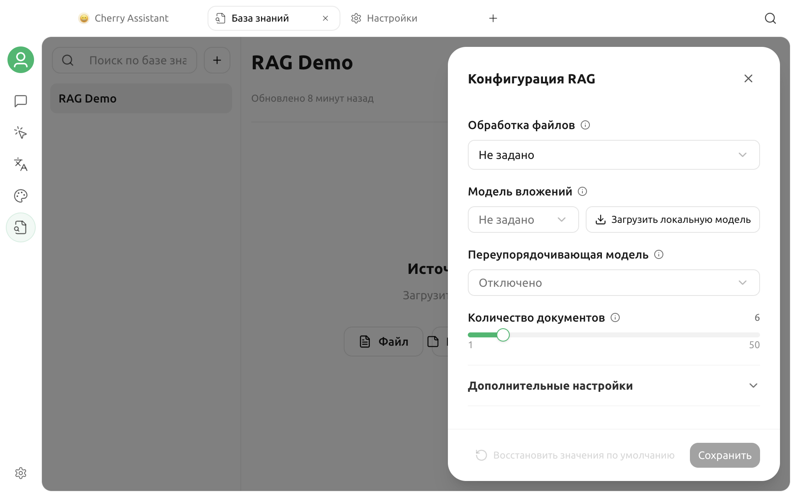

# Модели Embedding

Модель Embedding преобразует текст в векторы, чтобы Cherry Studio могла искать материалы по смыслу. Она отвечает за поиск, а не за создание окончательного ответа. Модели чата, Embedding и Rerank используют разные возможности.

## Поведение новой базы знаний по умолчанию

В окне создания необходимо указать только имя и, при необходимости, группу. Выбор модели Embedding в этом окне не предусмотрен.

- Если локальная модель Embedding ещё не загружена, база знаний создаётся в режиме **BM25**. BM25 выполняет поиск по ключевым словам, не создаёт векторы и не обращается к API Embedding.
- Если локальная модель Embedding уже загружена, новая база знаний автоматически использует её фиксированное число измерений и с самого начала создаёт векторный индекс.

Таким образом, добавлять и искать материалы можно без модели Embedding. Семантический поиск можно включить позднее в настройках базы знаний.

## Включение семантического поиска

Откройте нужную базу знаний, нажмите **Настройки** в правом верхнем углу и выберите один из вариантов в поле **Модель Embedding**.

### Использование локальной модели

Нажмите **Загрузить локальную модель**. После загрузки Cherry Studio автоматически выберет и сохранит встроенную локальную модель Embedding, а затем создаст недостающие векторы для имеющихся материалов.

Локальная модель не отправляет фрагменты материалов внешнему сервису Embedding. Первая загрузка и первое индексирование требуют времени, памяти и места на диске. Если текущая платформа не поддерживает локальный запуск, кнопка загрузки не отображается.

### Использование настроенного провайдера

Можно также выбрать включённую модель с возможностью **Embedding**. Если нужной модели нет в списке, настройте провайдера в разделе **Настройки → Службы моделей** и убедитесь, что для модели указана возможность Embedding.

При сохранении Cherry Studio отправляет короткую тестовую строку, чтобы определить фактическое число измерений вектора. Если адрес API, ключ, ID модели или сеть недоступны, сохранение завершится ошибкой; приложение не подставляет предполагаемое значение.


Названия DeepSeek, Kimi, GLM, GPT и Claude сами по себе не означают поддержку Embedding. Доступность определяется возможностями конкретной модели, а не брендом.


## Обработка имеющихся материалов

При изменении модели Cherry Studio выбирает безопасный процесс с учётом состояния базы знаний:

| Текущее состояние | Обработка |
| --- | --- |
| Первое включение Embedding в базе BM25 | Векторы создаются в той же базе знаний; повторное создание не требуется |
| Смена модели Embedding в пустой базе | Новая настройка сохраняется напрямую |
| Смена модели после добавления материалов и векторов | Запускается восстановление или перестроение, чтобы не смешивать старые и новые векторы |

Во время включения или перестроения не закрывайте приложение и не перемещайте исходные материалы. Чем больше данных, тем больше времени потребуется и тем выше могут быть расходы на онлайн-модель.

## Выбор модели

Сравните следующие факторы:

- **Поддержка языков**: проверяйте поиск на собственных материалах на китайском, английском, японском, русском и других нужных языках.
- **Конфиденциальность**: онлайн-модель получает фрагменты материалов и запросы; для конфиденциальных данных рассмотрите локальную модель.
- **Скорость и стоимость**: первичное и повторное индексирование, а также запросы могут обращаться к онлайн-API Embedding.
- **Стабильность**: ID модели, число измерений и поведение API должны оставаться стабильными.

Не выбирайте модель только по рейтингу или названию. Используйте одинаковые материалы и фиксированный набор вопросов, затем сравните, попадают ли правильные фрагменты в первые результаты.

## Устранение неполадок

### Список моделей Embedding пуст

Убедитесь, что провайдер включён, модель добавлена и её возможности содержат **Embedding**. Обычные модели чата и Rerank в этом списке не отображаются.

### Не удаётся получить число измерений при сохранении

Последовательно проверьте состояние провайдера, адрес API, ключ, ID модели, сеть и баланс аккаунта. При сохранении выполняется один реальный запрос Embedding.

### Каковы ограничения поиска только с BM25

BM25 хорошо работает с точными ключевыми словами, названиями продуктов и идентификаторами, но обычно хуже семантического поиска находит перефразированные и естественные формулировки. Можно начать с BM25, проверить качество материалов и затем решить, нужна ли модель Embedding.

### Требуется ли перестроение после смены ключа API

Обычно нет, если используется та же модель с тем же числом измерений. Если провайдер фактически направляет запросы к другой версии модели, повторите проверку качества поиска.

Подробный поток данных и расположение локальных файлов описаны в разделе [Данные базы знаний](data.md).

***

### Помощь и обратная связь

Если возникла проблема с обнаружением модели, загрузкой или индексированием, обратитесь к сообществу через раздел [Обратная связь и предложения](../question-contact/suggestions.md).
