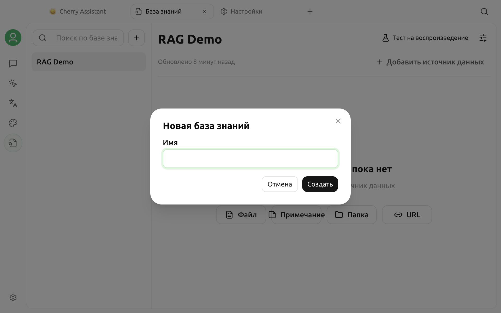

# Руководство по базе знаний

Справочная база знаний организует локальные документы и веб-страницы в поисковый репозиторий. Во время чата Cherry Studio сначала находит отрывки, относящиеся к вопросу, а затем отправляет эти отрывки текущей модели для генерации ответа.

Справочная база знаний не обучает и не изменяет модель. Она полезна для информации, которую вам нужно запрашивать повторно, использовать в разных чатах или которую неудобно прикреплять к каждому сообщению из-за большого объема.

На этой странице описан полный рабочий процесс: **создание базы знаний → проверка настроек поиска → добавление источников → тестирование поиска → использование в чате**.


Для общего обзора начните с [Обзор базы знаний](../cherrystudio/preview/knowledge-base.md). Для выбора модели, хранения данных и парсинга документов см. [Модели встраивания](emb-models-info.md), [Данные базы знаний](data.md) и [Предварительная обработка документов](zhi-shi-ku-wen-dang-yu-chu-li.md) соответственно.


## Перед началом работы

Для создания базы знаний не требуется заранее настраивать модель встраивания. Без неё база создаётся с поиском по ключевым словам BM25. Если локальная модель встраивания уже загружена, новая база автоматически использует эту модель и соответствующую размерность.

Если вы планируете использовать векторный или гибридный поиск, подготовьте модель встраивания в разделе **Настройки → Провайдеры моделей** и убедитесь, что она:

* Добавлена в список моделей и включена
* Включает в свои типы возможностей встраивание (embedding)
* Имеет работающую конечную точку API, ключ API и сетевое соединение

Обычная чат-модель не заменяет модель встраивания. Список доступных моделей может меняться вместе с предложениями провайдеров, поэтому руководство не предписывает конкретную онлайн-модель. Рекомендации по выбору приведены в разделе [Модели встраивания](emb-models-info.md).

## Создание базы знаний

1. Откройте «Панель запуска» (Launchpad) в верхней панели и выберите **База знаний** в списке приложений.
2. Нажмите кнопку добавления в левой навигационной области и выберите **Создать базу знаний**.
3. Введите легко узнаваемое имя.
4. Если вы создали группы, вы можете назначить базе знаний одну из них.

В окне создания нет выбора модели встраивания. Если локальная модель уже загружена, Cherry Studio автоматически назначит её новой базе; в противном случае база создаётся в режиме BM25. После создания откройте **Настройки RAG** в верхней части страницы, чтобы проверить или изменить модель встраивания и размерность.


Модель встраивания и размерность определяют формат векторного индекса. Если нужен векторный или гибридный поиск, завершите настройку и проверьте небольшой источник до пакетного импорта. Позднее изменение модели или размерности запускает перестроение.


## Добавление источников

После открытия базы знаний нажмите кнопку добавления в области «Источники данных» (Data Sources) и выберите тип источника.

| Источник | Подходящий контент | Текущее поведение |
| --- | --- | --- |
| Файл | Один или несколько локальных файлов | Поддерживает PDF, DOCX, MD, XLSX, TXT, CSV и EPUB |
| Папка | Коллекция источников в одном каталоге | Выберите локальный каталог для пакетного импорта его содержимого |
| URL | Одна публичная веб-страница | Введите полный адрес `http://` или `https://` |
| Sitemap | Несколько страниц с веб-сайта | Введите напрямую доступный адрес Sitemap |
| Заметка | Введенный вручную текст | Отправка пока недоступна в текущем интерфейсе добавления V2 |

### Импорт файлов

1. Выберите **Файл**.
2. Перетащите файлы или нажмите, чтобы выбрать локальные файлы.
3. Просмотрите список файлов и отправьте их.
4. Вернитесь в список источников данных и дождитесь завершения обработки.

Вы можете выбрать несколько файлов одновременно. Если формат файла не поддерживается, сначала преобразуйте его в один из форматов, указанных в таблице выше.

### Импорт папки

1. Выберите **Папка**.
2. Нажмите, чтобы выбрать каталог, и разрешите системе доступ к файлам.
3. Подтвердите каталог и отправьте его.

Папки полезны для импорта коллекции источников вместе. После импорта проверьте список источников данных, чтобы убедиться, что все необходимые файлы были обработаны успешно.

### Импорт веб-страницы или Sitemap

1. Выберите **URL** или **Sitemap**.
2. Введите полный, общедоступный адрес.
3. Отправьте его, а затем дождитесь завершения извлечения страниц и индексации.

Cherry Studio может не справиться с извлечением полезного контента со страниц, требующих входа в систему, зависящих от динамических скриптов для рендеринга или накладывающих ограничения доступа. Sitemap также должен быть напрямую доступен приложению. После импорта просмотрите извлеченный результат и запустите тестовый поиск.


После отправки задачи добавления Cherry Studio продолжает читать, разбивать на части (chunking) и встраивать источники в фоновом режиме. Не закрывайте приложение и не отключайте провайдера моделей во время обработки.


## Проверка статуса обработки

Пока источник индексируется, он проходит через такие этапы, как подготовка, чтение, обработка, разбиение на части (chunking) и встраивание (embedding). Промежуточные статусы могут различаться в зависимости от типа источника; окончательный успешный статус — **Завершено**.

| Статус | Значение | Рекомендуемое действие |
| --- | --- | --- |
| Подготовка / Чтение / Обработка / Разбиение на части / Встраивание | Строится индекс | Оставьте приложение запущенным и подождите |
| Завершено | Источник можно извлечь и использовать в чатах | Сначала запустите тестовый поиск |
| Не удалось | Индексация источника не завершена | Просмотрите ошибку, устраните причину и переиндексируйте |

В списке источников данных вы также можете:

* Отфильтровать по файлу, папке, URL и Sitemap
* Поиск по именам источников и просмотр количества готовых
* Предпросмотр извлеченного исходного контента
* Просмотр частей для завершенных источников
* Переиндексация завершенных или неудачных источников
* Выбрать несколько источников для пакетной переиндексации или удаления

Если изменился исходный файл или веб-страница, используйте **Переиндексировать** для обновления извлекаемого контента. Вы не можете переиндексировать источник во время его обработки; сначала дождитесь завершения текущей задачи.

## Сначала запустить тестовый поиск

В верхней части базы знаний находится **Тест поиска**. Он напрямую проверяет результаты поиска, помогая вам устранить неполадки с источниками, разбиением на части и настройками поиска перед началом чата.

1. Нажмите кнопку «Тест поиска» вверху.
2. Введите вопрос, который пользователь может задать на самом деле.
3. Просмотрите возвращенные отрывки, количество результатов, затраченное время и информацию о релевантности или ранжировании.
4. Разверните результат и убедитесь, что отрывок содержит исходный текст, необходимый для ответа на вопрос.
5. Повторите тест с несколькими вариациями вопроса.

Обратите внимание на следующие моменты:

* Появляются ли среди первых результатов правильные источники
* Содержит ли каждый отрывок полную ключевую информацию
* Не слишком ли длинные, слишком короткие или не разделены ли отрывки посреди ключевого предложения
* Не появляется ли слишком много нерелевантных результатов

Тест поиска сохраняет историю запросов для каждой базы знаний, поэтому вы можете повторно использовать те же вопросы для сравнения разных конфигураций. Если результаты поиска неточны, чат-модель также, как правило, не сможет предоставить надежный ответ.

## Использование базы знаний в чате

1. Откройте **Чат** и начните разговор.
2. Нажмите кнопку «База знаний» в области инструментов поля ввода.
3. Выберите одну или несколько баз знаний.
4. Введите вопрос, связанный с источниками, и отправьте его.
5. При чтении ответа также проверьте цитаты из базы знаний на соответствие исходным источникам.

В селекторе базы знаний можно выбрать несколько баз или сразу снять выбор со всех. Выбранные базы знаний связываются с текущим помощником и остаются доступными при дальнейшей работе с ним.


Кнопка «База знаний» может быть недоступна или скрыта в следующих случаях:

* Текущий помощник или режим инструмента не поддерживают базы знаний
* В поле ввода уже прикреплен файл

Если прикреплен файл, удалите его перед выбором базы знаний.


База знаний предоставляет только релевантные отрывки; окончательный ответ по-прежнему генерируется чат-моделью. Проверяйте важные выводы на соответствие цитируемым отрывкам и исходным источникам.

## Настройка RAG

Нажмите кнопку настроек в верхней части базы знаний, чтобы настроить рабочий процесс обработки документов и поиска.

| Настройка | Назначение | Рекомендации по настройке |
| --- | --- | --- |
| Обработчик файлов | Преобразует документы в текст, который можно разделить на части | Сначала проверьте это для отсканированных документов, изображений или сложных макетов |
| Размер и перекрытие частей | Определяет объем каждого извлеченного отрывка | Существующие источники должны быть переиндексированы после изменений |
| Модель встраивания и размерности | Генерирует и хранит векторный индекс | Изменения запускают процесс перестроения |
| Режим поиска | Выбирает метод поиска | Сначала оставьте значение по умолчанию, затем настройте на основе тестов поиска |
| Количество результатов | Контролирует количество возвращаемых отрывков | Слишком мало может упустить информацию; слишком много может добавить шум |
| Порог схожести | Фильтрует результаты с недостаточной релевантностью | Применяется только в поддерживаемых режимах поиска |
| Вес гибридного поиска | Балансирует семантический поиск и поиск по ключевым словам | Тщательно тестируйте это, если источники содержат много имен собственных |
| Модель переранжирования | Повторно ранжирует первоначальные результаты поиска | Добавляет еще один вызов модели и увеличивает время ожидания |

Изменяйте только одну категорию параметров за раз, а затем повторите тестовый поиск с теми же вопросами. Это упрощает определение того, какое изменение привело к полученному эффекту.

## Часто задаваемые вопросы

### Почему новая база использует только BM25?

В окне создания модель встраивания не выбирается. Если локальная модель ещё не загружена, новая база начинает работу с BM25. Для векторного или гибридного поиска выберите модель в **Настройках RAG**. Если список пуст, проверьте провайдера, метку возможности и конфигурацию API.

### Источники остаются в обработке

Оставьте приложение запущенным и подождите. Если прогресс отсутствует долгое время, проверьте провайдера моделей, сеть, разрешения доступа к файлам и обработчик документов, а затем переиндексируйте любые неудачные источники.

### Файл показывает статус «Не удалось»

Наведите курсор на статус «Не удалось», чтобы увидеть ошибку. Частые причины включают неподдерживаемый формат, нечитаемый файл, недоступную веб-страницу или сбой вызова сервиса встраивания.

### Отсканированный PDF не содержит полезного текста

Отсканированный PDF обычно содержит только изображения и требует метода обработки документов, поддерживающего OCR или парсинг изображений. См. [Предварительная обработка документов](zhi-shi-ku-wen-dang-yu-chu-li.md).

### Не извлекается правильный контент

Подтвердите, что источник завершил индексацию. Затем проверьте качество исходного контента, размер частей, режим поиска, количество результатов, порог и конфигурацию переранжирования по порядку. Не пытайтесь скрыть проблему поиска, меняя только чат-модель.

### Чат не использует базу знаний

Подтвердите, что текущий помощник выбрал базу знаний, статус целевого источника — «Завершено», а в поле ввода нет прикрепленных файлов. Вы также можете сначала протестировать тот же вопрос в Тесте поиска, чтобы убедиться, что поиск работает.

## Данные, конфиденциальность и затраты

Cherry Studio управляет метаданными базы знаний и индексами. В зависимости от выбранной обработки документов, встраивания, переранжирования и чат-сервисов, исходный или извлеченный контент может быть отправлен соответствующим провайдерам. Извлеченные отрывки также отправляются текущей чат-модели при генерации ответа.

Прежде чем импортировать конфиденциальную информацию, ознакомьтесь с политикой данных и методом развертывания каждого провайдера. Создание или перестройка индекса, переранжирование и генерация ответов в чате также могут повлечь за собой плату за использование модели.

Подробную информацию о локальном хранении, резервном копировании и очистке см. [Данные базы знаний](data.md).

***

### Получение помощи и отправка отзывов

Если вы столкнулись с проблемами при настройке или использовании базы знаний, свяжитесь с сообществом, используя информацию в [Отзывы и предложения](../question-contact/suggestions.md).
