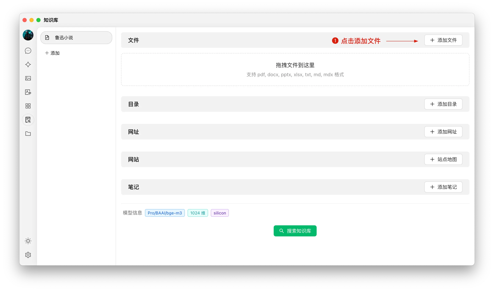


Этот документ переведен с китайского языка с помощью ИИ и еще не был проверен.


# Руководство по Базе Знаний

В версии 0.9.1 CherryStudio представил долгожданную функцию базы знаний.

Ниже пошагово представлено подробное руководство по использованию CherryStudio.

## Добавление модели встраивания

1. Найдите модель в сервисе управления моделями, используя фильтр "Модели встраивания" для быстрого поиска;
2. Выберите нужную модель и добавьте её в "Мои модели".

<figure><figcaption></figcaption></figure>

## Создание базы знаний

1. Доступ к базе знаний: В левой панели инструментов CherryStudio нажмите значок базы знаний, чтобы перейти на страницу управления;
2. Добавление базы знаний: Нажмите "Добавить", чтобы начать создание базы знаний;
3. Наименование: Введите название базы знаний и добавьте модель встраивания (например, bge-m3), чтобы завершить создание.

<figure><figcaption></figcaption></figure>

<figure><figcaption></figcaption></figure>

## Добавление файлов и их векторизация

1. Добавление файлов: Нажмите кнопку "Добавить файлы" для выбора файлов;
2. Выбор файлов: Выберите поддерживаемые форматы (pdf, docx, pptx, xlsx, txt, md, mdx и др.) и откройте их;
3. Векторизация: Система автоматически выполнит векторизацию. При появлении зелёной галочки (✓) процесс завершён.

<figure><figcaption></figcaption></figure>

<figure><figcaption></figcaption></figure>

<figure><figcaption></figcaption></figure>

## Добавление данных из различных источников

CherryStudio поддерживает несколько способов добавления данных:

1. Папка каталога: Добавьте целую папку — поддерживаемые файлы автоматически векторизуются;
2. Веб-ссылка: Поддерживает URL-адреса, например [https://docs.siliconflow.cn/introduction](https://docs.siliconflow.cn/introduction);
3. Карта сайта: Поддерживает XML-карты сайта, например [https://docs.siliconflow.cn/sitemap.xml](https://docs.siliconflow.cn/sitemap.xml);
4. Простой текст: Поддерживает ввод пользовательского текста.


**Примечания:**

1. Изображения в документах, импортированных в базу знаний, пока не поддерживают автоматическую векторизацию — их нужно вручную преобразовывать в текст;
2. Использование веб-ссылок как источников не всегда успешно: некоторые сайты имеют строгие защитные механизмы (или требуют авторизации). После создания проверьте поиском;
3. Большинство сайтов предоставляют карту сайта (sitemap), например карта CherryStudio: [sitemap](https://docs.cherry-ai.com/sitemap-pages.xml). Обычно доступна по адресу `домен/sitemap.xml`;
4. Если сайт не предоставляет sitemap, создайте XML-файл самостоятельно. Используйте публично доступные прямые ссылки (локальные файлы не поддерживаются).

> 1) Используйте ИИ для генерации sitemap или создания инструмента-генератора;
> 2) Для прямых ссылок используйте OSS или облачные хранилища. Можно воспользоваться бесплатным инструментом загрузки на [ocoolAI](https://one.ocoolai.com/login).


## Поиск в базе знаний

После завершения векторизации можно выполнять запросы:

1. Нажмите кнопку "Поиск в базе знаний" внизу страницы;
2. Введите запрос;
3. Просмотрите результаты;
4. Оценка релевантности отображается для каждого результата.

<figure><figcaption></figcaption></figure>

<figure><figcaption></figcaption></figure>

## Использование базы знаний в диалогах

1. Создайте новый диалог. В панели инструментов нажмите "База знаний" → выберите нужную базу;
2. Введите вопрос — модель сгенерирует ответ на основе полученных данных;
3. Источники данных отображаются под ответом для быстрого просмотра.

<figure><figcaption></figcaption></figure>

<figure><figcaption></figcaption></figure>