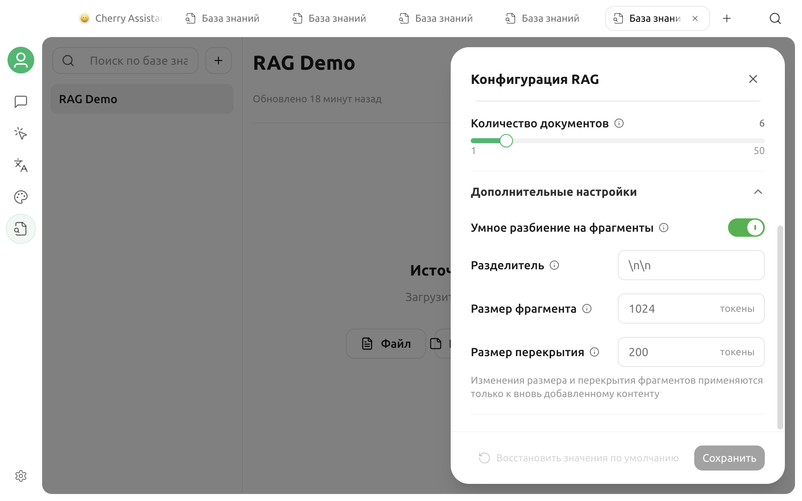

# Предварительная обработка документов

Предварительная обработка до разделения и векторизации преобразует документы PDF, Word, таблицы и другие файлы в текст Markdown, более подходящий для поиска. Она предназначена главным образом для сканов, сложного оформления, таблиц и многоколоночных документов.

Если документ уже содержит чёткий текстовый слой, обычно достаточно встроенного чтения Cherry Studio. Не включайте сетевой обработчик по умолчанию для всех файлов только потому, что он кажется «более продвинутым»: сначала сравните реальные результаты на небольшом объёме материалов.

## Процесс обработки

Если обработчик документов не выбран:

1. Cherry Studio напрямую читает поддерживаемый файл.
2. Извлекает и разделяет текст.
3. Вызывает модель Embedding для создания индекса.

Если обработчик документов выбран:

1. Cherry Studio передаёт документ выбранному обработчику.
2. Обработчик выводит Markdown.
3. Приложение управляет Markdown как результатом обработки.
4. Cherry Studio разделяет результат и создаёт индекс.


Обработчик документов «преобразует файл в доступный для поиска текст», модель Embedding «преобразует текст в векторы», а модель чата «отвечает на основе извлечённых фрагментов». Это разные этапы.


## Какие документы нуждаются в предварительной обработке

Использование обработчика документов прежде всего следует рассмотреть в следующих случаях:

* сканированный PDF не содержит копируемого текста
* PDF содержит сложные таблицы, многоколоночное оформление или много формул
* встроенный разбор Word, Excel или другого файла создаёт беспорядочную структуру
* важные сведения находятся в изображении или оформлении страницы
* извлечённые фрагменты содержат нечитаемые символы, неправильный порядок или крупные пропуски

Обычно дополнительная обработка не требуется в следующих случаях:

* текстовые файлы с чёткой структурой: обычный текст, Markdown, CSV
* PDF с полным текстовым слоем и простым оформлением
* предпросмотр и проверка извлечения после встроенного разбора уже работают правильно

Предварительная обработка не решает все проблемы автоматически. Рукописный текст, сканы с низким разрешением, сложные формулы и вложенные таблицы всё равно могут распознаваться неправильно.

## Возможности обработки в V2

Обработка файлов Cherry Studio делится на две категории:

| Возможность | Входные данные | Результат | Связь с базой знаний |
| --- | --- | --- | --- |
| Преобразование документа в Markdown | Файл документа | Markdown | Можно выбрать в настройках RAG базы знаний |
| Преобразование изображения в текст | Изображение | Текст | Для других сценариев OCR изображений; не равно обработке документов базы знаний |

В текущем интерфейсе добавления материалов в базу знаний изображение не является отдельным источником данных. Для обработки PDF или Office-документа с изображениями выберите обработчик с возможностью **Преобразование документа в Markdown**.

## Доступные обработчики документов

В текущей версии V2 `main` для базы знаний можно выбрать следующие обработчики преобразования документов в Markdown:

| Обработчик | Способ развёртывания | Обычные параметры |
| --- | --- | --- |
| Mistral OCR | Сетевой API | API Key, API Host, модель |
| MinerU | Сетевой API | API Key, API Host |
| Doc2X | Сетевой API | API Key, API Host |
| Open MinerU | Самостоятельно размещённая служба | Локальный API Host или адрес локальной сети |
| PaddleOCR | Служба API или самостоятельное размещение | API Key, API Host, модель разбора |

Фактически доступные варианты зависят от текущей системы и версии приложения. Адреса провайдеров, модели и способы регистрации могут меняться, поэтому ориентируйтесь на актуальный интерфейс **Настройки → Обработка документов**.


Сетевые обработчики обычно требуют загрузки исходного файла. Перед импортом договоров, внутренних материалов или личных данных проверьте политику провайдера, регион развёртывания и механизм удаления. Для конфиденциальных материалов отдавайте предпочтение локальному или самостоятельно размещённому обработчику.


## Настройка обработчика документов

1. Откройте **Настройки → Обработка документов**.
2. Выберите слева обработчик с поддержкой преобразования документов в Markdown.
3. Введите API Key в соответствии с требованиями обработчика.
4. Проверьте API Host; для самостоятельно размещённой службы укажите фактически доступный адрес.
5. Если в интерфейсе можно выбрать модель, укажите модель, развёрнутую на сервере.
6. Нажмите **Использовать по умолчанию**, чтобы сделать её обработчиком по умолчанию для обычных документов.

Поле API Key поддерживает управление несколькими ключами. При настройке не добавляйте ключи в документы, снимки экрана или журналы обратной связи.

### Сетевые обработчики

Для сетевого обработчика необходимо:

* действующий API Key и нормальное состояние учётной записи
* соответствие API Host региону учётной записи
* сетевой доступ к службе
* поддержка разбора документов текущей моделью
* соответствие размера и формата файла ограничениям провайдера

### Open MinerU

Open MinerU служит для подключения к самостоятельно развёрнутой службе MinerU. Адрес по умолчанию подходит только для локального тестирования. Если служба работает в контейнере, на удалённом компьютере или другом порте, укажите полный адрес, доступный с устройства Cherry Studio.

### PaddleOCR

Для PaddleOCR можно настроить модель разбора. Имя модели должно совпадать с развёрнутым на сервере. Готовый вариант в интерфейсе приложения не означает, что соответствующая модель обязательно установлена на вашем сервере.

## OCR изображений и обработка документов базы знаний

На странице настроек также могут отображаться обработчики преобразования изображений в текст: системный OCR, Tesseract, PaddleOCR, Mistral, OpenVINO OCR и другие.

* системный OCR отображается только на поддерживаемых платформах
* в Tesseract можно настроить язык распознавания
* OpenVINO OCR отображается, только когда среда выполнения соответствует требованиям
* PaddleOCR и Mistral могут поддерживать и изображения, и документы

Эти настройки OCR изображений не заменяют автоматически выбор преобразования документов в Markdown для базы знаний. При обработке PDF, DOCX, XLSX и других документов выберите обработчик документов в настройках RAG соответствующей базы знаний.

## Включение в базе знаний

1. Откройте нужную базу знаний.
2. Нажмите **Настройки RAG** в верхней части.
3. Выберите настроенный обработчик документов в поле **Обработчик файлов**.
4. Сохраните настройки.
5. Добавьте тестовый документ и дождитесь состояния «Завершено».

При создании новой базы знаний обработчик файлов по умолчанию можно не выбирать. Только после выбора обработчика поддерживаемые файлы документов проходят процесс преобразования в Markdown.


Смена обработчика файлов не перезаписывает автоматически уже готовые материалы. Чтобы обработать старые материалы новым обработчиком, выполните повторное индексирование соответствующего источника данных.


## Проверка результатов обработки

Не ориентируйтесь только на состояние «Завершено». Выполните как минимум три следующих шага.

### 1. Предпросмотр источника

Выберите **Предпросмотр источника** в дополнительном меню строки источника данных и проверьте:

* правильный ли порядок заголовков и абзацев
* сохранена ли связь строк и столбцов таблицы
* не создают ли верхние и нижние колонтитулы страниц слишком много шума
* распознаны ли важные числа, имена собственные и формулы
* нет ли пропущенных страниц, пустых мест или нечитаемых символов

### 2. Просмотр фрагментов

Откройте подробные сведения о фрагментах и проверьте, разделяется ли содержимое в разумных местах. Даже полный результат разбора может плохо искаться при неудачном разделении.

### 3. Проверка извлечения

Проверьте извлечение с помощью вопросов, ответ на которые действительно есть в документе:

* конкретные значения в таблицах
* сведения из нескольких абзацев
* имена собственные и номера
* символы, которые OCR легко путает

Если правильный текст не извлечён, сначала смените обработчик или улучшите исходный файл. Если текст правильный, а поиск работает плохо, измените параметры разделения и поиска.

## Как сравнить обработчики

Выберите 3–5 характерных документов и выполните одинаковую проверку для каждого кандидата.

| Критерий | Что нужно проверить |
| --- | --- |
| Полнота | Нет ли пропущенных страниц, абзацев или таблиц |
| Порядок | Правилен ли порядок многоколоночного текста и номеров страниц |
| Точность | Правильно ли распознаны числа, символы и имена собственные |
| Структура | Сохранились ли заголовки, списки и таблицы |
| Скорость | Время обработки одного документа и пакета |
| Стабильность | Нет ли частых тайм-аутов или ошибок |
| Конфиденциальность и стоимость | Загружается ли исходный текст и как рассчитывается стоимость |

Один обработчик может по-разному работать с разными типами документов. Для договоров, статей, отчётов и сканированных чеков не обязательно использовать одну конфигурацию.

## Частые вопросы

### В базе знаний нет параметра обработчика файлов

Убедитесь, что открыты настройки RAG в верхней части базы знаний, и проверьте версию приложения. В базе знаний перечисляются только обработчики преобразования документов в Markdown, а обработчики только с OCR изображений не отображаются.

### Обработка документа всё время находится в ожидании

Удалённый обработчик может использовать фоновую задачу. Оставьте приложение запущенным и проверьте сеть и состояние задачи у провайдера. После тайм-аута для материала отображается ошибка; исправьте конфигурацию и выполните повторное индексирование.

### Отображается ошибка API Key или Host

Проверьте, нет ли в ключе лишних пробелов, содержит ли Host правильный протокол, совпадает ли регион учётной записи и доступна ли самостоятельно размещённая служба с текущего устройства.

### Сканированный PDF после обработки остаётся пустым

Убедитесь, что выбран обработчик преобразования документов в Markdown, а не обработчик только с возможностью преобразования изображения в текст. Также проверьте разрешение скана, ориентацию страницы и поддерживаемые провайдером языки.

### Таблица разобрана неправильно

Сначала проверьте в предпросмотре источника, что проблема относится к обработке документа, а не к разделению. Можно выбрать обработчик, который лучше работает со сложным оформлением, или заранее экспортировать важную таблицу в файл с более простой структурой.

### После смены обработчика результат не изменился

Изменение обработчика влияет только на дальнейшую обработку. Выполните повторное индексирование существующего источника данных и дождитесь завершения новой задачи.

### Обычный Markdown тоже отправляется сетевому обработчику

База знаний запускает предварительную обработку только для файлов, распознанных как документы, если в базе выбран обработчик. Текст и файлы Markdown напрямую переходят к чтению и индексированию.

## Конфиденциальность и стоимость

При сетевой обработке документов может взиматься плата за загрузку, разбор и хранение. После обработки продолжает вызываться модель Embedding; если включены Rerank и сетевая модель чата, последующие поиск и ответы также могут привести к расходам.

Полный поток данных и рекомендации по резервному копированию приведены в разделе [Данные базы знаний](data.md).

***

### Получение помощи и отправка отзывов

Если при обработке документов, OCR или индексировании базы знаний возникла проблема, свяжитесь с сообществом по информации на странице [обратной связи и предложений](../question-contact/suggestions.md).
