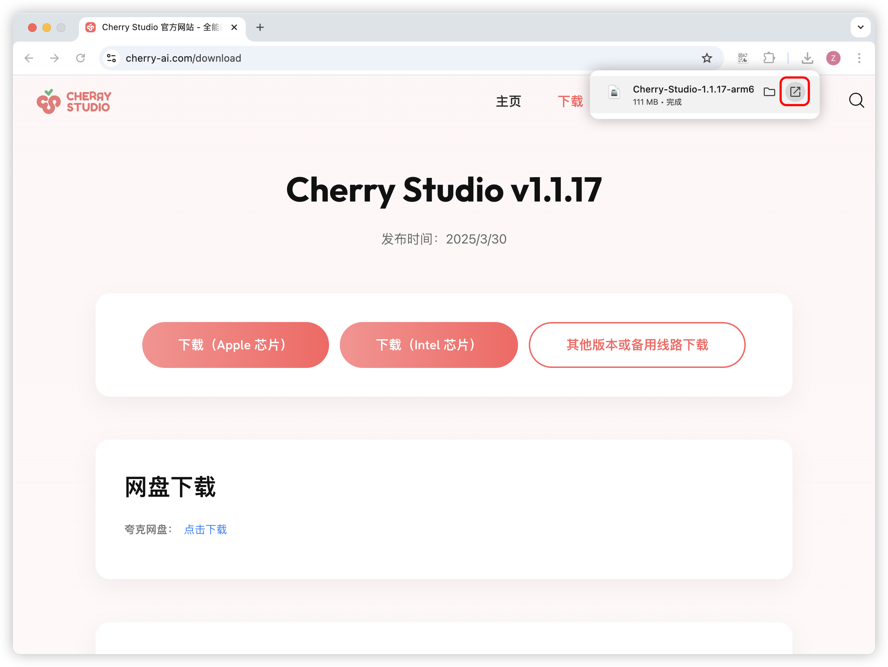

# macOS


Этот документ переведен с китайского языка с помощью ИИ и еще не был проверен.


1. Сначала перейдите на официальный сайт на страницу загрузки и скачайте версию для Mac, либо воспользуйтесь прямой ссылкой ниже:

Обратите внимание: скачайте **версию, соответствующую чипу вашего Mac**  

Если вы не знаете, какую версию чипа следует использовать для вашего Mac:

* Нажмите на меню  в верхнем левом углу экрана Mac
* В раскрывшемся меню выберите "Об этом Mac"
* В открывшемся окне проверьте информацию о процессоре

Если указан процессор Intel — скачайте версию для Intel  
Если указан процессор Apple M* — скачайте версию для чипов Apple  




2. После загрузки нажмите здесь

<figure><figcaption></figcaption></figure>

3. Перетащите значок для установки

<figure><figcaption></figcaption></figure>

Найдите значок Cherry Studio в Launchpad и нажмите на него. Если откроется главный интерфейс Cherry Studio — установка прошла успешно.

<figure><figcaption></figcaption></figure>