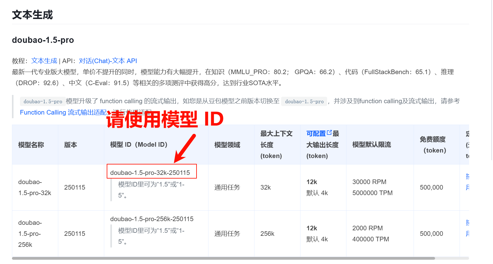


Этот документ переведен с китайского языка с помощью ИИ и еще не был проверен.


# ByteDance (Doubao)

* Войдите в [Volcano Engine](https://console.volcengine.com/)
* Нажмите [здесь для прямого перехода](https://console.volcengine.com/ark/region:ark+cn-beijing/openManagement?LLM=%7B%7D)

<figure><figcaption></figcaption></figure>

### Получение API Key

* Нажмите [Управление API Key](https://console.volcengine.com/ark/region:ark+cn-beijing/apiKey) в нижней части боковой панели
* Создайте API Key

<figure><figcaption></figcaption></figure>

* После успешного создания нажмите значок глаза рядом с созданным API Key для отображения и копирования

<figure><figcaption></figcaption></figure>

* Вставьте скопированный API Key в CherryStudio и включите переключатель провайдера услуг

<figure><figcaption></figcaption></figure>

### Активация и добавление моделей

* Активируйте нужные модели в разделе [Управление активацией](https://console.volcengine.com/ark/region:ark+cn-beijing/openManagement?LLM=%7B%7D\&OpenTokenDrawer=false) внизу боковой панели Ark Console. Здесь можно активировать серии Doubao, DeepSeek и другие модели по необходимости.

<figure><figcaption></figcaption></figure>

* В [документе списка моделей](https://www.volcengine.com/docs/82379/1330310#%E6%96%87%E6%9C%AC%E7%94%9F%E6%88%90) найдите соответствующий ID модели для нужной модели.

<figure><figcaption></figcaption></figure>

* В настройках Cherry Studio в разделе [Модели и сервисы](../../cherrystudio/preview/settings/providers.md) найдите Volcano Engine
* Нажмите "Добавить" и вставьте полученный ID модели в текстовое поле ID модели

<figure><figcaption></figcaption></figure>

* Повторите этот процесс для добавления моделей

### Адрес API

API адрес можно указать двумя способами

* Первый способ (по умолчанию в клиенте): `https://ark.cn-beijing.volces.com/api/v3/`
* Второй способ: `https://ark.cn-beijing.volces.com/api/v3/chat/completions#`


Оба варианта не имеют существенных различий, можно оставить значение по умолчанию без изменений.

Разницу между окончаниями `/` и `#` см. в разделе настройки API адреса провайдера услуг: [перейти к разделу](../../cherrystudio/preview/settings/providers.md#api-di-zhi)


<figure><figcaption>
Пример cURL из официальной документации
</figcaption></figure>