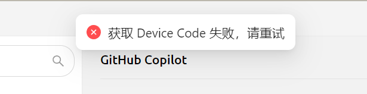


Этот документ переведен с китайского языка с помощью ИИ и еще не был проверен.


# GitHub Copilot

Чтобы использовать GitHub Copilot, сначала у вас должна быть учётная запись GitHub и подписка на GitHub Copilot. Доступна и бесплатная версия подписки, но она не поддерживает последнюю модель Claude 3.7. Подробности см. на [официальном сайте GitHub Copilot](https://github.com/features/copilot).

## Получение Device Code

Нажмите «Войти в GitHub», чтобы получить Device Code и скопировать его.

<figure><figcaption>
Получение Device Code
</figcaption></figure>

## Ввод Device Code в браузере и авторизация

После получения Device Code нажмите на ссылку, чтобы открыть браузер, войдите в учётную запись GitHub, введите Device Code и предоставьте разрешение.

<figure><figcaption>
Авторизация GitHub
</figcaption></figure>

После успешной авторизации вернитесь в Cherry Studio и нажмите «Подключить GitHub». После подключения отобразятся ваше имя пользователя и аватар GitHub.

<figure><figcaption>
Успешное подключение GitHub
</figcaption></figure>

## Получение списка моделей через «Управление»

Нажмите кнопку «Управление» внизу, чтобы автоматически получить список поддерживаемых моделей.

<figure><figcaption>
Получение списка моделей
</figcaption></figure>

## Часто задаваемые вопросы

### Не удалось получить Device Code, попробуйте снова

<figure><figcaption>
Ошибка получения Device Code
</figcaption></figure>

Сейчас для запросов используется Axios, который не поддерживает SOCKS-прокси. Используйте системный прокси или HTTP-прокси, либо вообще не настраивайте прокси в CherryStudio, а используйте глобальный прокси. Прежде всего убедитесь, что ваше интернет-соединение работает нормально, чтобы избежать ошибок при получении Device Code.