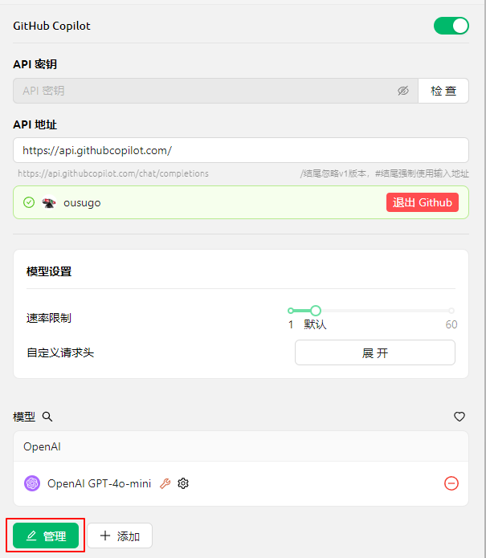

# GitHub Copilot


Этот документ переведен с китайского языка с помощью ИИ и еще не был проверен.


Для использования GitHub Copilot сначала необходимо иметь учетную запись GitHub и подписаться на сервис GitHub Copilot. Доступна бесплатная версия подписки (free), но она не поддерживает новейшую модель Claude 3.7. Подробности смотрите на [официальном сайте GitHub Copilot](https://github.com/features/copilot).

## Получение Device Code

Нажмите «Войти в GitHub», чтобы получить и скопировать Device Code.

<figure><figcaption>
Получение Device Code
</figcaption></figure>

## Ввод Device Code в браузере и авторизация

После успешного получения Device Code перейдите по ссылке в браузере, войдите в учетную запись GitHub, введите Device Code и предоставьте разрешение.

<figure><figcaption>
Авторизация GitHub
</figcaption></figure>

После успешной авторизации вернитесь в Cherry Studio, нажмите «Подключить GitHub». После подключения отобразятся ваше имя пользователя и аватар GitHub.

<figure><figcaption>
Подключение GitHub успешно
</figcaption></figure>

## Получение списка моделей через кнопку «Управление»

Нажмите кнопку «Управление» ниже, чтобы автоматически загрузить список поддерживаемых моделей.

<figure><figcaption>
Получение списка моделей
</figcaption></figure>

## Часто задаваемые вопросы

### Ошибка получения Device Code, повторите попытку

<figure><figcaption>
Ошибка получения Device Code
</figcaption></figure>

В текущей реализации запросы выполняются через Axios, который не поддерживает socks-прокси. Используйте системный прокси, HTTP-прокси или настройте глобальный прокси вне CherryStudio. Убедитесь в стабильности сетевого соединения, чтобы избежать сбоев при получении Device Code.