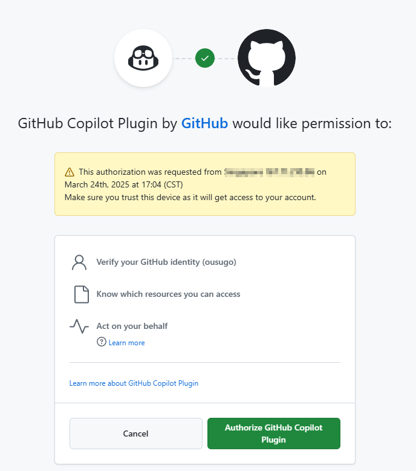


Этот документ переведен с китайского языка с помощью ИИ и еще не был проверен.


# GitHub Copilot

Для использования GitHub Copilot необходимо иметь учётную запись GitHub и подписку на сервис GitHub Copilot. Подойдёт и бесплатная версия подписки (free), однако она не поддерживает новейшую модель Claude 3.7. Подробности смотрите на [официальном сайте GitHub Copilot](https://github.com/features/copilot).

## Получение Device Code

Нажмите «Войти в GitHub», чтобы получить Device Code и скопируйте его.

<figure><figcaption>
Получение Device Code
</figcaption></figure>

## Ввод Device Code и авторизация в браузере

После успешного получения Device Code перейдите по ссылке в браузере, войдите в учётную запись GitHub, введите Device Code и подтвердите доступ.

<figure><figcaption>
Авторизация GitHub
</figcaption></figure>

После успешной авторизации вернитесь в Cherry Studio, нажмите «Подключить GitHub». При успешном подключении отобразятся имя пользователя и аватар GitHub.

<figure><figcaption>
Успешное подключение GitHub
</figcaption></figure>

## Получение списка моделей через кнопку «Управление»

Нажмите кнопку «Управление» внизу экрана — автоматически загрузится список поддерживаемых моделей.

<figure><figcaption>
Получение списка моделей
</figcaption></figure>

## Часто задаваемые вопросы

### Не удалось получить Device Code, повторите попытку

<figure><figcaption>
Ошибка получения Device Code
</figcaption></figure>

В настоящее время для отправки запросов используется Axios, который не поддерживает socks-прокси. Рекомендуем использовать системный прокси или HTTP-прокси. Либо отключите настройки прокси в Cherry Studio и используйте глобальный прокси. Убедитесь, что ваше сетевое соединение стабильно, чтобы избежать ошибок при получении Device Code.