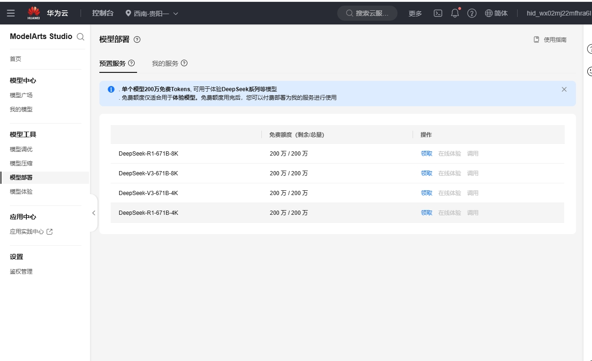

# Облако Huawei


Этот документ переведен с китайского языка с помощью ИИ и еще не был проверен.


一、Перейдите на [Huawei Cloud](https://auth.huaweicloud.com/authui/login) для создания учётной записи и входа

二、Нажмите [эту ссылку](https://console.huaweicloud.com/modelarts/?region=cn-southwest-2#/model-studio/homepage), чтобы перейти в консоль Maa S

三、Авторизация

Шаги авторизации (если уже авторизованы, пропустите)

1.  После перехода по ссылке из шага (二) следуйте инструкциям на странице авторизации (нажмите IAM-подпользователь → Новая доверенность → Обычный пользователь)

.png>)

2.  После создания вернитесь по ссылке из шага (二)
3.  При появлении сообщения "Недостаточно прав доступа" нажмите "Нажмите здесь" в уведомлении
4.  Добавьте существующую авторизацию и подтвердите

.png>)

Примечание: Этот метод подходит для новичков — не требует глубокого изучения, просто следуйте подсказкам. Если получилось авторизоваться с первого раза, действуйте своим способом.

四、В боковой панели выберите "Управление аутентификацией", создайте API Key (секретный ключ) и скопируйте его

<figure><figcaption></figcaption></figure>

Затем в CherryStudio создайте нового поставщика услуг

<figure><figcaption></figcaption></figure>

После создания вставьте скопированный секретный ключ

五、В боковой панели выберите "Развертывание моделей", активируйте все доступные ресурсы

<figure><figcaption></figcaption></figure>

六、Нажмите "Вызов"

<figure><figcaption></figcaption></figure>

Скопируйте адрес в позиции ①, вставьте в поле адреса поставщика услуг CherryStudio и добавьте символ "#" в конец

и добавьте символ "#" в конец

и добавьте символ "#" в конец

и добавьте символ "#" в конец

и добавьте символ "#" в конец

Зачем добавлять "#"? [Смотрите здесь](https://docs.cherry-ai.com/cherrystudio/preview/settings/providers#api-di-zhi)

> Конечно, можно не читать и просто следовать инструкции;
> 
> Либо использовать метод удаления v1/chat/completions при заполнении. Если понимаете процесс — делайте как удобно, если нет — строго следуйте руководству.

<figure><figcaption></figcaption></figure>

Затем скопируйте название модели в позиции ② и в CherryStudio нажмите "+Добавить" для создания новой модели

<figure><figcaption></figcaption></figure>

Введите точное название модели без добавлений, без кавычек — скопируйте как в примере.

<figure><figcaption></figcaption></figure>

Нажмите "Добавить модель" для завершения.


В Huawei Cloud каждый модель имеет уникальный адрес, поэтому для каждой модели нужно создавать отдельного поставщика услуг, повторяя указанные шаги.
