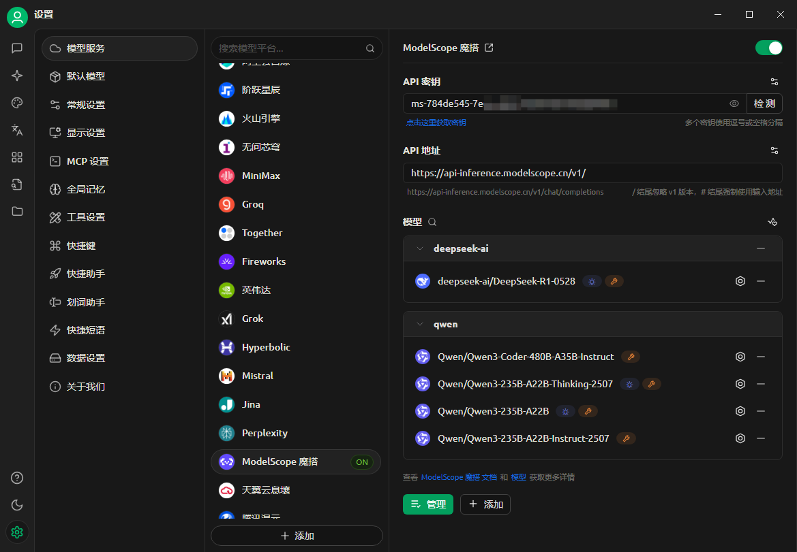

# Руководство по подключению к платформе ModelScope (MоDa)


Этот документ переведен с китайского языка с помощью ИИ и еще не был проверен.


## Что такое ModelScope?
> ModelScope — это платформа совместного использования моделей как услуги (MaaS) нового поколения с открытым исходным кодом, которая стремится предоставить разработчикам в области ИИ **гибкое, простое в использовании и недорогое** комплексное решение для обслуживания моделей, делая применение моделей более простым!
>
> Благодаря **возможностям сервиса API-Inference** платформа стандартизирует модели с открытым исходным кодом в виде вызываемых API-интерфейсов, позволяя разработчикам легко и быстро интегрировать возможности моделей в различные ИИ-приложения, поддерживая такие инновационные сценарии, как вызов инструментов, разработка прототипов и т.д.

### Ключевые преимущества
- ✅ **Бесплатная квота**: ежедневно предоставляется **2000 бесплатных вызовов API** ([Правила тарификации](##计费与额度规则))
- ✅ **Обширная библиотека моделей**: охватывает 1000+ моделей с открытым исходным кодом, включая NLP, CV, распознавание речи, мультимодальные и т.д.
- ✅ **Работает сразу**: не требует развертывания, быстро вызывается через RESTful API

---

## Процесс подключения Cherry Studio
### Шаг 1: Получение токена API ModelScope
1. **Вход на платформу**
   - Перейдите на [официальный сайт ModelScope](https://modelscope.cn) → нажмите **Вход** в правом верхнем углу → выберите способ аутентификации
   
2. **Создание токена доступа**
   - Перейдите в раздел **[Настройки аккаунта → Токены доступа](https://modelscope.cn/my/myaccesstoken)**
   - Нажмите **`Создать токен`** → заполните описание → **скопируйте сгенерированный токен** (*пример страницы см. на рисунке ниже*)
   
   > 🔑 **Важно**: утечка токена может повлиять на безопасность аккаунта!

### Шаг 2: Настройка Cherry Studio
- Откройте **Cherry Studio** → **Настройки → Модельные сервисы → ModelScope**
- В поле `API ключ` вставьте скопированный токен
  
- Нажмите **`Сохранить`** для завершения авторизации

### Шаг 3: Вызов API модели
1. **Поиск моделей с поддержкой API**
   - Перейдите в [Библиотеку моделей ModelScope](https://modelscope.cn/models)
   - Условия фильтрации: **отметьте галочкой `API-Inference`** (или ищите значок `API` на карточке модели)
   
   > Набор моделей, охватываемых API-Inference, в основном определяется популярностью модели в сообществе ModelScope (учитываются такие данные, как лайки, загрузки и т.д.). Поэтому с выпуском нового поколения моделей с открытым исходным кодом, обладающих большими возможностями и повышенным вниманием, список поддерживаемых моделей будет постоянно обновляться.
2. **Получение ID модели**
   - Перейдите на страницу сведений о целевой модели → скопируйте **Model ID** (в формате, например, `damo/nlp_structbert_sentiment-classification_chinese-base`)
   
3. **Ввод в Cherry Studio**
   - Введите ID в поле `ID модели` на странице настройки модельного сервиса → выберите тип задачи → завершите настройку
   

---

## Правила тарификации и квот
### Важные примечания
- 🎫 **Бесплатная квота**: каждый пользователь получает **2000 вызовов API в день** (*согласно последним правилам на официальном сайте)
- 🔁 **Сброс квоты**: автоматический сброс каждый день в 00:00 по UTC+8, **накопление или перенос на следующий день не поддерживаются**
- 💡 **Обработка превышения квоты**:
  - После достижения дневного лимита API вернет ошибку `429`
  - Решение: переключиться на резервный аккаунт / использовать другую платформу / оптимизировать частоту вызовов

### Просмотр остатка квоты
- Войдите в ModelScope → нажмите на **`имя пользователя`** в правом верхнем углу → выберите **`Использование API`**
  

> ⚠️ Примечание: бесплатная квота для API-Inference составляет 2000 вызовов в день. Для большего количества вызовов рассмотрите использование облачных сервисов, таких как Alibaba Cloud Bailian.