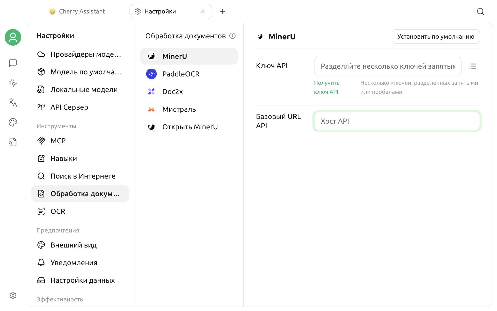

# Обработка документов

В Cherry Studio V2 есть две отдельные страницы обработки файлов: **OCR** преобразует изображения в обычный текст, а **Обработка документов** преобразует PDF и другие документы в Markdown для последующего поиска, анализа и индексации в базе знаний.

Cherry Studio V2 разделяет возможности обработки на две категории:

| Возможность | Входные данные | Выходные данные | Типичное использование |
| --- | --- | --- | --- |
| Изображение в текст (OCR) | Файл изображения | Чистый текст | Извлечение текста из скриншотов, отсканированных изображений |
| Документ в Markdown | Файл документа | Markdown и связанные ресурсы | Сохранение структуры заголовков, параграфов, таблиц и т. д. для дальнейшей обработки в базе знаний |

Для каждого пункта выбирается отдельный обработчик по умолчанию. Если одна служба поддерживает обе возможности, она отображается на страницах **OCR** и **Обработка документов**, а конфигурация и состояние по умолчанию управляются отдельно.

## Открытие настроек OCR и обработки документов

- Для преобразования изображений в текст откройте **Настройки > OCR**.
- Для преобразования документов в Markdown откройте **Настройки > Обработка документов**.

На странице **Обработка документов** текущий интерфейс показывает слева MinerU, PaddleOCR, Doc2x, Mistral и Open MinerU именно в таком порядке. На странице **OCR** отображаются обработчики изображений, доступные на текущем устройстве.

Обработчики OCR фильтруются в зависимости от платформы и среды выполнения. Если список отличается от данного текста, руководствуйтесь фактическим отображением в приложении.


В V2 по умолчанию не устанавливается обработчик для изображений или документов. После завершения настройки необходимо нажать **Установить по умолчанию** для соответствующей возможности; простое заполнение ключа API не установит его по умолчанию.


## Сравнение возможностей обработчиков

### Изображение в текст

| Обработчик | Место выполнения | Учётные данные | Область применения |
| --- | --- | --- | --- |
| System OCR | Локально | Нет | macOS и Windows; прямое использование системного OCR |
| Tesseract OCR | Локально | Нет | macOS, Windows, Linux; выбор языкового пакета |
| PaddleOCR | API или собственное развёртывание | API Key | OCR изображений; выбор модели парсинга PaddleOCR |
| Mistral | Mistral API | API Key | Изображение в текст |
| Intel OV OCR | Локально | Нет | Отображается только на устройствах Windows с Intel Core Ultra при выполнении условий |

System OCR не поддерживает Linux. Intel OV OCR также требует, чтобы приложение обнаружило необходимые локальные скрипты для запуска, поэтому он может быть недоступен на всех устройствах Intel.

### Документ в Markdown

| Обработчик | Адрес API по умолчанию | Учётные данные | Описание |
| --- | --- | --- | --- |
| MinerU | `https://mineru.net` | API Key | Отправка задач на удалённый парсинг и опрос результатов |
| PaddleOCR | `https://paddleocr.aistudio-app.com/` | API Key | Поддерживает парсинг документов; также можно изменить на адрес собственного развёртывания |
| Doc2x | `https://v2.doc2x.noedgeai.com` | API Key | Отправка задач на удалённый парсинг и экспорт |
| Mistral | `https://api.mistral.ai` | API Key | Использование OCR Mistral для парсинга документов |
| Open MinerU | `http://127.0.0.1:8000` | Опционально | Подключение к совместимой с MinerU службе, развёрнутой локально |

Адреса в таблице являются текущими значениями по умолчанию. При изменении интерфейсов поставщиков услуг, создании обратного прокси или при частном развёртывании **адрес API (Base URL)** может быть изменён в интерфейсе.


Удалённые обработчики отправляют файлы для обработки соответствующей службе. Перед обработкой контрактов, клиентских данных или других конфиденциальных файлов, пожалуйста, подтвердите политику обработки, хранения и соответствия требованиям данных поставщика услуг. Если вы хотите, чтобы файлы оставались локально, выберите доступный локальный обработчик или надёжную службу собственного развёртывания.


## Настройка локального OCR

### System OCR

System OCR отображается только в macOS и Windows. После выбора на странице появится сообщение о доступности системного OCR, и не потребуется вводить API Key или адрес.

- В macOS используется встроенная функция OCR системы, языковой выборщик не отображается.
- В Windows можно выбрать язык распознавания в **Языке**; необходимый язык должен быть поддерживаем операционной системой.

После нажатия **Установить по умолчанию** System OCR станет обработчиком по умолчанию для преобразования изображения в текст.

### Tesseract OCR

Tesseract доступен на трех настольных платформах и работает локально.

Выберите один или несколько языков распознавания в **Языке**. Если язык не выбран, текущая версия использует комбинацию упрощенного китайского, традиционного китайского и английского как языки по умолчанию.

Чем больше языков, тем точнее не всегда, а также это может увеличить время обработки. Обычно лучше выбирать только те языки, которые фактически присутствуют на изображении.

### Intel OV OCR

Intel OV OCR появляется только при одновременном выполнении следующих условий:

- Операционная система Windows;
- Модель CPU содержит Intel и Ultra;
- В установленном приложении присутствует необходимый скрипт для запуска OV OCR.

Это не универсальный вариант «доступно на всех видеокартах Intel». Если его нет в списке, это означает, что текущая среда не прошла проверку доступности.

## Настройка обработчиков API

PaddleOCR, Mistral, MinerU и Doc2x требуют API Key; для Open MinerU ключ опционален и зависит от вашего бэкенда.

### Ввод ключа API

Вы можете ввести один или несколько ключей непосредственно в поле **Ключ API (API Key)**, разделяя их запятыми. Вы также можете нажать кнопку списка справа от поля ввода, чтобы добавлять, редактировать, копировать или удалять ключи по отдельности.

При сохранении автоматически произойдёт:

- Удаление пробелов в начале и конце;
- Игнорирование пустых значений;
- Объединение повторяющихся ключей.

После настройки нескольких ключей при запуске новых задач этим обработчиком ключи будут последовательно чередоваться. Возможности обработки изображений и документов используют общий список ключей этого обработчика.

Не раскрывайте полные ключи в скриншотах, отзывах об ошибках или при обмене конфигурацией.

### Изменение адреса API

**Адрес API (Base URL)** проверяется и сохраняется при потере фокуса поля ввода. Если адрес недействителен, на странице появится предупреждение, и значение не будет применено.

При использовании адресов собственного развёртывания или прокси:

1. Убедитесь, что сервис реализует интерфейсы, необходимые соответствующему обработчику, а не обычный OpenAI-совместимый интерфейс чата.
2. Сохраните правильный протокол `http://` или `https://`.
3. Убедитесь, что устройство Cherry Studio может получить доступ к этому адресу.
4. Если адрес указывает на локальную сеть, проверьте брандмауэр, порты и сертификаты.

### Выбор модели PaddleOCR

PaddleOCR показывает разные списки моделей для каждого раздела:

- **OCR:** `PP-OCRv6` и `PP-OCRv5`; встроенное значение по умолчанию — `PP-OCRv6`.
- **Обработка документов:** `PaddleOCR-VL-1.5`, `PaddleOCR-VL-1.6`, `PaddleOCR-VL` и `PP-StructureV3`; встроенное значение по умолчанию — `PaddleOCR-VL-1.5`.

Выбранная модель должна поддерживаться целевым сервисом PaddleOCR; доступные модели для собственного развёртывания могут отличаться от облачных.

Для справки по самостоятельному развёртыванию на странице есть ссылка на [проект PaddleOCR](https://github.com/PaddlePaddle/PaddleOCR). Cherry Studio не устанавливает и не обслуживает сервер вместо пользователя.

## Настройка двух отдельных обработчиков по умолчанию

Значения по умолчанию для «Изображение в текст» и «Документ в Markdown» независимы друг от друга:

1. Выберите обработчик «Изображение в текст» слева.
2. Завершите настройку локального языка или API.
3. Нажмите **Установить по умолчанию**.
4. Затем выберите обработчик «Документ в Markdown».
5. Завершите настройку API и нажмите **Установить по умолчанию**.

После установки значения по умолчанию, в левой панели и на странице с деталями будет отображаться метка **По умолчанию** для каждого элемента.

Если один и тот же обработчик поддерживает две возможности, ключ API совместно используется на уровне обработчика, но адреса API и значения моделей сохраняются отдельно для каждой возможности. Изменение адреса одной из возможностей не должно предполагать автоматическое изменение другой возможности.

## Связь с базой знаний

Документы базы знаний сначала можно преобразовать в Markdown, а затем выполнить их фрагментацию, встраивание и индексацию. Подробный процесс см. в разделе [Предварительная обработка документов для базы знаний](../../knowledge-base/zhi-shi-ku-wen-dang-yu-chu-li.md).


Каждая база знаний сохраняет свой выбор обработчика файлов. Глобальные значения по умолчанию не будут автоматически перезаписывать существующие конфигурации баз знаний; пожалуйста, также подтвердите пункт **Обработка файлов** в настройках RAG базы знаний.


Смена обработчика не выполнит повторно индексацию уже завершенных данных. Если вы хотите, чтобы старые документы были обработаны новым обработчиком, вам потребуется выполнить повторную обработку или повторный импорт способом, предусмотренным функциональностью базы знаний.

Обработка документов отвечает только за преобразование содержимого и не заменяет модель эмбеддингов. Преобразованный Markdown по-прежнему требует создания векторного индекса с помощью [модели эмбеддингов](../../knowledge-base/emb-models-info.md).

## Проверка конфигурации

На текущей странице настроек **Обработка документов** нет отдельной кнопки проверки подключения. Самый надёжный способ проверки:

1. Установить обработчик по умолчанию для целевой возможности.
2. Для базы знаний выбрать тот же обработчик документа в настройках RAG этой базы знаний.
3. Выполнить реальную обработку с помощью небольшой тестовой картинки или документа, не содержащего конфиденциальной информации.
4. Проверить завершение задачи и соответствие извлеченного текста, заголовков, таблиц и параграфов ожиданиям.

Размер файла, количество страниц, формат, квоты и ограничения параллелизма для разных обработчиков определяются на стороне сервера, поэтому следует руководствоваться текущими правилами соответствующей службы.

## Часто задаваемые вопросы

### В списке нет System OCR

System OCR поддерживается только на macOS и Windows. Для Linux используйте Tesseract, PaddleOCR или другой доступный обработчик.

### В списке нет Intel OV OCR

Этот обработчик отображается только в среде Windows с процессором Intel Core Ultra, соответствующей требованиям, и при наличии локальных компонентов. Невозможно заставить его появиться путем ручного ввода адреса API.

### Указан API Key, но при обработке всё равно появляется сообщение об отсутствии обработчика по умолчанию

Ключ и обработчик по умолчанию — это две независимые настройки. Вернитесь на страницу соответствующего обработчика и нажмите **Установить по умолчанию**.

### Много API Key, как управлять ими?

Управляйте ключами по отдельности, нажав кнопку списка справа от поля ввода. Дубликаты не сохраняются; несколько действительных ключей будут поочерёдно использоваться этим обработчиком.

### Невозможно подключиться к сервису собственного развёртывания

Проверьте Base URL, порт, брандмауэр, сертификат HTTPS и версию интерфейса сервера. PaddleOCR и Open MinerU требуют совместимых по отдельности интерфейсов, нельзя просто указать адрес API обычной чат-модели.

### Изменился обработчик, но база знаний не изменилась?

База знаний сохраняет собственный выбор обработчика файлов, а готовые индексы не перестраиваются автоматически. Измените конфигурацию RAG базы знаний и при необходимости повторно обработайте документы.

Если проблема сохраняется, отправьте через [Обратную связь и предложения](../../question-contact/suggestions.md) название операционной системы и обработчика, тип файла, сообщение об ошибке и скриншот настроек со скрытыми конфиденциальными данными.
