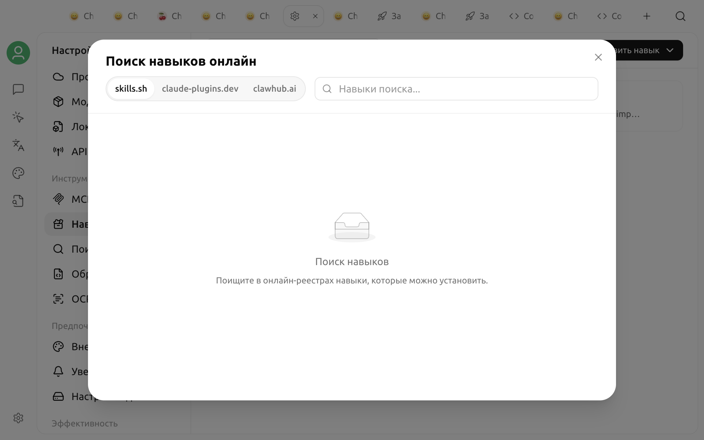

# Навыки (Skills)

Навык — это набор специализированных инструкций и сопутствующих файлов, которые агент загружает по мере необходимости. В нём можно определить порядок выполнения определённых задач, формат результата и правила использования инструментов, а также добавить сценарии, справочные материалы и другие ресурсы. Например, навык для проверки документации может закрепить единый контрольный список и формат результата.

Навык не изменяет базовую модель и не является отдельным приложением. В Cherry Studio V2 навык сначала устанавливается в глобальную библиотеку, после чего вы решаете, для каких [агентов](../../advanced-basic/agent.md) его включить. Один навык может использоваться несколькими агентами, но состояние его включения сохраняется отдельно для каждого агента.


В текущей версии V2 навыки предназначены только для агентов и недоступны обычным ассистентам. Установка в глобальную библиотеку не включает навык автоматически для всех агентов.


## Чем установка отличается от включения

| Действие | Область действия | Результат |
| :--- | :--- | :--- |
| Установка | Глобальная библиотека навыков | Навык появляется в разделе **Настройки → Навыки** и в [Библиотеке](../../cherrystudio/preview/library.md) |
| Включение | Один агент | Навык связывается с рабочей областью этого агента и становится доступен для обнаружения и использования во время работы |
| Отключение | Один агент | Навык удаляется только у этого агента, не затрагивая других агентов и глобальные файлы навыка |
| Удаление | Глобально | Файлы навыка удаляются, а навык отключается у всех использовавших его агентов |

Встроенные навыки Cherry Studio по умолчанию включаются для каждого нового агента. Последующий выбор включённых и отключённых навыков сохраняется отдельно для каждого агента. Обновление встроенного навыка приложением не сбрасывает этот выбор.

## Установка из онлайн-каталогов

1. Откройте **Настройки → Навыки**.
2. Введите название нужной возможности в строке поиска справа вверху.
3. Переключайтесь между вкладками `claude-plugins`, `skills.sh` и `clawhub`, чтобы просмотреть результаты.
4. Откройте результат и проверьте описание, автора, источник и статистику.
5. Нажмите **Установить**.

Для онлайн-установки требуется подключение к сети. При установке из `claude-plugins` или `skills.sh` система также должна уметь запускать Git: содержимое загружается из соответствующего репозитория. Из `clawhub` скачивается и устанавливается пакет навыка.

Новый сторонний навык добавляется только в глобальную библиотеку и не включается автоматически для всех агентов. После установки выполните действия из раздела «Включение для агента».

## Установка из локальных файлов

На странице **Настройки → Навыки** можно:

* нажать **Установить из ZIP-файла** и выбрать архив;
* нажать **Установить из каталога** и выбрать каталог навыка;
* перетащить ZIP-файл или каталог в область установки на странице.

Локальный пакет должен содержать `SKILL.md`. В этом файле указаны название навыка, описание и основные инструкции. Навык также может содержать сопутствующие каталоги `scripts/`, `references/`, `assets/` и другие.

ZIP-файл или каталог также можно импортировать кнопкой в категории навыков [Библиотеки](../../cherrystudio/preview/library.md). Сейчас Библиотека предназначена только для просмотра установленных навыков и локального импорта. Для поиска в онлайн-каталогах откройте **Настройки → Навыки**.


Сторонние навыки могут содержать команды, сценарии и инструкции, требующие от агента доступа к внешним сервисам. Перед установкой проверьте источник, а после установки прочитайте `SKILL.md` и содержимое сценариев в дереве файлов. Включайте такие навыки только в доверенных рабочих областях.


## Установка и создание навыка агентом

Всем агентам доступны встроенные инструменты управления навыками. Например, можно попросить агента:

> Найди навык для проверки продуктовой документации, объясни его назначение и источник, а перед установкой дождись моего подтверждения.

При установке через диалог агент находит и устанавливает навык из каталога, а затем включает его только для текущего агента. Другие агенты не затрагиваются.

Агент также может создать новый навык. Он инициализирует каталог навыка, запишет `SKILL.md` и необходимые сопутствующие файлы, зарегистрирует навык в глобальной библиотеке и включит его для текущего агента. После создания проверьте содержимое файлов в разделе **Настройки → Навыки**, а затем протестируйте работу на небольшой задаче.

## Включение для агента

1. Откройте [Библиотеку](../../cherrystudio/preview/library.md) и перейдите в раздел **Агенты**.
2. Откройте для редактирования сохранённого агента.
3. В разделе **Расширение возможностей** выберите вкладку **Навыки**.
4. Нажмите кнопку добавления и выберите навык из глобальной библиотеки.
5. Сохраните настройки и проверьте работу в новой задаче.

Состояние навыков сохраняется отдельно для каждого агента. Чтобы отключить навык у одного агента, удалите его в том же разделе.

Во время работы Cherry Studio создаёт ссылку на включённые навыки в `.claude/skills/` первого каталога рабочей области агента. Поэтому у агента должен быть доступный каталог рабочей области. Если по пути с тем же именем уже существует обычный каталог, а не ссылка под управлением Cherry Studio, включить навык не удастся.


Включение навыка не означает, что он будет принудительно использоваться в каждом сообщении. Агент решает, загружать ли его, исходя из названия, описания и текущей задачи. Если применение навыка обязательно, явно укажите его название в промпте.


## Просмотр и удаление

Выберите установленный навык в разделе **Настройки → Навыки**, чтобы открыть полное дерево файлов. Markdown-файлы отображаются как форматированный текст, а сценарии и другие текстовые файлы — как код.

Сторонний навык можно удалить через контекстное меню, кнопку удаления на странице сведений или режим множественного выбора. Встроенные навыки удалить здесь нельзя, но их можно отключить отдельно для каждого агента.

Удаление — это глобальная операция. Вместе с файлами навыка удаляются соответствующие ссылки и записи о включении из рабочих областей всех агентов. Если навык не нужен только одному агенту, отключите его, а не удаляйте.

## Различия между навыками и MCP

| Возможность | Навыки | [MCP](../../advanced-basic/mcp/) |
| :--- | :--- | :--- |
| Основное содержимое | Порядок работы, инструкции для промпта, сценарии и справочные материалы | Инструменты или данные, предоставляемые MCP Server |
| Нужна ли постоянно работающая служба | Обычно нет | Зависит от MCP Server |
| Типичные задачи | Стандартизация рабочих процессов, контрольных списков и правил генерации | Запросы к базам данных, вызов внешних API, управление другими системами |

Навык может объяснять агенту, когда и как вызывать инструменты MCP. Обе возможности можно включать одновременно.

## Навык не срабатывает

Проверьте по порядку:

1. Появился ли навык в глобальной библиотеке.
2. Включён ли он для текущего агента, а не только установлен.
3. Настроен ли у текущего агента доступный каталог рабочей области.
4. Не мешает ли созданию ссылки обычный одноимённый каталог в `.claude/skills/`.
5. Позволяют ли название и описание в `SKILL.md` определить, что навык подходит для текущей задачи.

Если файл навыка был только что изменён, начните новый сеанс и проверьте ещё раз. Файлы навыков, созданные или изменённые инструментами управления агента, вступают в силу сразу: применять дополнительный патч или повторно устанавливать навык не требуется.
