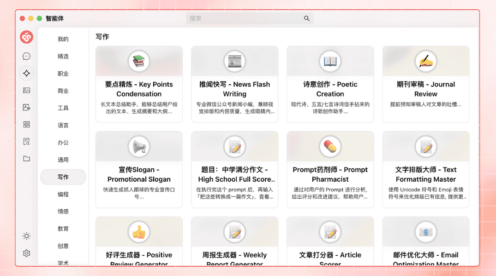
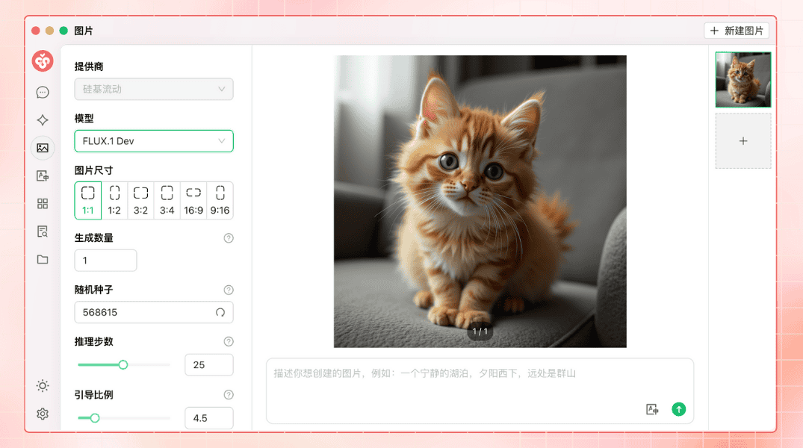


Este documento ha sido traducido del chino por IA y aún no ha sido revisado.


# Introducción del Proyecto

<figure><figcaption></figcaption></figure>

Síguenos en redes sociales: [Twitter(X)](https://x.com/CherryStudioAPP), [Xiaohongshu](https://www.xiaohongshu.com/user/profile/662b6853000000000b031d9a), [Weibo](https://weibo.com/u/7975656228), [Bilibili](https://space.bilibili.com/3546657515898892), [Douyin](https://www.douyin.com/user/MS4wLjABAAAAmw9A54m5J0hHVMQY5eGrVJ-EHDoOS0hgJ6M1F9MN2Tn2V163A0xrC4_KVzfmQSxC)

Únete a nuestras comunidades: [Grupo QQ (575014769)](https://qm.qq.com/q/lo0D4qVZKi), [Telegram](https://t.me/CherryStudioAI), [Discord](https://discord.gg/wez8HtpxqQ), Grupo de WeChat (haz clic para ver)[^1]

***

Cherry Studio es una plataforma integral de asistente AI que integra funciones como diálogos multimodelo, gestión de bases de conocimiento, pintura AI y traducción.  
Con su diseño altamente personalizable, potentes capacidades de expansión y experiencia de usuario amigable, Cherry Studio es la elección ideal para usuarios profesionales y entusiastas de IA. Tanto usuarios sin experiencia como desarrolladores pueden encontrar funciones AI adaptadas a sus necesidades, mejorando su eficiencia laboral y creatividad.

***

### **Funciones y características principales**

#### **1. Funciones básicas de diálogo**

* **Respuestas múltiples**: Permite generar respuestas simultáneas de múltiples modelos para la misma pregunta, facilitando la comparación de rendimiento. Más detalles en [Interfaz de diálogo](cherrystudio/preview/chat.md).

<figure><figcaption></figcaption></figure>

* **Agrupación automática**: Los registros de conversación se gestionan automáticamente por grupos para una rápida recuperación.
* **Exportación de conversaciones**: Soporta exportación completa o parcial a formatos como Markdown o Word.
* **Altamente personalizable**: Permite ajustar parámetros avanzados e incluir parámetros personalizados.

<figure><figcaption></figcaption></figure>

* **Mercado de asistentes**: Incluye más de mil asistentes especializados en traducción, programación, redacción, etc., además de soporte para asistentes personalizados.

<figure><figcaption></figcaption></figure>

* **Renderizado múltiple**: Soporta renderizado Markdown, fórmulas matemáticas y vista previa HTML en tiempo real.

<figure><figcaption></figcaption></figure>

#### **2. Funciones integradas especializadas**

* **Pintura AI**: Panel dedicado para generar imágenes de alta calidad mediante descripciones en lenguaje natural.

<figure><figcaption></figcaption></figure>

* **Mini programas AI**: Integra herramientas AI web gratuitas sin necesidad de cambiar de navegador.
* **Traducción**: Soporta traducción en panel especializado, traducción conversacional y de prompts.
* **Gestión de archivos**: Organización centralizada de archivos de diálogos, pintura y bases de conocimiento.

<figure><figcaption></figcaption></figure>

* **Búsqueda global**: Localización rápida en historiales y bases de conocimiento.

<figure><figcaption></figcaption></figure>

#### **3. Gestión unificada de múltiples proveedores**

* **Agregación de modelos**: Soporta modelos principales de OpenAI, Gemini, Anthropic, Azure, etc.
* **Obtención automática**: Lista completa de modelos con un clic, sin configuración manual.
* **Rotación de claves**: Uso rotativo de múltiples claves API para evitar límites de uso.
* **Avatares personalizados**: Asignación automática de avatares exclusivos por modelo.
* **Proveedores personalizables**: Compatible con servicios de terceros que sigan estándares de OpenAI/Gemini/Anthropic.

<figure><figcaption></figcaption></figure>

#### **4. Personalización avanzada de interfaz**

* **CSS personalizado**: Personalización global de estilos visuales.
* **Diseños conversacionales**: Soporta disposición en lista o burbujas con estilos de mensaje personalizables.
* **Avatares personalizados**: Personalización de avatares para software y asistentes.
* **Menú lateral adaptable**: Ocultar/reordenar funciones según necesidades.

<figure><figcaption></figcaption></figure>

#### **5. Sistema local de bases de conocimiento**

* **Formatos múltiples**: Importación de PDF, DOCX, PPTX, XLSX, TXT, MD, etc.
* **Fuentes diversas**: Soporta archivos locales, URLs, mapas de sitios e input manual.
* **Exportación**: Compartir bases de conocimiento procesadas.
* **Verificación**: Búsqueda en tiempo real para comprobar segmentación y resultados.

<figure><figcaption></figcaption></figure>

#### **6. Funciones de enfoque especial**

* **Asistente rápido**: Invocación instantánea en cualquier contexto (WeChat, navegador).
* **Traducción rápida**: Traducción inmediata de textos en otras aplicaciones.
* **Resumen de contenido**: Síntesis rápida de textos largos.
* **Explicación instantánea**: Aclaración de conceptos sin prompts complejos.

<figure><figcaption></figcaption></figure>

#### **7. Garantía de datos**

* **Múltiples copias de seguridad**: Local, WebDAV y copias programadas.
* **Seguridad de datos**: Uso completamente local con modelos locales para evitar fugas.

***

### **Ventajas del proyecto**

1. **Accesible para principiantes**: Reduce barreras técnicas para enfoque en trabajo/aprendizaje.
2. **Documentación completa**: Manuales detallados y solución de problemas comunes.
3. **Mejora continua**: Actualizaciones basadas en feedback de usuarios.
4. **Código abierto**: Permite personalización y expansión mediante código.

***

### **Casos de uso**

* **Gestión de conocimiento**: Construcción/consulta de bases de conocimiento para investigación/educación.
* **Diálogos multimodelo**: Generación de contenido e información con múltiples modelos simultáneos.
* **Traducción y automatización**: Procesamiento de documentos y comunicación multilingüe.
* **Pintura AI y diseño**: Generación de imágenes desde descripciones textuales.

### Historial de Stars

## Síguenos en redes sociales

<table data-view="cards"><thead><tr><th></th><th data-hidden data-card-cover data-type="files"></th><th data-hidden data-card-target data-type="content-ref"></th></tr></thead><tbody><tr><td><a href="https://www.xiaohongshu.com/user/profile/662b6853000000000b031d9a?xsec_token=YB_1nKvlH4r5hPYVVbbsNHF8Y6n6AKlm5-DaggPCtd2DQ%3D&#x26;xsec_source=app_share&#x26;xhsshare=CopyLink&#x26;appuid=662b6853000000000b031d9a&#x26;apptime=1738627324&#x26;share_id=ace5db41b5954fab8d98a2a7865a62bc&#x26;share_channel=copy_link">Xiaohongshu</a></td><td><a href=".gitbook/assets/1.png">1.png</a></td><td><a href="https://www.xiaohongshu.com/user/profile/662b6853000000000b031d9a?xsec_token=YB_1nKvlH4r5hPYVVbbsNHF8Y6n6AKlm5-DaggPCtd2DQ%3D&#x26;xsec_source=app_share&#x26;xhsshare=CopyLink&#x26;appuid=662b6853000000000b031d9a&#x26;apptime=1738627324&#x26;share_id=ace5db41b5954fab8d98a2a7865a62bc&#x26;share_channel=copy_link">https://www.xiaohongshu.com/user/profile/662b6853000000000b031d9a?xsec_token=YB_1nKvlH4r5hPYVVbbsNHF8Y6n6AKlm5-DaggPCtd2DQ%3D&#x26;xsec_source=app_share&#x26;xhsshare=CopyLink&#x26;appuid=662b6853000000000b031d9a&#x26;apptime=1738627324&#x26;share_id=ace5db41b5954fab8d98a2a7865a62bc&#x26;share_channel=copy_link</a></td></tr><tr><td><a href="https://b23.tv/hIfGgDW">Bilibili</a></td><td><a href=".gitbook/assets/3.png">3.png</a></td><td><a href="https://b23.tv/hIfGgDW">https://b23.tv/hIfGgDW</a></td></tr><tr><td><a href="https://weibo.com/u/7975656228">Weibo</a></td><td><a href=".gitbook/assets/2.png">2.png</a></td><td><a href="https://weibo.com/u/7975656228">https://weibo.com/u/7975656228</a></td></tr><tr><td><a href="https://v.douyin.com/ifTpX4X7">Douyin</a></td><td><a href=".gitbook/assets/4.png">4.png</a></td><td><a href="https://v.douyin.com/ifTpX4X7">https://v.douyin.com/ifTpX4X7</a></td></tr><tr><td><a href="https://x.com/CherryStudioAPP?t=DYR0ulaLur-bO4Us3bG79A&#x26;s=05">Twitter(X)</a></td><td><a href=".gitbook/assets/5.png">5.png</a></td><td><a href="https://x.com/CherryStudioAPP?t=DYR0ulaLur-bO4Us3bG79A&#x26;s=05">https://x.com/CherryStudioAPP?t=DYR0ulaLur-bO4Us3bG79A&#x26;s=05</a></td></tr></tbody></table>

[^1]: 