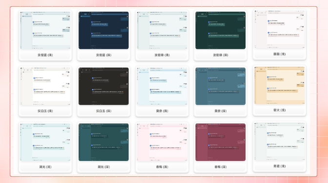

# Introducción del Proyecto


Este documento ha sido traducido del chino por IA y aún no ha sido revisado.


<figure><figcaption></figcaption></figure>

Síguenos en nuestras redes sociales: [Twitter(X)](https://x.com/CherryStudioHQ), [Xiaohongshu](https://www.xiaohongshu.com/user/profile/662b6853000000000b031d9a), [Weibo](https://weibo.com/u/7975656228), [Bilibili](https://space.bilibili.com/3546657515898892), [Douyin](https://www.douyin.com/user/MS4wLjABAAAAmw9A54m5J0hHVMQY5eGrVJ-EHDoOS0hgJ6M1F9MN2Tn2V163A0xrC4_KVzfmQSxC)

Únete a nuestras comunidades: [Grupo QQ (575014769)](https://qm.qq.com/q/lo0D4qVZKi), [Telegram](https://t.me/CherryStudioAI), [Discord](https://discord.gg/wez8HtpxqQ), [Grupo de WeChat (haz clic para ver)](https://www.cherry-ai.com/#Community)

***

Cherry Studio es una plataforma integral de asistente AI que integra conversación multimodelo, gestión de bases de conocimiento, pintura con AI, traducción y más funcionalidades.\
El diseño altamente personalizable, la potente capacidad de expansión y la experiencia de usuario amigable de Cherry Studio lo convierten en una elección ideal para usuarios profesionales y entusiastas de la IA. Tanto usuarios sin experiencia como desarrolladores pueden encontrar funciones de IA adecuadas en Cherry Studio para mejorar la eficiencia laboral y la creatividad.

***

### **Funciones principales y características destacadas**

#### **1. Funciones básicas de conversación**

* **Una pregunta, múltiples respuestas**: Permite generar respuestas simultáneas de múltiples modelos para la misma pregunta, facilitando la comparación de diferentes modelos (ver [Interfaz de conversación](cherrystudio/preview/chat.md)).

<figure><figcaption></figcaption></figure>

* **Agrupación automática**: El historial de conversación de cada asistente se agrupa automáticamente para facilitar la búsqueda.
* **Exportación de diálogos**: Soporta exportar conversaciones completas o parciales en múltiples formatos (Markdown, Word, etc.).
* **Parámetros altamente personalizables**: Permite el ajuste de parámetros personalizados según necesidades individuales.

<figure><figcaption></figcaption></figure>

* **Mercado de asistentes**: Incluye miles de asistentes especializados en industrias como traducción, programación, escritura, además de permitir crear asistentes personalizados.

<figure><figcaption></figcaption></figure>

* **Varios formatos de renderizado**: Admite renderizado Markdown, ecuaciones matemáticas, vista previa HTML en tiempo real y más.

<figure><figcaption></figcaption></figure>

#### **2. Integración de múltiples funciones especializadas**

* **Pintura con IA**: Panel especializado para generar imágenes de alta calidad mediante descripciones de lenguaje natural.

<figure><figcaption></figcaption></figure>

* **Mini-programas de IA**: Integración de herramientas web de IA gratuitas sin necesidad de cambiar de navegador.
* **Traducción**: Soporta paneles de traducción dedicados, traducción conversacional y de prompts.
* **Gestión de archivos**: Organización unificada de archivos en conversaciones, pintura y bases de conocimiento.

<figure><figcaption></figcaption></figure>

* **Búsqueda global**: Localización rápida de historiales y contenido del conocimiento.

<figure><figcaption></figcaption></figure>

#### **3. Mecanismo de gestión unificada para múltiples proveedores**

* **Agregación de modelos**: Permite usar modelos principales de proveedores como OpenAI, Gemini, Anthropic, Azure.
* **Obtención automática de modelos**: Listas completas de modelos con un solo clic.
* **Rotación de múltiples claves**: Evita límites de tasas mediante uso alternativo de claves API.
* **Coincidencia precisa de avatares**: Asigna avatares exclusivos automáticamente a cada modelo.
* **Proveedores personalizados**: Soporta proveedores terceros compatibles con OpenAI, Gemini, Anthropic.

<figure><figcaption></figcaption></figure>

#### **4. Interfaz y diseño altamente personalizables**

* **CSS personalizado**: Soporta estilos globales personalizados.
* **Distribución de diálogos**: Diseños de lista o chat de burbujas con mensajes personalizables.
* **Avatares personalizados**: Permite establecer avatares para el software y asistentes.
* **Menú lateral personalizable**: Capacidad para ocultar/ordenar funciones según necesidades.

<figure><figcaption></figcaption></figure>

#### **5. Sistema local de bases de conocimiento**

* **Soporta múltiples formatos**: Permite importar PDF, DOCX, PPTX, XLSX, TXT, MD.
* **Diversas fuentes de datos**: Archivos locales, URLs, mapas de sitio e incluso entrada manual.
* **Exportación de conocimiento**: Comparte conocimiento procesado.
* **Verificación de búsqueda**: Prueba inmediata de resultados después de la importación.

<figure><figcaption></figcaption></figure>

#### **6. Funciones de foco especial**

* **Respuesta rápida**: Invoca asistente rápido en cualquier contexto (WeChat, navegador).
* **Traducción rápida**: Traduce palabras o textos en otros entornos.
* **Resumen de contenido**: Resume textos extensos eficientemente.
* **Explicación**: Explica problemas complejos sin prompts avanzados.

<figure><figcaption></figcaption></figure>

#### **7. Garantía de datos**

* **Copias de seguridad**: Permite backups locales, WebDAV y programados.
* **Seguridad de datos**: Soporta uso completamente local con protección de privacidad.

***

### **Ventajas del proyecto**

1. **Amigable para principiantes**: Diseñado para usuarios sin experiencia técnica básica.
2. **Documentación completa**: Manuales detallados de uso y solución de problemas.
3. **Desarrollo continuo**: Actualizaciones frecuentes basadas en feedback.
4. **Código abierto**: Permite personalización y extensión mediante código fuente.

***

### **Casos de uso**

* **Gestión y consulta de conocimiento**: Construye bases de conocimiento rápidamente para investigación y educación.
* **Conversación y creación multimodelo**: Interacción simultánea con múltiples modelos.
* **Traducción y automatización de oficina**: Traducción asistida y procesamiento de documentos.
* **Pintura y diseño con IA**: Generación de imágenes para proyectos creativos.

### Star History

## Síguenos en nuestras redes sociales

<table data-view="cards"><thead><tr><th></th><th data-hidden data-card-cover data-type="files"></th><th data-hidden data-card-target data-type="content-ref"></th></tr></thead><tbody><tr><td><a href="https://www.xiaohongshu.com/user/profile/662b6853000000000b031d9a?xsec_token=YB_1nKvlH4r5hPYVVbbsNHF8Y6n6AKlm5-DaggPCtd2DQ%3D&#x26;xsec_source=app_share&#x26;xhsshare=CopyLink&#x26;appuid=662b6853000000000b031d9a&#x26;apptime=1738627324&#x26;share_id=ace5db41b5954fab8d98a2a7865a62bc&#x26;share_channel=copy_link">Xiaohongshu</a></td><td><a href=".gitbook/assets/1.png">1.png</a></td><td><a href="https://www.xiaohongshu.com/user/profile/662b6853000000000b031d9a?xsec_token=YB_1nKvlH4r5hPYVVbbsNHF8Y6n6AKlm5-DaggPCtd2DQ%3D&#x26;xsec_source=app_share&#x26;xhsshare=CopyLink&#x26;appuid=662b6853000000000b031d9a&#x26;apptime=1738627324&#x26;share_id=ace5db41b5954fab8d98a2a7865a62bc&#x26;share_channel=copy_link">https://www.xiaohongshu.com/user/profile/662b6853000000000b031d9a?xsec_token=YB_1nKvlH4r5hPYVVbbsNHF8Y6n6AKlm5-DaggPCtd2DQ%3D&#x26;xsec_source=app_share&#x26;xhsshare=CopyLink&#x26;appuid=662b6853000000000b031d9a&#x26;apptime=1738627324&#x26;share_id=ace5db41b5954fab8d98a2a7865a62bc&#x26;share_channel=copy_link</a></td></tr><tr><td><a href="https://b23.tv/hIfGgDW">Bilibili</a></td><td><a href=".gitbook/assets/3.png">3.png</a></td><td><a href="https://b23.tv/hIfGgDW">https://b23.tv/hIfGgDW</a></td></tr><tr><td><a href="https://weibo.com/u/7975656228">Weibo</a></td><td><a href=".gitbook/assets/2.png">2.png</a></td><td><a href="https://weibo.com/u/7975656228">https://weibo.com/u/7975656228</a></td></tr><tr><td><a href="https://v.douyin.com/ifTpX4X7">Douyin</a></td><td><a href=".gitbook/assets/4.png">4.png</a></td><td><a href="https://v.douyin.com/ifTpX4X7">https://v.douyin.com/ifTpX4X7</a></td></tr><tr><td><a href="https://x.com/CherryStudioAPP?t=DYR0ulaLur-bO4Us3bG79A&#x26;s=05">Twitter(X)</a></td><td><a href=".gitbook/assets/5.png">5.png</a></td><td><a href="https://x.com/CherryStudioAPP?t=DYR0ulaLur-bO4Us3bG79A&#x26;s=05">https://x.com/CherryStudioHQ?t=DYR0ulaLur-bO4Us3bG79A&#x26;s=05</a></td></tr></tbody></table>