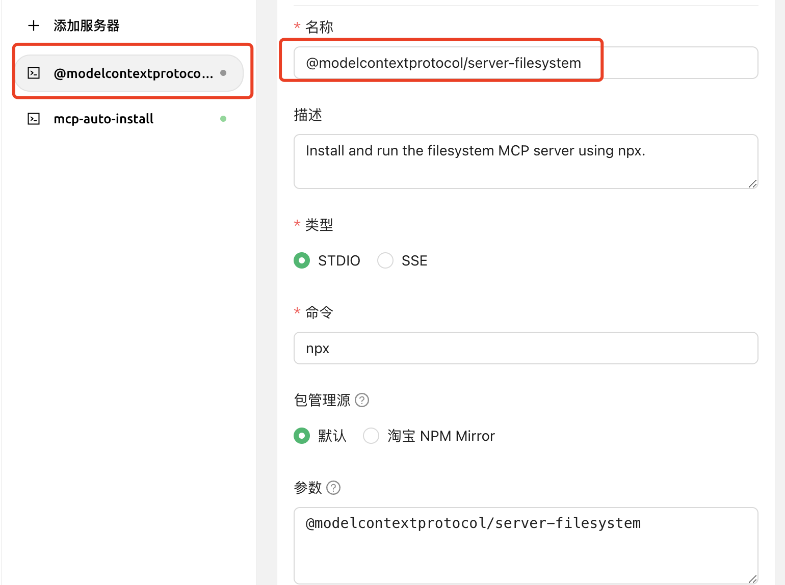

# Instalación Automática de MCP



Este documento ha sido traducido del chino por IA y aún no ha sido revisado.



> La instalación automática de MCP requiere actualizar Cherry Studio a la versión v1.1.18 o superior.

## Introducción a la Función

Además de la instalación manual, Cherry Studio incluye la herramienta `@mcpmarket/mcp-auto-install`, que proporciona una forma más conveniente de instalar servidores MCP. Solo necesitas ingresar el comando correspondiente en un diálogo de modelo grande que admita servicios MCP.


**Recordatorio de fase de pruebas:**

* `@mcpmarket/mcp-auto-install` aún se encuentra en fase de pruebas
* La efectividad depende de la "inteligencia" del modelo grande: algunos se añadirán automáticamente, mientras que otros **requerirán cambiar manualmente parámetros en la configuración de MCP**
* Actualmente las fuentes de búsqueda provienen de @modelcontextprotocol, pero pueden configurarse personalmente (ver explicación más abajo)


## Instrucciones de Uso

Por ejemplo, puedes ingresar:

```
帮我安装一个 filesystem mcp server
```

<figure><figcaption><p>Ingresar comando para instalar servidor MCP</p></figcaption></figure>

<figure><figcaption><p>Interfaz de configuración del servidor MCP</p></figcaption></figure>

El sistema reconocerá automáticamente tu requerimiento y completará la instalación mediante `@mcpmarket/mcp-auto-install`. Esta herramienta admite varios tipos de servidores MCP, incluyendo pero no limitados a:

* filesystem (sistema de archivos)
* fetch (solicitud de red)
* sqlite (base de datos)
* etc.

> La variable MCP_PACKAGE_SCOPES permite personalizar fuentes de búsqueda de servicios MCP. Valor predeterminado: `@modelcontextprotocol`.

## Introducción a la librería `@mcpmarket/mcp-auto-install`


**Configuración de referencia:**

```json
// `axun-uUpaWEdMEMU8C61K` es el ID del servicio (personalizable)
"axun-uUpaWEdMEMU8C61K": {
  "name": "mcp-auto-install",
  "description": "Instala servicios MCP automáticamente (versión Beta)",
  "isActive": false,
  "registryUrl": "https://registry.npmmirror.com",
  "command": "npx",
  "args": [
    "-y",
    "@mcpmarket/mcp-auto-install",
    "connect",
    "--json"
  ],
  "env": {
    "MCP_REGISTRY_PATH": "Detalles en https://www.npmjs.com/package/@mcpmarket/mcp-auto-install"
  },
  "disabledTools": []
}
```

`@mcpmarket/mcp-auto-install` es un paquete npm de código abierto. Consulta detalles y documentación en el [repositorio oficial de npm](https://www.npmjs.com/package/@mcpmarket/mcp-auto-install). `@mcpmarket` es la colección oficial de servicios MCP de Cherry Studio.
