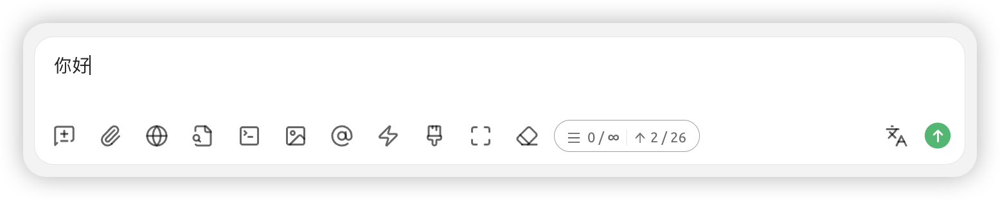


Este documento ha sido traducido del chino por IA y aún no ha sido revisado.


# Interfaz de Chat

## Asistentes y Temas

### Asistente

`助手` es una configuración personalizada para el modelo seleccionado, como ajustes preestablecidos de indicaciones y parámetros, que permite que el modelo funcione mejor según sus expectativas laborales.

`Asistente predeterminado del sistema` ofrece parámetros genéricos preestablecidos (sin indicaciones). Puede usarlo directamente o buscar los ajustes preestablecidos que necesite en la [página de agentes](agents.md).

### Tema

`助手` es el conjunto principal de `话题` (temas). Un solo asistente puede contener múltiples temas (conversaciones). Todos los `话题` comparten la configuración del modelo como parámetros y palabras preestablecidas (prompt) del `助手`.

<figure><figcaption></figcaption></figure>

<figure><figcaption></figcaption></figure>

## Botones en el cuadro de diálogo

<figure><figcaption></figcaption></figure>

 `Nuevo tema` Crea un nuevo tema bajo el asistente actual.

 `Subir imagen o documento` Las imágenes requieren soporte del modelo. Los documentos se analizan automáticamente como texto para proporcionar contexto al modelo.

 `Búsqueda en web` Requiere configurar información de búsqueda web en ajustes. Los resultados se devuelven como contexto al modelo. Ver [Modo con conexión a internet](../../websearch/).

 `Base de conocimiento` Activa la base de conocimiento. Ver [Tutorial de base de conocimiento](../../knowledge-base/knowledge-base.md).

 `Servidor MCP` Activa la función de servidor MCP. Ver [Tutorial de uso de MCP](../../advanced-basic/mcp/).

 `Generar imagen` No se muestra por defecto. Para modelos compatibles (ej. Gemini), active manualmente para generar imágenes.


Por razones técnicas, debe activar manualmente este botón para generar imágenes. Se eliminará después de optimizar esta función.


 `Seleccionar modelo` Cambia al modelo especificado para la siguiente conversación, manteniendo el contexto.

 `Frases rápidas` Requiere frases comunes preestablecidas en ajustes. Se utilizan aquí para entrada directa, admitiendo variables.

 `Limpiar mensajes` Elimina todo el contenido del tema actual.

 `Expandir` Amplía el cuadro de diálogo para entradas largas.

 `Limpiar contexto` Trunca el contexto disponible para el modelo sin borrar contenido; el modelo "olvida" conversaciones previas.

 `Cantidad estimada de tokens` Muestra tokens estimados. Los cuatro datos son: `Contexto actual`, `Contexto máximo` (∞ = ilimitado), `Caracteres en el cuadro de entrada`, `Tokens estimados`.


Esto solo estima tokens. Los tokens reales varían por modelo; consulte datos del proveedor.


 `Traducir` Traduce el contenido del cuadro de entrada al inglés.

## Configuración del chat

<figure><figcaption></figcaption></figure>

### Configuración del modelo

Sincronizado con parámetros de `Configuración del modelo` en ajustes del asistente. Ver [Editar asistente](chat.md#bian-ji-zhu-shou).


En esta sección, solo `Configuración del modelo` afecta al asistente actual; otros ajustes son globales. Ej: Configurar el estilo de mensaje como burbujas aplicará en todos los temas/asistentes.


### Configuración de mensajes

#### <mark style="color:blue;">**`Línea divisoria de mensajes`**</mark>:

Separa el contenido del mensaje del panel de acciones.



<figure><figcaption></figcaption></figure>



<figure><figcaption></figcaption></figure>



#### <mark style="color:blue;">**`Usar fuente serif`**</mark>：

Cambia el estilo de fuente. También puede cambiarlo mediante [CSS personalizado](../../personalization-settings/).

#### <mark style="color:blue;">**`Mostrar números de línea en código`**</mark>：

Muestra números de línea en bloques de código generados por el modelo.



<figure><figcaption></figcaption></figure>



<figure><figcaption></figcaption></figure>



#### <mark style="color:blue;">**`Bloques de código plegables`**</mark>：

Plegado automático de bloques de código cuando son extensos.

#### <mark style="color:blue;">**`Bloques de código con ajuste de línea`**</mark>：

Ajuste automático de línea cuando el código excede el ancho de ventana.

#### <mark style="color:blue;">**`Plegar proceso de razonamiento automáticamente`**</mark>：

Plegado automático del proceso de razonamiento después de completarse (en modelos compatibles).

#### <mark style="color:blue;">**`Estilo de mensaje`**</mark>：

Cambia la interfaz a burbujas o estilo lista.

#### <mark style="color:blue;">**`Estilo de código`**</mark>：

Cambia el estilo de visualización de fragmentos de código.

#### <mark style="color:blue;">**`Motor de fórmulas matemáticas`**</mark>：

* KaTeX: Renderizado más rápido (optimizado para rendimiento).
* MathJax: Renderizado más lento pero más funciones (admite más símbolos).

#### <mark style="color:blue;">**`Tamaño de fuente en mensajes`**</mark>：

Ajusta el tamaño de fuente en la interfaz.

### Configuración de entrada

#### <mark style="color:blue;">**`Mostrar tokens estimados`**</mark>：

Muestra tokens estimados en el cuadro de entrada (referencial; no incluye contexto real).

#### <mark style="color:blue;">**`Pegar texto largo como archivo`**</mark>：

Al pegar texto extenso, se muestra como archivo para reducir interferencias.

#### <mark style="color:blue;">**`Renderizar Markdown en mensajes enviados`**</mark>：

Cuando está desactivado, solo se renderizan respuestas del modelo (no los mensajes enviados).



<figure><figcaption></figcaption></figure>



<figure><figcaption></figcaption></figure>



#### <mark style="color:blue;">**`Traducción rápida con triple espacio`**</mark>：

Presionar espacio tres veces traduce el contenido del cuadro de entrada al inglés.


Nota: Sobrescribe el texto original.


#### <mark style="color:blue;">**`Idioma objetivo`**</mark>：

Establece el idioma para traducciones (botón y triple espacio).

## Configuración del asistente

Seleccione el <mark style="background-color:yellow;">nombre del asistente</mark>→ en <mark style="background-color:yellow;">el menú contextual</mark> elija la configuración

### Editar asistente


La configuración del asistente afecta todos sus temas.


<figure><figcaption></figcaption></figure>

#### Configuración de indicaciones

#### <mark style="color:blue;">**`Nombre`**</mark>：

Nombre personalizado para identificar al asistente.

#### <mark style="color:blue;">**`Indicación`**</mark>：

Prompt; puede editarse basándose en ejemplos de la página de agentes.

#### Configuración del modelo

#### <mark style="color:blue;">**`Modelo predeterminado`**</mark>：

Fija un modelo inicial para este asistente. Si no se establece, usa el modelo global ([Modelo de asistente predeterminado](settings/default-models.md#mo-ren-zhu-shou-mo-xing)).


Prioridad: Modelo del asistente > Modelo global. Si no existe modelo del asistente, predeterminado = global.


#### <mark style="color:blue;">**`Restablecer modelo automáticamente`**</mark>：

Activado: Tras cambiar modelos en un tema, el nuevo tema usará el modelo predeterminado del asistente. Desactivado: Nuevos temas conservan el último modelo usado.

> Ejemplo: Modelo predeterminado = gpt-3.5-turbo. En Tema1 se cambia a gpt-4o.
> * Con restablecimiento: Tema2 usa gpt-3.5-turbo.
> * Sin restablecimiento: Tema2 usa gpt-4o.

#### <mark style="color:blue;">**`Temperatura (Temperature)`**</mark>：

Controla aleatoriedad (valor predeterminado: 0.7):
* Baja (0-0.3): Output determinista (ej. generación de código).
* Media (0.4-0.7): Balance creatividad/coherencia (recomendado para chat).
* Alta (0.8-1.0): Máxima creatividad (puede reducir coherencia).

#### <mark style="color:blue;">**`Top P (Muestreo de núcleo)`**</mark>：

Valor predeterminado: 1.
* Valores bajos (0.1-0.3): Palabras de alta probabilidad (output conservador).
* Medios (0.4-0.6): Equilibrio diversidad/precisión.
* Altos (0.7-1.0): Máxima diversidad léxica (ej. escritura creativa).


- Usar parámetros combinados o independientes.
- Experimente para ajustes óptimos.
- Rangos son referenciales; consulte documentación del modelo.


#### <mark style="color:blue;">**`Cantidad de contexto (Context Window)`**</mark>

Número de mensajes conservados en contexto (a mayor valor, más tokens consumidos):
* 5-10: Conversaciones simples.
* >10: Tareas complejas con memoria extendida (ej. escritura estructurada).

#### <mark style="color:blue;">**`Habilitar límite de longitud (MaxToken)`**</mark>

Límite máximo de [tokens](https://docs.cherry-ai.com/question-contact/knowledge#shen-me-shi-tokens) por respuesta. Afecta calidad/longitud del output.

> Ej: En pruebas de conectividad con key, MaxToken=1 es suficiente.

La mayoría de modelos soportan hasta 32K tokens (consulte documentación específica).


Recomendado:
* Chat: 500-800
* Texto corto: 800-2000
* Código: 2000-3600
* Texto largo: 4000+ (requiere soporte del modelo)



Respuestas pueden truncarse si superan MaxToken. Ajuste según necesidades.


#### <mark style="color:blue;">**`Salida por transmisión (Stream)`**</mark>

Output continuo (datos enviados al generarse). En entornos como CherryStudio, produce efecto máquina de escribir.

* Activado: Output carácter por carácter.
* Desactivado: Respuesta completa enviada de una vez.


Desactive si el modelo no admite stream (ej. o1-mini inicial).


#### <mark style="color:blue;">**`Parámetros personalizados`**</mark>

Agrega parámetros adicionales al cuerpo de la solicitud (ej. `presence_penalty`). Normalmente innecesarios.

> Ejemplos de parámetros existentes: top-p, max tokens, stream.
> Sintaxis: `Nombre:Tipo:Valor`. Ver documentación: [Visitar](https://openai.apifox.cn/doc-3222739)


* Prioridad: Parámetros personalizados > Parámetros incorporados (en caso de duplicados).
* Use `<kbd>Nombre:undefined</kbd>` para excluir parámetros.
* Proveedores pueden tener parámetros exclusivos; consulte su documentación.
