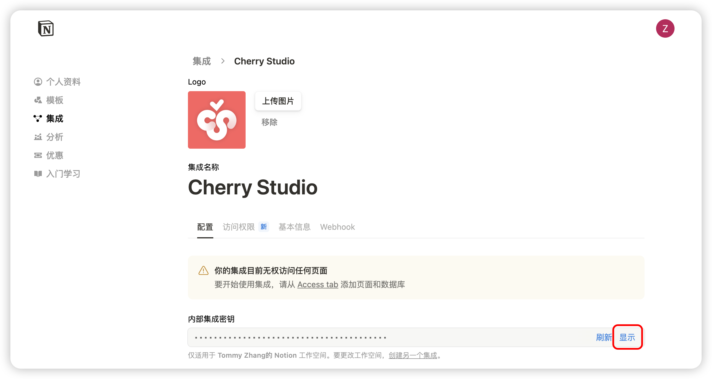
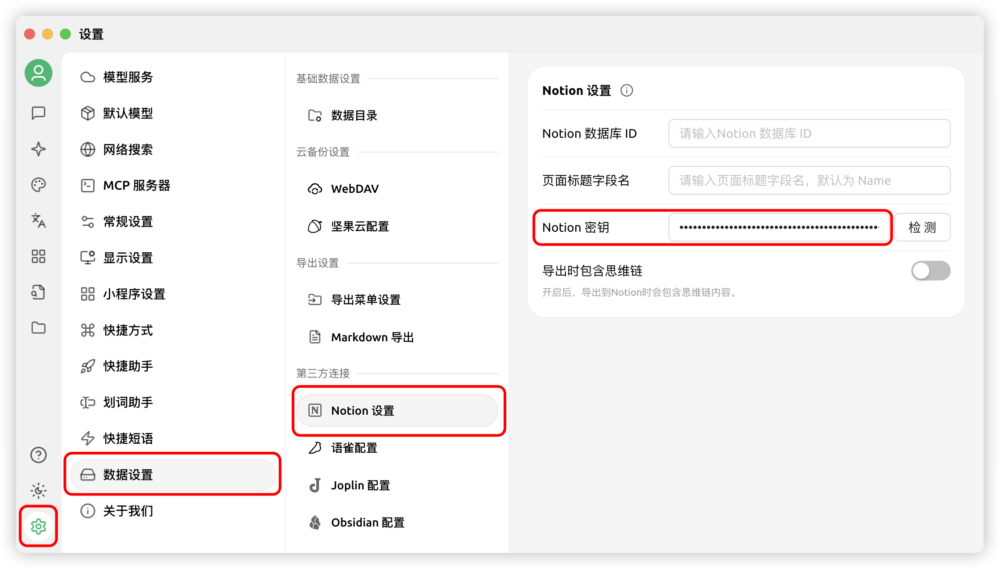
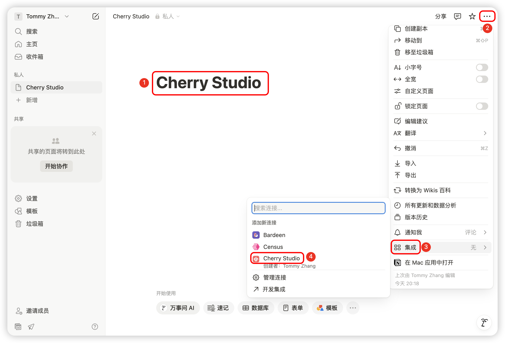

# Tutorial de configuración de Notion


Este documento ha sido traducido del chino por IA y aún no ha sido revisado.


Cherry Studio admite la importación de temas a bases de datos de Notion.

## Paso 1

Visita el sitio [Notion Integrations](https://www.notion.so/profile/integrations) para crear una aplicación

<figure><figcaption>
Haz clic en el signo más para crear una aplicación
</figcaption></figure>

## Paso 2

Crea una aplicación

<figure><figcaption>
Completa la información de la aplicación
</figcaption></figure>

Nombre: Cherry Studio  
Tipo: Selecciona la primera opción  
Icono: Puedes guardar esta imagen

<figure><figcaption></figcaption></figure>

## Paso 3

Copia la clave secreta e ingrésala en la configuración de Cherry Studio

<figure><figcaption>
Haz clic para copiar la clave secreta
</figcaption></figure>

<figure><figcaption>
Ingresa la clave secreta en la configuración de datos
</figcaption></figure>

## Paso 4

Abre el sitio de [Notion](https://www.notion.so/), crea una nueva página, selecciona el tipo de base de datos en la parte inferior, escribe Cherry Studio como nombre y conecta siguiendo las imágenes

<figure><figcaption>
Crea una nueva página y selecciona el tipo de base de datos
</figcaption></figure>

<figure><figcaption>
Ingresa el nombre de la página y selecciona "Conectar a APP"
</figcaption></figure>

## Paso 5

<figure><figcaption>
Copia el ID de la base de datos
</figcaption></figure>

Si la URL de tu base de datos de Notion es similar a esta:  
https://www.notion.so/\<long\_hash\_1>?v=\<long\_hash\_2>  
entonces el ID de la base de datos de Notion es la parte `<long_hash_1>`

<figure><figcaption>
Ingresa el ID de la base de datos y haz clic en "Comprobar"
</figcaption></figure>

## Paso 6

Ingresa el `nombre del campo de título de página`:  
Si tu interfaz está en inglés, ingresa `Name`  
Si tu interfaz está en chino, ingresa `名称`

<figure><figcaption>
Ingresa el nombre del campo de título de página
</figcaption></figure>

## Paso 7

¡Felicidades! La configuración de Notion está completa ✅ Ahora puedes exportar contenido de Cherry Studio a tu base de datos de Notion

<figure><figcaption>
Exportar a Notion
</figcaption></figure>

<figure><figcaption>
Ver los resultados de la exportación
</figcaption></figure>