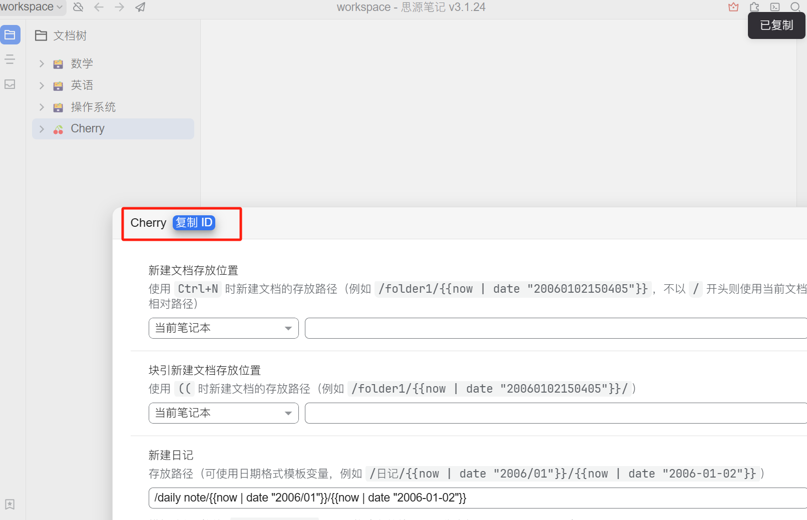

# Tutorial de Configuración de SiYuan Note


Este documento ha sido traducido del chino por IA y aún no ha sido revisado.


Permite exportar temas y mensajes a SiYuan Note.

## Primer paso

Abre SiYuan Note y crea un cuaderno

<figure><figcaption>
Haz clic en "Nuevo cuaderno"
</figcaption></figure>

## Segundo paso

Abre la configuración del cuaderno y copia el `ID del cuaderno`

<figure><figcaption>
Abrir configuración del cuaderno
</figcaption></figure>

<figure><figcaption>
Haz clic en el botón "Copiar ID del cuaderno"
</figcaption></figure>

## Tercer paso

Pega el ID del cuaderno en la configuración de Cherry Studio

<figure><figcaption>
Ingresa el ID del cuaderno en la configuración de datos
</figcaption></figure>

## Cuarto paso

Ingresa la dirección de SiYuan Note

* **Local**\
  Normalmente `http://127.0.0.1:6806`
* **Auto-despliegue**\
  Tu dominio `http://note.domain.com`

<figure><figcaption>
Ingresa tu dirección de SiYuan Note
</figcaption></figure>

## Quinto paso

Copia el `Token de API` de SiYuan Note

<figure><figcaption>
Copiar token de SiYuan Note
</figcaption></figure>

Pégalo en la configuración de Cherry Studio y comprueba

<figure><figcaption>
Ingresa el ID de base de datos y haz clic en "Comprobar"
</figcaption></figure>

## Sexto paso

¡Felicidades! La configuración de SiYuan Note está completa ✅ Ahora puedes exportar contenido de Cherry Studio a tu SiYuan Note

<figure><figcaption>
Exportar a SiYuan Note
</figcaption></figure>

<figure><figcaption>
Ver resultado de exportación
</figcaption></figure>