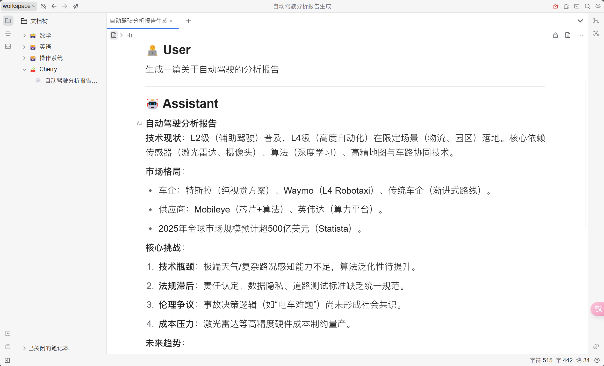


Este documento ha sido traducido del chino por IA y aún no ha sido revisado.


# Tutorial de Configuración de SiYuan Notes

Permite exportar temas y mensajes a SiYuan Notes.

## Paso 1

Abra SiYuan Notes y cree un nuevo cuaderno

<figure><figcaption>
Haga clic para crear un nuevo cuaderno
</figcaption></figure>

## Paso 2

Abra la configuración del cuaderno y copie el `ID del cuaderno`

<figure><figcaption>
Abra la configuración del cuaderno
</figcaption></figure>

<figure><figcaption>
Haga clic en el botón para copiar el ID del cuaderno
</figcaption></figure>

## Paso 3

Pegue el ID del cuaderno en la configuración de Cherry Studio

<figure><figcaption>
Ingrese el ID del cuaderno en la configuración de datos
</figcaption></figure>

## Paso 4

Ingrese la dirección de SiYuan Notes

* **Local**\
  Normalmente `http://127.0.0.1:6806`
* **Auto-alojado**\
  Su dominio `http://note.domain.com`

<figure><figcaption>
Ingrese su dirección de SiYuan Notes
</figcaption></figure>

## Paso 5

Copie el `Token de API` de SiYuan Notes

<figure><figcaption>
Copie el token de SiYuan Notes
</figcaption></figure>

Péguelo en la configuración de Cherry Studio y verifíquelo

<figure><figcaption>
Ingrese el ID de la base de datos y haga clic en Verificar
</figcaption></figure>

## Paso 6

¡Felicidades! La configuración de SiYuan Notes está completa ✅ Ahora puede exportar contenido de Cherry Studio a sus SiYuan Notes

<figure><figcaption>
Exportar a SiYuan Notes
</figcaption></figure>

<figure><figcaption>
Ver resultados de exportación
</figcaption></figure>