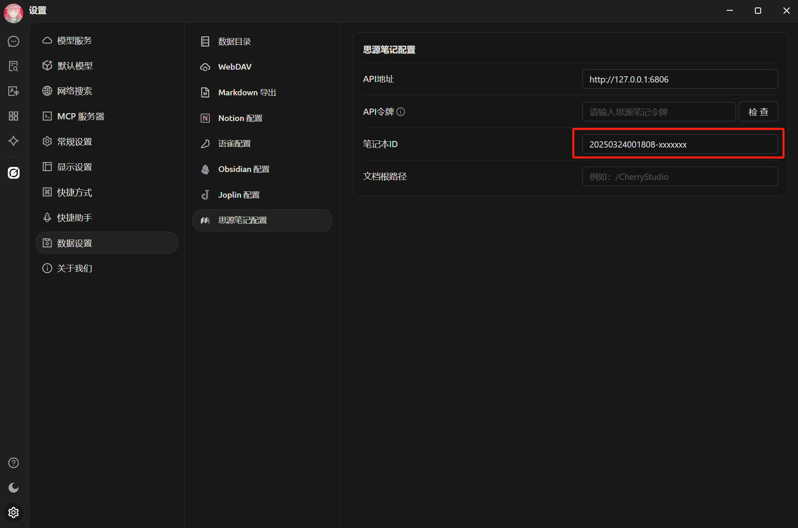


Este documento ha sido traducido del chino por IA y aún no ha sido revisado.


# Tutorial de Configuración de SiYuan Note

Permite exportar temas y mensajes a SiYuan Note.

## Paso 1

Abra SiYuan Note y cree un cuaderno de notas

<figure><figcaption>
Haga clic en "Nuevo cuaderno de notas"
</figcaption></figure>

## Paso 2

Abra la configuración del cuaderno y copie el `ID del cuaderno`

<figure><figcaption>
Abrir configuración del cuaderno de notas
</figcaption></figure>

<figure><figcaption>
Haga clic en el botón "Copiar ID del cuaderno de notas"
</figcaption></figure>

## Paso 3

Pegue el ID del cuaderno en la configuración de Cherry Studio

<figure><figcaption>
Complete el ID del cuaderno de notas en la configuración de datos
</figcaption></figure>

## Paso 4

Complete la dirección de SiYuan Note

* **Local**\
  Normalmente `http://127.0.0.1:6806`
* **Auto implementado**\
  Su dominio `http://note.domain.com`

<figure><figcaption>
Ingrese su dirección de SiYuan Note
</figcaption></figure>

## Paso 5

Copie el `API Token` de SiYuan Note

<figure><figcaption>
Copie el token de la API de SiYuan Note
</figcaption></figure>

Ingréselo en la configuración de Cherry Studio y verifique

<figure><figcaption>
Complete la ID de la base de datos y haga clic en "Comprobar"
</figcaption></figure>

## Paso 6

¡Felicidades! La configuración de SiYuan Note se ha completado ✅. Ahora puede exportar contenido de Cherry Studio a su SiYuan Note

<figure><figcaption>
Exportar a SiYuan Note
</figcaption></figure>

<figure><figcaption>
Ver el resultado de la exportación
</figcaption></figure>