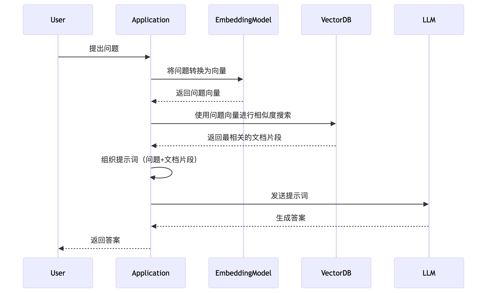


Este documento ha sido traducido del chino por IA y aún no ha sido revisado.


# Instrucciones de almacenamiento de datos

Los datos agregados a la base de conocimiento de Cherry Studio se almacenan completamente de forma local. Durante el proceso de agregado, se realiza una copia del documento en el directorio de almacenamiento de datos de Cherry Studio.

<figure><figcaption>
Diagrama de flujo del procesamiento de la base de conocimiento
</figcaption></figure>

Base de datos vectorial: [https://turso.tech/libsql](https://turso.tech/libsql)

Cuando un documento se agrega a la base de conocimiento de Cherry Studio, el archivo se divide en varios fragmentos. Estos fragmentos luego se procesan mediante el modelo de embeddings.

Al utilizar modelos grandes para preguntas y respuestas, se consultan fragmentos de texto relevantes a la pregunta y se entregan al modelo de lenguaje grande para su procesamiento.

Si tiene requisitos de privacidad de datos, se recomienda utilizar una base de datos de embeddings local y modelos de lenguaje grandes locales.