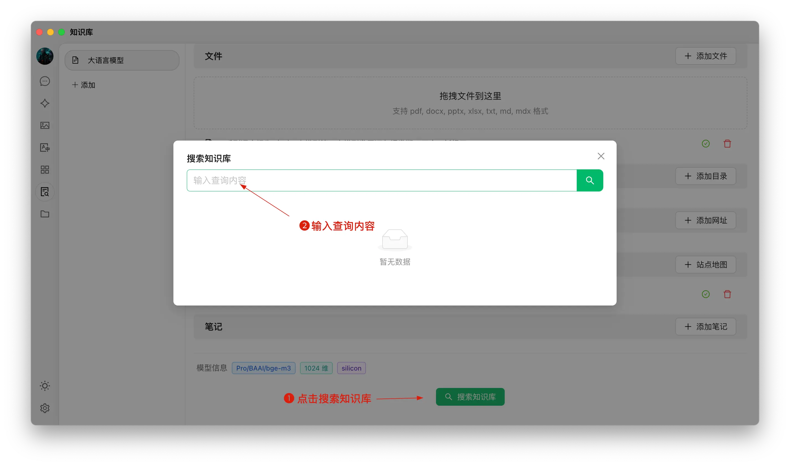


Este documento ha sido traducido del chino por IA y aún no ha sido revisado.


# Tutorial de Base de Conocimientos

En la versión 0.9.1, CherryStudio introdujo la tan esperada función de base de conocimientos.

A continuación, presentamos instrucciones detalladas paso a paso sobre cómo usar CherryStudio.

## Agregar Modelos de Incrustación

1. Busca modelos en el servicio de gestión de modelos; puedes filtrar rápidamente haciendo clic en "Modelos de Incrustación";
2. Encuentra el modelo necesario y agrégalo a Mis Modelos.

<figure><figcaption></figcaption></figure>

## Crear Base de Conocimientos

1. Entrada a la base de conocimientos: en la barra de herramientas izquierda de CherryStudio, haz clic en el icono de base de conocimientos para acceder a la página de gestión;
2. Agregar base de conocimientos: haz clic en Agregar para comenzar a crear una base de conocimientos;
3. Nombrar: ingresa el nombre de la base de conocimientos y agrega un modelo de incrustación; tomando bge-m3 como ejemplo, podrás completar la creación.

<figure><figcaption></figcaption></figure>

<figure><figcaption></figcaption></figure>

## Agregar Archivos y Vectorización

1. Agregar archivos: haz clic en el botón Agregar archivos para abrir el selector de archivos;
2. Seleccionar archivos: elige formatos compatibles como pdf, docx, pptx, xlsx, txt, md, mdx, etc., y ábrelos;
3. Vectorización: el sistema procesará la vectorización automáticamente; cuando se muestre "Completado" (✓ verde), indica que la vectorización ha finalizado.

<figure><figcaption></figcaption></figure>

<figure><figcaption></figcaption></figure>

<figure><figcaption></figcaption></figure>

## Agregar Datos de Múltiples Fuentes

CherryStudio admite varias formas de agregar datos:

1. Directorios: puedes agregar directorios completos; los archivos compatibles se vectorizarán automáticamente;
2. Enlaces web: admite URLs como [https://docs.siliconflow.cn/introduction](https://docs.siliconflow.cn/introduction);
3. Mapas de sitio: admite mapas de sitio en formato XML como [https://docs.siliconflow.cn/sitemap.xml](https://docs.siliconflow.cn/sitemap.xml);
4. Notas de texto plano: admite contenido personalizado mediante entrada de texto plano.


Nota:

1. Las ilustraciones en documentos importados aún no son compatibles con la conversión a vectores; debes convertirlas manualmente a texto;
2. El uso de URLs como fuente no siempre es exitoso, ya que algunos sitios tienen medidas anti-scraping estrictas (o requieren inicio de sesión/autorización). Se recomienda probar con una búsqueda después de la creación;
3. La mayoría de sitios web ofrecen sitemap, como el [sitemap de CherryStudio](https://docs.cherry-ai.com/sitemap-pages.xml). Generalmente se accede agregando `/sitemap.xml` a la URL raíz (ej: `aaa.com/sitemap.xml`);
4. Si un sitio no tiene sitemap o tiene URLs complejas, puedes crear manualmente un archivo XML. El archivo debe tener un enlace público accesible. Los enlaces locales no se reconocen.

> 1) Puedes usar IA para generar sitemap o crear una herramienta generadora de HTML para sitemap;
> 2) Para enlaces directos, usa OSS o servicios de almacenamiento. Sin herramientas, puedes iniciar sesión en [ocoolAI](https://one.ocoolai.com/login) y usar su herramienta gratuita de subida de archivos.


## Buscar en la Base de Conocimientos

Cuando los archivos se vectorizan, puedes realizar consultas:

1. Haz clic en el botón "Buscar en Base de Conocimientos";
2. Introduce el contenido a consultar;
3. Revisa los resultados;
4. Verifica la puntuación de coincidencia de cada resultado.

<figure><figcaption></figcaption></figure>

<figure><figcaption></figcaption></figure>

## Generar Respuestas Citando la Base de Conocimientos en Conversaciones

1. Crea un nuevo tema; en la barra de herramientas de conversación, haz clic en "Base de Conocimientos" para ver la lista. Selecciona la base deseada;
2. Envía tu pregunta; el modelo generará una respuesta usando los resultados de búsqueda;
3. Las fuentes de datos citadas aparecerán bajo la respuesta para acceso rápido.

<figure><figcaption></figcaption></figure>

<figure><figcaption></figcaption></figure>