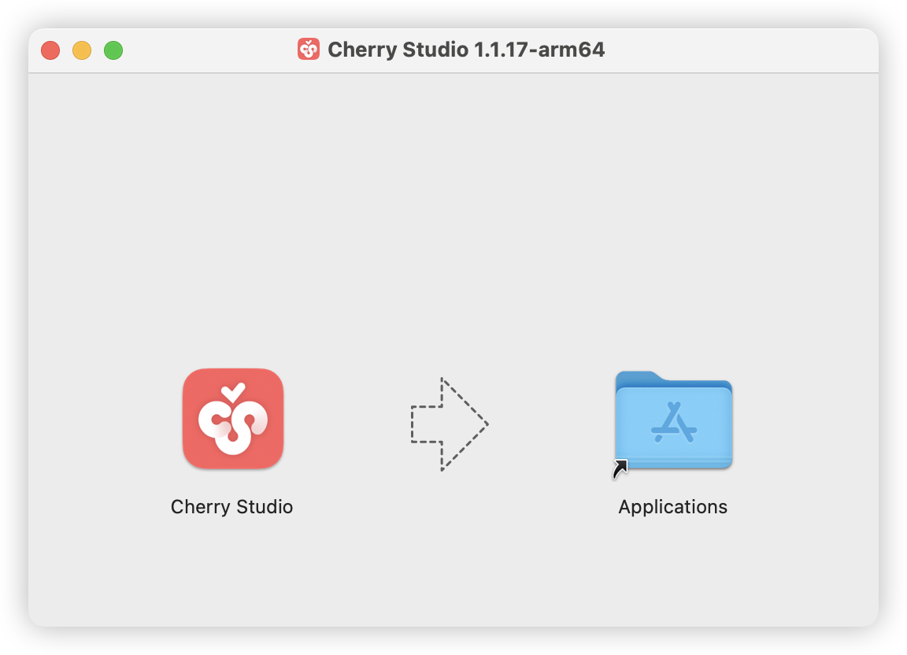


Este documento ha sido traducido del chino por IA y aún no ha sido revisado.


# macOS

1. Primero, dirígete a la página de descarga oficial y haz clic en la versión para Mac, o usa el enlace directo a continuación:

Por favor, descarga **la versión correspondiente al chip de tu Mac**.

Si no sabes qué versión de chip debe usar tu Mac:

* Haz clic en el menú  en la esquina superior izquierda de tu Mac
* Selecciona "Acerca de este Mac" en el menú desplegado
* En la ventana emergente, consulta la información del procesador

Si es un chip Intel, descarga la versión para Intel  
Si es un chip Apple M\*, descarga la versión para Apple Silicon




2. Después de descargar, haz clic aquí

<figure><figcaption></figcaption></figure>

3. Arrastra el ícono para instalar

<figure><figcaption></figcaption></figure>

Busca el ícono de Cherry Studio en Launchpad y haz clic. Si se abre la interfaz principal de Cherry Studio, la instalación fue exitosa.

<figure><figcaption></figcaption></figure>