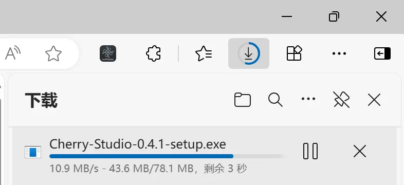


Este documento ha sido traducido del chino por IA y aún no ha sido revisado.


# Windows

## Abrir el sitio web oficial


Nota: Windows 7 no admite la instalación de Cherry Studio.


Haga clic en Descargar y seleccione la versión adecuada



<figure><figcaption>
Abrir el sitio web oficial
</figcaption></figure>

## Esperar a que se complete la descarga

<figure><figcaption>
Descarga en progreso en el navegador Edge
</figcaption></figure>

> Si el navegador muestra que el archivo no es de confianza, seleccione "Mantener"
>
> `Seleccionar Mantener` → `Confiar en Cherry-Studio`

<figure><figcaption></figcaption></figure>

## Abrir el archivo

<figure><figcaption>
Lista de descargas de Edge
</figcaption></figure>

## Instalación

<figure><figcaption>
Interfaz de instalación del software
</figcaption></figure>