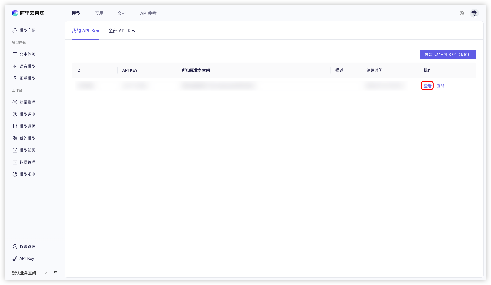


Este documento ha sido traducido del chino por IA y aún no ha sido revisado.


# Alibaba Cloud Bailian

1. Inicie sesión en [Alibaba Cloud Bailian](https://bailian.console.aliyun.com/?tab=model#/api-key). Si no tiene una cuenta de Alibaba Cloud, deberá registrarse.

2. Haga clic en el botón `创建我的 API-KEY` (Crear mi clave API) en la esquina superior derecha.  
  <figure><figcaption>Creación de clave API en Alibaba Cloud Bailian</figcaption></figure>
  
3. En la ventana emergente, seleccione el espacio de trabajo predeterminado (o puede personalizarlo). Si lo desea, complete la descripción.  
  <figure><figcaption>Ventana emergente para crear clave API en Bailian</figcaption></figure>
  
4. Haga clic en el botón `确定` (Aceptar) en la esquina inferior derecha.

5. Posteriormente, debería ver una nueva fila en la lista. Haga clic en el botón `查看` (Ver) a la derecha.  
   <figure><figcaption>Visualización de clave API en Bailian</figcaption></figure>
   
6. Haga clic en el botón `复制` (Copiar).  
    <figure><figcaption>Copia de clave API en Bailian</figcaption></figure>

7. Diríjase a Cherry Studio. En `设置` (Configuración) → `模型服务` (Servicios de modelos) → `阿里云百炼` (Bailian), busque `API 密钥` (Clave API) y pegue allí la clave copiada.  
    <figure><figcaption>Ingreso de clave API en Bailian</figcaption></figure>
    
8. Puede ajustar la configuración según las instrucciones en [模型服务](../../cherrystudio/preview/settings/providers.md) y empezar a usar el servicio.

Si no ve los modelos de Bailian en la lista, confirme que ha añadido los modelos según [模型服务](../../cherrystudio/preview/settings/providers.md) y ha activado este proveedor.
