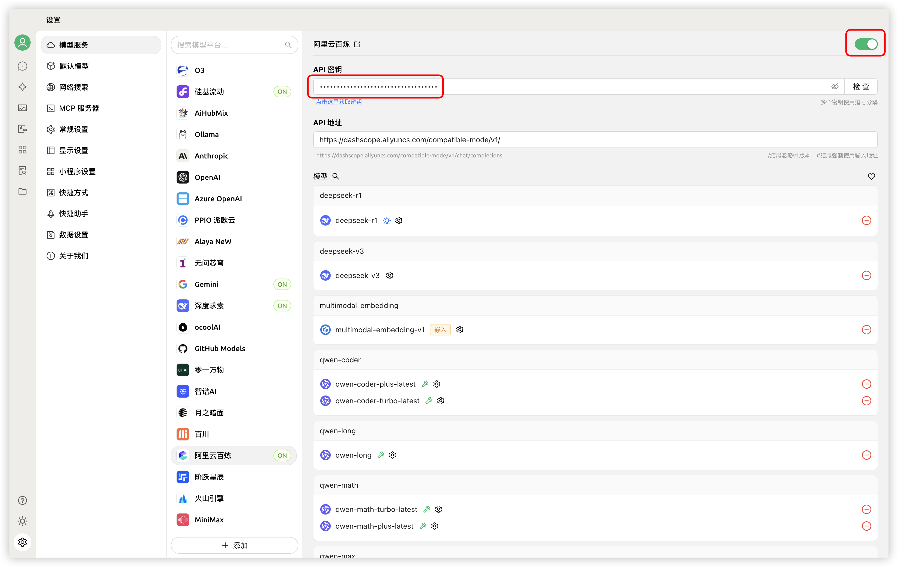


Este documento ha sido traducido del chino por IA y aún no ha sido revisado.


# 阿里云百炼

1. Inicia sesión en [阿里云百炼](https://bailian.console.aliyun.com/?tab=model#/api-key). Si no tienes una cuenta de Alibaba Cloud, regístrate primero.  

2. Haz clic en el botón `创建我的 API-KEY` en la esquina superior derecha.  
  <figure><figcaption>Crear clave API en Aliyun Bailian</figcaption></figure>  

3. En la ventana emergente, selecciona el espacio de trabajo predeterminado (o personalízalo si lo deseas). Opcionalmente, puedes añadir una descripción.  
  <figure><figcaption>Ventana emergente para crear clave API</figcaption></figure>  

4. Haz clic en el botón `确定` en la esquina inferior derecha.  

5. Verás una nueva fila en la lista. Haz clic en el botón `查看` a la derecha.  
   <figure><figcaption>Ver clave API en Aliyun Bailian</figcaption></figure>  

6. Haz clic en el botón `复制`.  
    <figure><figcaption>Copiar clave API</figcaption></figure>  

7. En Cherry Studio, ve a `设置` → `模型服务` → `阿里云百炼`, localiza `API 密钥` y pega la clave copiada.  
    <figure><figcaption>Pegar clave API</figcaption></figure>  

8. Ajusta las configuraciones según las instrucciones en [模型服务](../../cherrystudio/preview/settings/providers.md) y podrás comenzar a usarlo.  


Si los modelos de Aliyun Bailian no aparecen en la lista, verifica que hayas añadido los modelos según [模型服务](../../cherrystudio/preview/settings/providers.md) y activado este proveedor.
