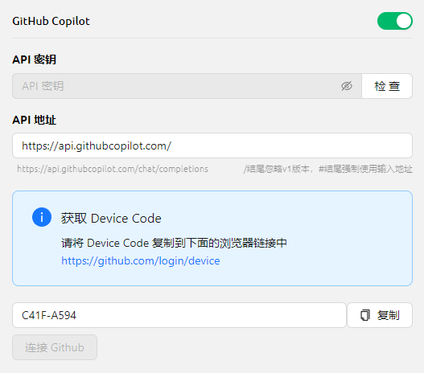


Este documento ha sido traducido del chino por IA y aún no ha sido revisado.


# GitHub Copilot

Para usar GitHub Copilot, primero necesitas tener una cuenta de GitHub y suscribirte al servicio GitHub Copilot. La versión gratuita también funciona, pero no admite el modelo Claude 3.7 más reciente. Para más detalles, consulta el [sitio oficial de GitHub Copilot](https://github.com/features/copilot).

## Obtener Device Code

Haz clic en "Iniciar sesión en GitHub" para obtener el Device Code y cópialo.

<figure><figcaption>
Obtener Device Code
</figcaption></figure>

## Ingresar Device Code en el navegador y autorizar

Después de obtener el Device Code correctamente, haz clic en el enlace para abrir el navegador. Inicia sesión en tu cuenta de GitHub dentro del navegador, ingresa el Device Code y autoriza el acceso.

<figure><figcaption>
Autorización de GitHub
</figcaption></figure>

Tras autorizar con éxito, vuelve a Cherry Studio y haz clic en "Conectar con GitHub". Al completarse, se mostrarán tu nombre de usuario y avatar de GitHub.

<figure><figcaption>
Conexión exitosa con GitHub
</figcaption></figure>

## Haz clic en "Administrar" para obtener la lista de modelos

Haz clic en el botón "Administrar" inferior para obtener automáticamente la lista de modelos compatibles actualmente.

<figure><figcaption>
Obtener lista de modelos
</figcaption></figure>

## Preguntas frecuentes

### Error al obtener Device Code, reintentar

<figure><figcaption>
Error al obtener Device Code
</figcaption></figure>

Actualmente las solicitudes se implementan con Axios, que no es compatible con proxy socks. Utiliza proxy de sistema, HTTP proxy, o no configures proxy en CherryStudio (usa proxy global). Primero verifica que tu conexión de red funcione correctamente para evitar este error.