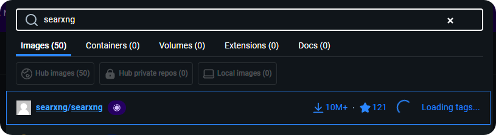
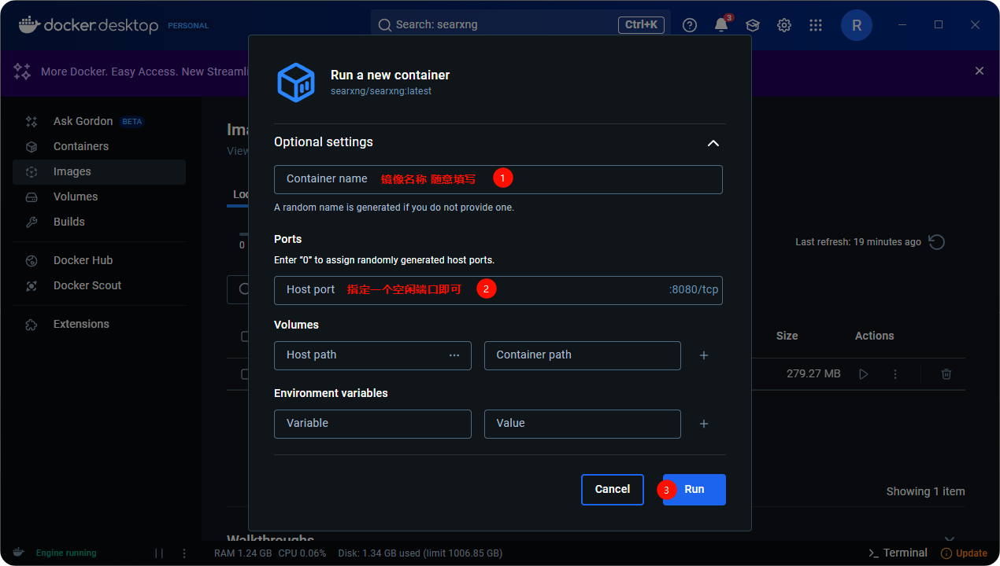
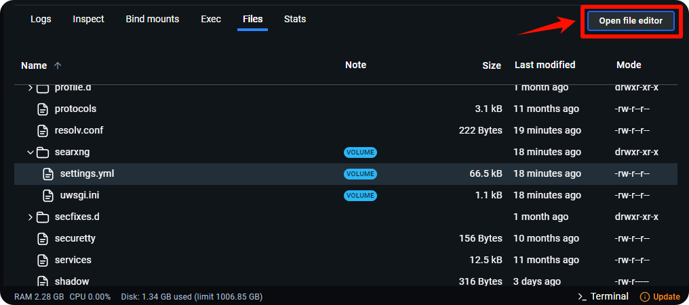
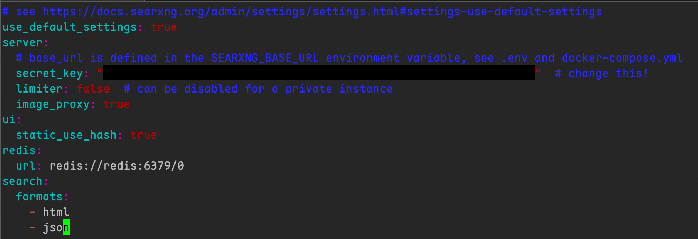

# Despliegue y configuración local de SearXNG



Este documento ha sido traducido del chino por IA y aún no ha sido revisado.



CherryStudio admite búsquedas web a través de SearXNG, un proyecto de código abierto que se puede implementar localmente o en servidores, lo que difiere ligeramente de otras configuraciones que requieren proveedores de API.

**Enlace al proyecto SearXNG**: [SearXNG](https://github.com/searxng/searxng)

## Ventajas de SearXNG

* Código abierto y gratuito, sin necesidad de API
* Alta privacidad relativa
* Altamente personalizable

## Despliegue local

### 1. Despliegue directo con Docker

Dado que SearXNG no requiere configuraciones ambientales complejas y puede implementarse sin docker compose simplemente asignando un puerto libre, la forma más rápida es utilizar Docker para descargar e implementar directamente la imagen.

#### 1. Descarga, instalación y configuración de [docker](https://www.docker.com/)

<figure><figcaption></figcaption></figure>

Después de la instalación, seleccione una ruta de almacenamiento para las imágenes:

<figure><figcaption></figcaption></figure>

#### 2. Buscar y descargar la imagen de SearXNG

Ingrese **searxng** en la barra de búsqueda:

<figure><figcaption></figcaption></figure>

Descargar la imagen:

<figure><figcaption></figcaption></figure>

<figure><figcaption></figcaption></figure>

#### 3. Ejecutar la imagen

Después de descargar con éxito, vaya a la página **images**:

<figure><figcaption></figcaption></figure>

Seleccione la imagen descargada y haga clic en ejecutar:

<figure><figcaption></figcaption></figure>

Abra la configuración para realizar ajustes:

<figure><figcaption></figcaption></figure>

Tomando el puerto `8085` como ejemplo:

<figure><figcaption></figcaption></figure>

Después de ejecutar con éxito, haga clic en el enlace para abrir la interfaz frontal de SearXNG:

<figure><figcaption></figcaption></figure>

La aparición de esta página indica que el despliegue fue exitoso:

<figure><figcaption></figcaption></figure>

## Despliegue en servidor

Dado que instalar Docker en Windows puede ser complicado, los usuarios pueden implementar SearXNG en un servidor y compartirlo con otros. Sin embargo, SearXNG actualmente no admite autenticación, lo que permite que otros escaneen y abusen de su instancia implementada.

Por ello, Cherry Studio admite actualmente la configuración de [Autenticación básica HTTP (RFC7617)](https://developer.mozilla.org/zh-CN/docs/Web/HTTP/Guides/Authentication). Si expone su instancia de SearXNG en Internet, **debe** configurar la autenticación básica HTTP mediante software proxy inverso como Nginx. A continuación se proporciona un breve tutorial que requiere conocimientos básicos de administración de Linux.

### Implementar SearXNG

Similarmente, se utiliza Docker para el despliegue. Suponiendo que ya ha instalado la última versión de Docker CE en el servidor siguiendo el [tutorial oficial](https://docs.docker.com/engine/install), aquí tiene comandos completos para una instalación nueva en sistemas Debian:

```bash
sudo apt update
sudo apt install git -y

# Descargar repositorio oficial
cd /opt
git clone https://github.com/searxng/searxng-docker.git
cd /opt/searxng-docker

# Si su servidor tiene ancho de banda limitado, puede establecerlo en false
export IMAGE_PROXY=true

# Modificar archivo de configuración
cat <<EOF > /opt/searxng-docker/searxng/settings.yml
# see https://docs.searxng.org/admin/settings/settings.html#settings-use-default-settings
use_default_settings: true
server:
  # base_url is defined in the SEARXNG_BASE_URL environment variable, see .env and docker-compose.yml
  secret_key: $(openssl rand -hex 32)
  limiter: false  # can be disabled for a private instance
  image_proxy: $IMAGE_PROXY
ui:
  static_use_hash: true
redis:
  url: redis://redis:6379/0
search:
  formats:
    - html
    - json
EOF
```

Si necesita modificar el puerto de escucha local o reutilizar un nginx existente, edite el archivo `docker-compose.yaml` como referencia:

```yaml
version: "3.7"

services:
# Si no necesita Caddy y reutiliza un Nginx local existente, elimine esto. Por defecto no necesitamos Caddy.
  caddy:
    container_name: caddy
    image: docker.io/library/caddy:2-alpine
    network_mode: host
    restart: unless-stopped
    volumes:
      - ./Caddyfile:/etc/caddy/Caddyfile:ro
      - caddy-data:/data:rw
      - caddy-config:/config:rw
    environment:
      - SEARXNG_HOSTNAME=${SEARXNG_HOSTNAME:-http://localhost}
      - SEARXNG_TLS=${LETSENCRYPT_EMAIL:-internal}
    cap_drop:
      - ALL
    cap_add:
      - NET_BIND_SERVICE
    logging:
      driver: "json-file"
      options:
        max-size: "1m"
        max-file: "1"
# Si no necesita Caddy y reutiliza un Nginx local existente, elimine esto. Por defecto no necesitamos Caddy.
  redis:
    container_name: redis
    image: docker.io/valkey/valkey:8-alpine
    command: valkey-server --save 30 1 --loglevel warning
    restart: unless-stopped
    networks:
      - searxng
    volumes:
      - valkey-data2:/data
    cap_drop:
      - ALL
    cap_add:
      - SETGID
      - SETUID
      - DAC_OVERRIDE
    logging:
      driver: "json-file"
      options:
        max-size: "1m"
        max-file: "1"

  searxng:
    container_name: searxng
    image: docker.io/searxng/searxng:latest
    restart: unless-stopped
    networks:
      - searxng
    # Asigna por defecto al puerto 8080 del host. Si desea escuchar en 8000, cambie a "127.0.0.1:8000:8080"
    ports:
      - "127.0.0.1:8080:8080"
    volumes:
      - ./searxng:/etc/searxng:rw
    environment:
      - SEARXNG_BASE_URL=https://${SEARXNG_HOSTNAME:-localhost}/
      - UWSGI_WORKERS=${SEARXNG_UWSGI_WORKERS:-4}
      - UWSGI_THREADS=${SEARXNG_UWSGI_THREADS:-4}
    cap_drop:
      - ALL
    cap_add:
      - CHOWN
      - SETGID
      - SETUID
    logging:
      driver: "json-file"
      options:
        max-size: "1m"
        max-file: "1"

networks:
  searxng:

volumes:
# Si no necesita Caddy y reutiliza un Nginx local existente, elimine esto
  caddy-data:
  caddy-config:
# Si no necesita Caddy y reutiliza un Nginx local existente, elimine esto
  valkey-data2:
```

Ejecute `docker compose up -d` para iniciar. Ejecute `docker compose logs -f searxng` para ver registros.

### Implementar proxy inverso Nginx y autenticación básica HTTP

Si utiliza paneles de servidor como BT-Panel o 1Panel, consulte su documentación para agregar sitios web y configurar proxy inverso Nginx. Luego modifique el archivo de configuración de Nginx según este ejemplo:

```conf
server
{
    listen 443 ssl;

    # Su nombre de host
    server_name search.example.com;

    # index index.html;
    # root /data/www/default;

    # Si configura SSL, debe tener estas dos líneas
    ssl_certificate    /ruta/de/su/cert/fullchain.pem;
    ssl_certificate_key    /ruta/de/su/cert/privkey.pem;

    # HSTS
    # add_header Strict-Transport-Security "max-age=31536000; includeSubDomains; preload";

    # Configuración predeterminada de proxy inverso
    location / {
        # Agregue estas dos líneas en el bloque location
        # Este ejemplo asume que los archivos de configuración se guardan en /etc/nginx/conf.d/
        # Para BT-Panel, puede estar en /www, preste atención
        auth_basic "Por favor ingrese su nombre de usuario y contraseña";
        auth_basic_user_file /etc/nginx/conf.d/search.htpasswd;

        proxy_http_version 1.1;
        proxy_set_header Connection "";
        proxy_redirect off;
        proxy_set_header Host $host;
        proxy_set_header X-Forwarded-For $proxy_protocol_addr;
        proxy_pass http://127.0.0.1:8000;
        client_max_body_size 0;
    }

    # access_log  ...;
    # error_log  ...;
}
```

Suponiendo que el archivo de configuración de Nginx se guarda en `/etc/nginx/conf.d`, guardaremos el archivo de contraseñas en el mismo directorio.

Ejecute este comando (reemplace `nombre_ejemplo` y `contraseña_ejemplo` con su nombre de usuario y contraseña):

```bash
echo "nombre_ejemplo:$(openssl passwd -5 'contraseña_ejemplo')" > /etc/nginx/conf.d/search.htpasswd
```

Reinicie Nginx (o recargue la configuración).

Ahora, al abrir la página web, se le pedirá nombre de usuario y contraseña. Ingrese los datos establecidos anteriormente para verificar si accede correctamente a la página de búsqueda de SearXNG.

<figure><figcaption></figcaption></figure>

## Configuración relacionada con Cherry Studio

Una vez implementado SearXNG localmente o en el servidor, proceda con la configuración en CherryStudio.

Vaya a la página de configuración de búsqueda web y seleccione Searxng:

<figure><figcaption></figcaption></figure>

Al ingresar el enlace de implementación local, la verificación fallará inicialmente (esto es normal):

<figure><figcaption></figcaption></figure>

La implementación predeterminada no configura el tipo de retorno JSON, por lo que es necesario modificar el archivo de configuración.

Regrese a Docker, vaya a la pestaña Files y encuentre la carpeta etiquetada:

<figure><figcaption></figcaption></figure>

Expanda y continúe desplazándose para encontrar otra carpeta etiquetada:

<figure><figcaption></figcaption></figure>

Expanda y busque el archivo de configuración **settings.yml**:

<figure><figcaption></figcaption></figure>

Haga clic para abrir el editor de archivos:

<figure><figcaption></figcaption></figure>

En la línea 78, verá que solo hay un tipo html:

<figure><figcaption></figcaption></figure>

Agregue el tipo json, guarde y reinicie la imagen:

<figure><figcaption></figcaption></figure>

<figure><figcaption></figcaption></figure>

Regrese a Cherry Studio para verificar: la verificación ahora será exitosa:

<figure><figcaption></figcaption></figure>

La dirección puede ser local: [http://localhost](http://localhost) :número_de_puerto\
O la dirección de Docker: [http://host.docker.internal](http://host.docker.internal) :número_de_puerto

Si implementó en servidor con proxy inverso configurado correctamente y habilitó el tipo de retorno JSON, al ingresar la dirección para verificación (con autenticación básica HTTP habilitada) debería recibir un error 401:

<figure><figcaption></figcaption></figure>

Configure la autenticación básica HTTP en el cliente con el nombre de usuario y contraseña establecidos:

<figure><figcaption></figcaption></figure>

Realice la verificación nuevamente; debería ser exitosa.

### Otras configuraciones

SearXNG ahora tiene capacidad de búsqueda web predeterminada. Para personalizar motores de búsqueda, configure manualmente:

Nota: Estas preferencias no afectan la configuración utilizada por los modelos grandes durante la invocación

<figure><figcaption></figcaption></figure>

Para configurar motores de búsqueda invocados por modelos grandes, establezca en el archivo de configuración:

<figure><figcaption></figcaption></figure>

<figure><figcaption></figcaption></figure>

Referencia de configuración de idioma:

<figure><figcaption></figcaption></figure>

Si el contenido es demasiado largo para editar directamente, cópielo en un IDE local, modifíquelo y luego péguelo de vuelta en el archivo de configuración.

## Causas comunes de fallo en verificación

### Formato de retorno sin JSON agregado

Agregue json al formato de retorno en el archivo de configuración:

<figure><figcaption></figcaption></figure>

### Motor de búsqueda configurado incorrectamente

Cherry Studio selecciona por defecto motores cuyas categorías incluyen web y general. Predeterminadamente selecciona Google, pero en China continental este no es accesible. Agregue esta configuración para forzar a SearXNG a usar Baidu:

```
use_default_settings:
  engines:
    keep_only:
      - baidu
engines:
  - name: baidu
    engine: baidu 
    categories: 
      - web
      - general
    disabled: false
```

### Tasa de acceso demasiado rápida

La configuración limiter de SearXNG bloquea el acceso API. Intente desactivarla en la configuración:

<figure><figcaption></figcaption></figure>