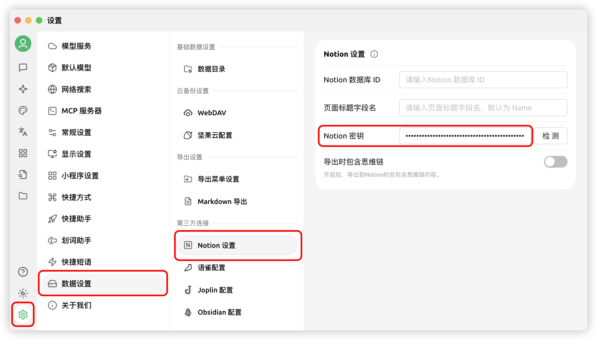


เอกสารนี้ได้รับการแปลจากภาษาจีนโดย AI และยังไม่ได้รับการตรวจสอบ


# คู่มือการกำหนดค่า Notion

Cherry Studio รองรับการนำเข้าหัวข้อไปยังฐานข้อมูล Notion

## ขั้นตอนที่หนึ่ง

เปิดเว็บไซต์ [Notion Integrations](https://www.notion.so/profile/integrations) เพื่อสร้างแอปพลิเคชัน

<figure><figcaption>
คลิกเครื่องหมายบวกเพื่อสร้างแอปพลิเคชัน
</figcaption></figure>

## ขั้นตอนที่สอง

สร้างแอปพลิเคชัน

<figure><figcaption>
กรอกข้อมูลแอปพลิเคชัน
</figcaption></figure>

ชื่อ: Cherry Studio  
ประเภท: เลือกตัวเลือกแรก  
ไอคอน: สามารถบันทึกรูปภาพนี้  

<figure><figcaption></figcaption></figure>

## ขั้นตอนที่สาม

คัดลอกคีย์ลับแล้วนำไปกรอกในการตั้งค่า Cherry Studio

<figure><figcaption>
คลิกคัดลอกคีย์ลับ
</figcaption></figure>

<figure><figcaption>
กรอกคีย์ลับในการตั้งค่าข้อมูล
</figcaption></figure>

## ขั้นตอนที่สี่

เปิดเว็บไซต์ [Notion](https://www.notion.so/) สร้างหน้าใหม่ เลือกประเภทฐานข้อมูลด้านล่าง ตั้งชื่อว่า Cherry Studio และเชื่อมต่อตามภาพ

<figure><figcaption>
สร้างหน้าใหม่แล้วเลือกประเภทฐานข้อมูล
</figcaption></figure>

<figure><figcaption>
ตั้งชื่อหน้าแล้วเลือก "เชื่อมต่อกับแอป"
</figcaption></figure>

## ขั้นตอนที่ห้า

<figure><figcaption>
คัดลอก ID ฐานข้อมูล
</figcaption></figure>

หาก URL ฐานข้อมูล Notion ของคุณเป็นแบบนี้:  
https://www.notion.so/\<long\_hash\_1>?v=\<long\_hash\_2>  
ID ฐานข้อมูล Notion จะเป็นส่วน `<long_hash_1>`

<figure><figcaption>
กรอก ID ฐานข้อมูลแล้วคลิกตรวจสอบ
</figcaption></figure>

## ขั้นตอนที่หก

กรอก `ชื่อฟิลด์ชื่อหน้า`:  
หากเว็บเป็นภาษาอังกฤษ ให้กรอก `Name`  
หากเว็บเป็นภาษาจีน ให้กรอก `名称`

<figure><figcaption>
กรอกชื่อฟิลด์ชื่อหน้า
</figcaption></figure>

## ขั้นตอนที่เจ็ด

ยินดีด้วย! การตั้งค่า Notion เสร็จสมบูรณ์ ✅ ทีนี้คุณสามารถส่งออกเนื้อหาจาก Cherry Studio ไปยังฐานข้อมูล Notion ของคุณได้แล้ว

<figure><figcaption>
ส่งออกไปยัง Notion
</figcaption></figure>

<figure><figcaption>
ดูผลลัพธ์การส่งออก
</figcaption></figure>