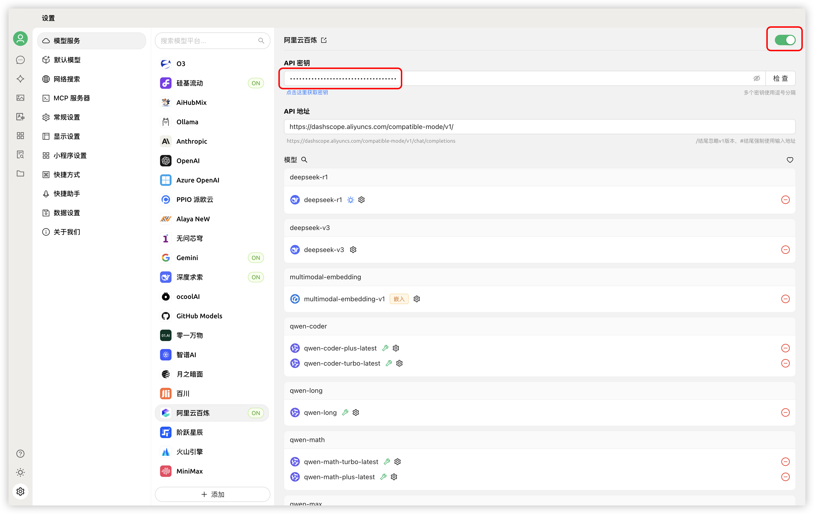


เอกสารนี้ได้รับการแปลจากภาษาจีนโดย AI และยังไม่ได้รับการตรวจสอบ


# Alibaba Cloud Bailian

1. เข้าสู่ระบบ [Alibaba Cloud Bailian](https://bailian.console.aliyun.com/?tab=model#/api-key) หากไม่มีบัญชี Alibaba Cloud ให้ลงทะเบียน

2. คลิกปุ่ม `创建我的 API-KEY` ที่มุมขวาบน  
   <figure><figcaption>การสร้างคีย์ API บน Alibaba Cloud Bailian</figcaption></figure>
   
3. ในหน้าต่างที่ปรากฏขึ้น ให้เลือกพื้นที่ทำงานเริ่มต้น (หรือคุณสามารถกำหนดเองได้) และกรอกคำอธิบายหากต้องการ  
   <figure><figcaption>ป๊อปอัพสร้างคีย์ API บน Alibaba Cloud Bailian</figcaption></figure>
   
4. คลิกปุ่ม `确定` ที่มุมขวาล่าง

5. หลังจากนั้น คุณควรเห็นแถวใหม่ในรายการ ให้คลิกปุ่ม `查看` ด้านขวา  
   <figure><figcaption>ดูคีย์ API บน Alibaba Cloud Bailian</figcaption></figure>
   
6. คลิกปุ่ม `复制`  
   <figure><figcaption>คัดลอกคีย์ API บน Alibaba Cloud Bailian</figcaption></figure>

7. ไปที่ Cherry Studio ใน `设置` → `模型服务` → `阿里云百炼` ให้ค้นหา `API 密钥` แล้ววางคีย์ API ที่คัดลอกไว้ที่นี่  
   <figure><figcaption>กรอกคีย์ API บน Alibaba Cloud Bailian</figcaption></figure>
   
8. คุณสามารถปรับการตั้งค่าที่เกี่ยวข้องตามคำแนะนำใน [บริการโมเดล](../../cherrystudio/preview/settings/providers.md) แล้วเริ่มใช้งานได้

หากไม่พบโมเดล Alibaba Cloud Bailian ในรายการโมเดล โปรดยืนยันว่าคุณได้เพิ่มโมเดลตามคำแนะนำใน [บริการโมเดล](../../cherrystudio/preview/settings/providers.md) และเปิดใช้งานผู้ให้บริการนี้แล้ว
