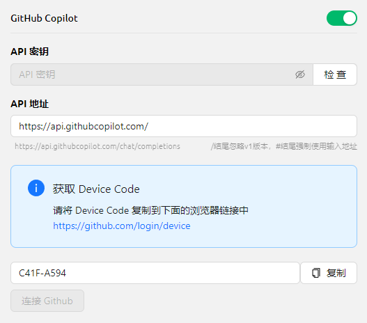


เอกสารนี้ได้รับการแปลจากภาษาจีนโดย AI และยังไม่ได้รับการตรวจสอบ


# GitHub Copilot

การใช้งาน GitHub Copilot จำเป็นต้องมีบัญชี GitHub และสมัครใช้บริการ GitHub Copilot ก่อน แม้เวอร์ชันฟรีก็ใช้งานได้ แต่เวอร์ชันฟรีไม่รองรับโมเดล Claude 3.7 ล่าสุด ดูรายละเอียดเพิ่มเติมได้ที่ [เว็บไซต์อย่างเป็นทางการของ GitHub Copilot](https://github.com/features/copilot)

## รับ Device Code

คลิก "เข้าสู่ระบบ GitHub" เพื่อรับ Device Code แล้วคัดลอกเก็บไว้

<figure><figcaption>
รับ Device Code
</figcaption></figure>

## กรอก Device Code ในเบราว์เซอร์และให้สิทธิ์

หลังจากรับ Device Code สำเร็จ ให้คลิกลิงก์เพื่อเปิดเบราว์เซอร์ เข้าสู่ระบบบัญชี GitHub ในเบราว์เซอร์ กรอก Device Code และให้สิทธิ์การเข้าถึง

<figure><figcaption>
การให้สิทธิ์ GitHub
</figcaption></figure>

เมื่อให้สิทธิ์สำเร็จ กลับมายัง Cherry Studio แล้วคลิก "เชื่อมต่อ GitHub" เมื่อเชื่อมต่อสำเร็จจะแสดงชื่อผู้ใช้และรูปโปรไฟล์ GitHub

<figure><figcaption>
เชื่อมต่อ GitHub สำเร็จ
</figcaption></figure>

## คลิกปุ่ม "จัดการ" เพื่อรับรายการโมเดล

คลิกปุ่ม "จัดการ" ด้านล่าง ระบบจะดึงข้อมูลรายการโมเดลที่รองรับปัจจุบันจากอินเทอร์เน็ตโดยอัตโนมัติ

<figure><figcaption>
รับรายการโมเดล
</figcaption></figure>

## คำถามที่พบบ่อย

### การรับ Device Code ล้มเหลว กรุณาลองอีกครั้ง

<figure><figcaption>
การรับ Device Code ล้มเหลว
</figcaption></figure>

ขณะนี้ระบบใช้ Axios ในการสร้างคำขอ โดย Axios ไม่รองรับพร็อกซี้ประเภท socks โปรดใช้พร็อกซี้ระบบหรือพร็อกซี้ HTTP หรือไม่ต้องตั้งค่าพร็อกซี้ใน CherryStudio แต่ใช้พร็อกซี้ทั้งระบบแทน ขั้นแรกโปรดตรวจสอบการเชื่อมต่อเครือข่ายให้ปกติ เพื่อหลีกเลี่ยงปัญหาการรับ Device Code ล้มเหลว