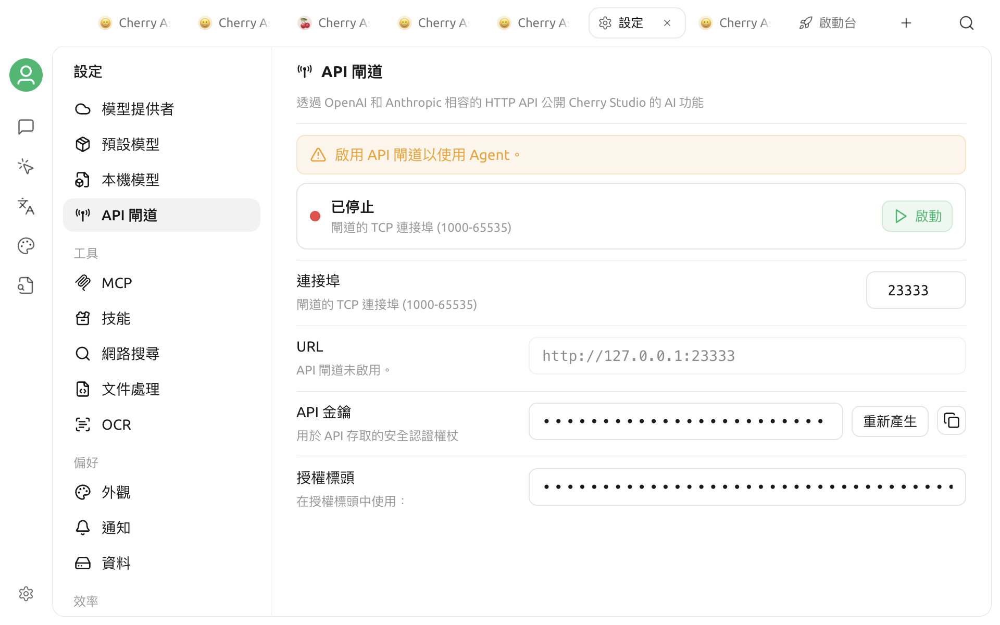

# API 閘道

API 閘道會將 Cherry Studio 中已設定的模型、MCP 及知識庫功能公開為本機 HTTP 介面。其他應用程式可以透過 OpenAI 或 Anthropic 相容的要求格式呼叫這些功能，不必在每個工具中重複設定服務商金鑰。



常見用途包括：

* 讓指令碼或第三方工具沿用 Cherry Studio 中的模型服務商。
* 透過 OpenAI Chat Completions 或 Anthropic Messages 格式發起對話。
* 從外部程式查詢 MCP Server，或搜尋 Cherry Studio 知識庫。
* 支援 Cherry Studio 的 Agent 頁面及部分內部操作。


目前 Agent 頁面需要 API 伺服器。Cherry Studio 偵測到已有 Agent 時，會嘗試自動啟動服務；如果服務已停止，Agent 頁面會提示重新啟用。頻道和排程任務使用獨立的本機主程序服務，不要求你另外啟用 API 伺服器。


## 啟動伺服器

1. 開啟 `設定 → API 伺服器`。
2. 確認連接埠可用。預設連接埠為 `23333`，可以設定為 `1000`–`65535`。
3. 按一下**啟動**。

啟動後，頁面會顯示**執行中**、服務位址及 **API 文件**按鈕。標準設定下的位址為：

```
http://127.0.0.1:23333
```

伺服器執行時無法編輯連接埠。如需修改，請先按一下**停止**，變更連接埠後再重新啟動。

重新開啟 Cherry Studio 時，如果符合以下任一條件，便會自動嘗試啟動：

* API 伺服器上次保持啟用；
* Cherry Studio 中已經存在 Agent。


API 伺服器會隨 Cherry Studio 一起執行。結束應用程式後，本機介面也會停止。


## API 金鑰

首次啟動時，Cherry Studio 會產生一個以 `cs-sk-` 開頭的 API 金鑰，並儲存在本機。重新啟動伺服器或應用程式不會自動更換此金鑰。

受保護的介面支援兩種認證標頭：

```
Authorization: Bearer YOUR_API_KEY
```

或：

```
x-api-key: YOUR_API_KEY
```

設定頁面預設顯示 Bearer 格式，並提供複製按鈕。需要更換金鑰時，請先停止伺服器，再按一下**重新產生**；新金鑰產生後，舊金鑰會立即無法通過認證。


API 金鑰可以呼叫 Cherry Studio 中已啟用的模型及資料功能。不要將真實金鑰寫入程式碼儲存庫、截圖、文件或公開聊天；建議透過環境變數傳給呼叫程式。


## 可用介面

啟動伺服器後，開啟頁面右上角的 **API 文件**，或直接存取：

* `/api-docs`：Swagger 格式的互動式文件
* `/api-docs.json`：OpenAPI JSON

主要公開介面包括：

| 功能 | 介面 |
|---|---|
| 服務狀態 | `GET /health` |
| OpenAI 相容對話 | `POST /v1/chat/completions` |
| Anthropic 相容對話 | `POST /v1/messages` |
| 指定服務商的 Anthropic 相容對話 | `POST /{provider_id}/v1/messages` |
| MCP Server 清單與詳細資料 | `GET /v1/mcps`、`GET /v1/mcps/:server_id` |
| 知識庫清單與詳細資料 | `GET /v1/knowledge-bases`、`GET /v1/knowledge-bases/:id` |
| 知識庫搜尋 | `POST /v1/knowledge-bases/search` |

`GET /`、`GET /health`、`/api-docs`及`/api-docs.json`不要求認證；模型、MCP、知識庫和其他 `/v1` 介面需要 API 金鑰。


目前 API 不提供 `GET /v1/models`。如果第三方用戶端必須自動取得模型清單，請改為手動填寫模型 ID，或確認用戶端允許略過模型探索。


## 發起第一個要求

以下範例會呼叫 OpenAI 相容介面。請將 `YOUR_API_KEY`、`provider-id`及`model-id`替換為自己的值：

```bash
curl http://127.0.0.1:23333/v1/chat/completions \
  -H "Authorization: Bearer YOUR_API_KEY" \
  -H "Content-Type: application/json" \
  -d '{
    "model": "provider-id:model-id",
    "messages": [
      {
        "role": "user",
        "content": "用一句話介紹 Cherry Studio"
      }
    ]
  }'
```

如果需要串流輸出，請在要求本文中加入：

```json
{
  "stream": true
}
```

串流回應使用 Server-Sent Events，並以 `data: [DONE]` 結束。

## 填寫模型 ID

API 使用以下格式定位模型：

```
服務商 ID:模型 ID
```

例如，服務商 ID 為 `my-openai`、模型 ID 為 `gpt-4o-mini` 時，應填寫：

```
my-openai:gpt-4o-mini
```

這裡需要的是 Cherry Studio 內部的服務商 ID，不一定等於設定頁面顯示的名稱。模型必須已加入該服務商並可用；缺少冒號、服務商未啟用或模型不存在，都會傳回要求錯誤。

API 伺服器會從已啟用的 OpenAI、Anthropic、Ollama 和 New API 類型服務商中解析可用模型。具體模型功能仍由上游服務商決定。

不同相容端點的限制並不相同：

* `/v1/chat/completions` 目前只接受類型為 OpenAI 的服務商。
* `/v1/messages`和`/{provider_id}/v1/messages`用於 Anthropic Messages 相容要求。
* 某個服務商顯示在 Cherry Studio 設定中，不代表它能透過所有 API 端點呼叫。

如果傳回「服務商不支援」，請先確認服務商類型與所用端點相符，而不是只檢查模型名稱。

## 在第三方用戶端中使用

對於允許自訂 OpenAI Base URL 的用戶端，通常填寫：

| 設定項目 | 值 |
|---|---|
| Base URL | `http://127.0.0.1:23333/v1` |
| API Key | 設定頁面顯示的 Cherry Studio API 金鑰 |
| Model | `服務商 ID:模型 ID` |

不同用戶端可能會自動串接 `/v1`，填寫前請先查看其 Base URL 說明。如果最終要求出現 `/v1/v1/chat/completions`，請移除其中一處 `/v1`。

部分用戶端只接受公用網路 HTTPS 位址、強制呼叫 `/v1/models`，或不允許模型 ID 中包含冒號。這類用戶端無法直接使用目前的本機介面。

## 安全界線

標準設定預設監聽 `127.0.0.1`，因此只有本機程式可以直接存取。設定頁面只提供連接埠修改，不提供區域網路開放開關。

從舊版本升級的使用者可能會保留歷史監聽位址。請以設定頁面執行狀態顯示的實際 URL 為準；如果顯示 `0.0.0.0` 或區域網路位址，應立即確認這是否為你的預期設定。

如果你透過反向 Proxy、連接埠轉送、SSH Tunnel 或其他方式，將介面轉送到另一部裝置，需要自行承擔額外的存取控制：

* 強制使用 HTTPS。
* 在 Proxy 層增加來源限制及速率限制。
* 不在 URL 查詢參數中傳遞 API 金鑰。
* 定期更換金鑰，並在不使用時停止轉送。
* 注意 `/health`及 API 文件本身不要求認證。

不要將監聽位址直接公開到網際網路。API 允許跨來源要求，單靠瀏覽器同源政策無法構成安全保護。

## 排查問題

### 啟動失敗或連接埠被占用

如果錯誤中包含 `EADDRINUSE`：

1. 停止可能正在使用相同連接埠的其他 Cherry Studio 實例或本機服務。
2. 在設定頁面改用另一個未占用的連接埠。
3. macOS 或 Linux 可以執行 `lsof -i :23333` 查看占用程序；Windows 可以執行 `netstat -ano | findstr :23333`。

### 傳回 401 或 403

* `401` 通常表示沒有認證標頭、Bearer 格式錯誤或金鑰為空。
* `403` 通常表示金鑰與設定頁面目前的值不一致。
* 如果剛重新產生金鑰，請更新呼叫程式中的環境變數或設定後再試。

先使用以下不需認證的要求，確認服務是否在線：

```bash
curl http://127.0.0.1:23333/health
```

### 傳回模型格式或服務商錯誤

確認模型使用 `服務商 ID:模型 ID` 格式，並檢查：

* 服務商已啟用；
* API 伺服器支援該服務商類型；
* 該模型已存在於服務商的模型清單；
* 要求使用的是內部服務商 ID，而不是只用於顯示的名稱。

同時確認端點與服務商類型相符：OpenAI Chat Completions 目前要求 OpenAI 類型服務商，Anthropic Messages 應使用 Messages 端點。

### 知識庫介面傳回 503

知識庫介面需要讀取 Cherry Studio 主視窗中目前的知識庫狀態。主視窗尚未準備完成、正在關閉，或內部狀態不可用時，介面會傳回 `503`。請保持主視窗開啟，等待應用程式完成載入後再試。

### 第三方用戶端無法連線

* 確認 Cherry Studio 和 API 伺服器都仍在執行。
* 檢查用戶端是否在另一部裝置、容器或虛擬機器中執行；其中的 `127.0.0.1` 不一定指向 Cherry Studio 所在的主機。
* 檢查 Base URL 是否重複或遺漏 `/v1`。
* 使用 `curl` 分別測試 `/health`及目標介面，以區分網路、認證和要求本文問題。

如需進一步排查，可以在 `設定 → 資料設定` 中開啟日誌目錄。分享日誌前，必須搜尋並遮蓋 API 金鑰、Token、個人路徑及業務資料。

***

### 💡 取得協助與提交意見

如果你在設定或使用過程中遇到疑問、Bug 或改進建議，請參考[意見與建議](../question-contact/suggestions.md)中的官方管道。
