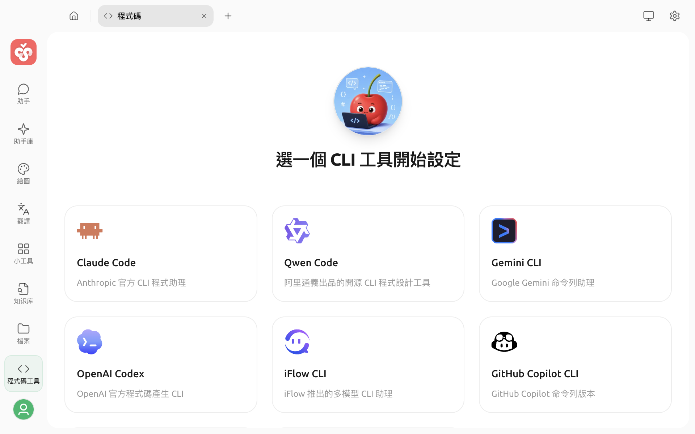
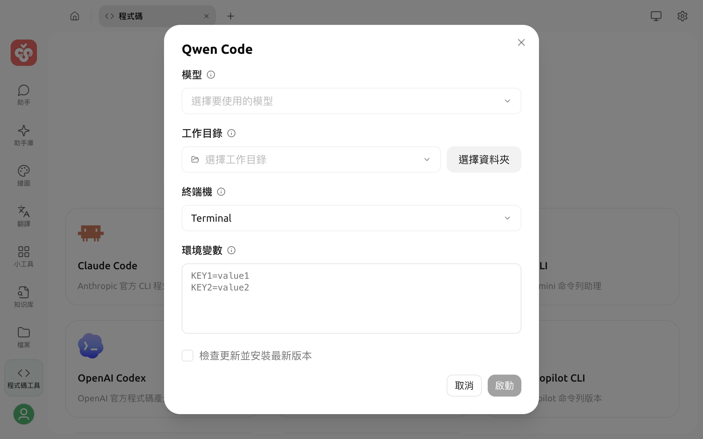

# 程式碼工具

程式碼工具用於在 Cherry Studio 中設定並啟動 AI 程式設計 CLI。你可以重複使用已設定的模型服務、指定專案目錄和終端機，再於獨立的終端機視窗中使用 CLI。

## 開始之前

* 程式碼工具需要 **Bun**。如果頁面提示尚未安裝，請點選提示中的 **安裝 Bun**。
* 使用 Kimi CLI 時還需要 **uv**；可以在 **設定 → MCP 伺服器 → 環境依賴** 中安裝。
* 除 GitHub Copilot CLI 外，請先在 Cherry Studio 中設定可用的模型服務和 API Key。


AI 程式設計 CLI 可以在所選工作目錄中讀取、修改檔案並執行指令。建議先使用 Git 或其他方式儲存目前版本，且不要選擇包含無關敏感檔案的目錄。


## 開啟程式碼工具

1. 點選頂部分頁列右側的 `+`，開啟啟動台。
2. 點選 **程式碼**。
3. 在程式碼工具頁面選擇要使用的 CLI。

目前支援：

| CLI | 模型來源 |
| :--- | :--- |
| Claude Code | Anthropic 相容模型 |
| Qwen Code | OpenAI 相容模型 |
| Gemini CLI | Gemini 相容模型 |
| OpenAI Codex | OpenAI 或 OpenAI Responses 相容模型 |
| iFlow CLI | OpenAI 相容模型 |
| GitHub Copilot CLI | 不顯示模型選擇；使用 GitHub Copilot 本身的驗證和模型能力 |
| Kimi CLI | OpenAI 相容模型 |
| OpenCode | OpenAI、OpenAI Responses 或 Anthropic 相容模型 |

模型清單會依所選 CLI 支援的 Endpoint 類型自動篩選。如果某個模型未顯示，請先檢查供應商是否已啟用、模型是否已新增，以及 Endpoint 類型是否相容。

## 設定並啟動

選擇 CLI 卡片後，請在設定視窗中完成以下項目：

1. **模型**：選擇要交由 CLI 使用的模型。GitHub Copilot CLI 沒有此項目。
2. **工作目錄**：選擇 CLI 啟動時進入的專案目錄。最近使用的目錄會保留在清單中。
3. **終端機**：在 macOS 或 Windows 上選擇已偵測到的終端機。在 Windows 上使用 WSL、Alacritty 或 WezTerm 時，如果無法自動找到程式，必須設定自訂執行檔路徑。
4. **環境變數**：依 `KEY=value` 格式填寫，每行一個。Cherry Studio 會依模型產生必要的變數；在此填寫的同名變數會覆蓋自動產生的值。
5. **檢查更新並安裝最新版本**：視需要啟用。啟用後，啟動前會查詢並更新所選 CLI。
6. 點選 **啟動**。

如果 CLI 尚未安裝，Cherry Studio 會在第一次啟動時下載並安裝，接著在所選終端機和工作目錄中執行。Kimi CLI 由 uv 負責下載和啟動，因此第一次執行同樣需要網路連線。


GitHub Copilot CLI 不使用 Cherry Studio 的模型選擇器。如需額外的驗證資訊，請依該 CLI 的要求在環境變數區域設定，例如使用 `GITHUB_TOKEN`。


## 環境變數與金鑰

除自訂環境變數外，Cherry Studio 會從所選模型服務讀取 API 位址、模型識別碼和 API Key，並轉換為對應 CLI 所需的變數或啟動參數。

自訂變數適合用於代理位址或 CLI 專用開關。填寫前請先確認變數名稱；同名自訂值的優先順序高於自動產生值，錯誤覆蓋可能造成驗證或連線失敗。


請勿在截圖、日誌或公開問題中揭露 API Key、GitHub Token 或其他憑證。程式碼工具會將自訂環境變數儲存在目前的設定中，只應在可信任的裝置上使用。


## 常見問題

### 啟動按鈕無法使用

確認已安裝 Bun、已選擇工作目錄，並為 GitHub Copilot CLI 以外的工具選擇模型。

### 模型清單是空的

所選 CLI 只會顯示 Endpoint 類型相容的模型。返回模型服務設定，檢查供應商是否已啟用、API Key 是否可用、模型是否已新增，以及模型的 Endpoint 類型。

### Kimi CLI 提示找不到 uv

前往 **設定 → MCP 伺服器 → 環境依賴** 安裝 uv。安裝後仍無法識別時，請重新啟動 Cherry Studio。

### 終端機未開啟

改用系統預設終端機。在 Windows 上使用其他終端機時，請確認對應的程式已安裝；WSL、Alacritty 或 WezTerm 還可以透過 **設定自訂終端機路徑** 指定執行檔。

第一次啟動、安裝 CLI 或檢查更新都需要網路，可能需要稍候。若操作失敗，請先檢查網路、代理和 API 服務設定，再重新啟動。
