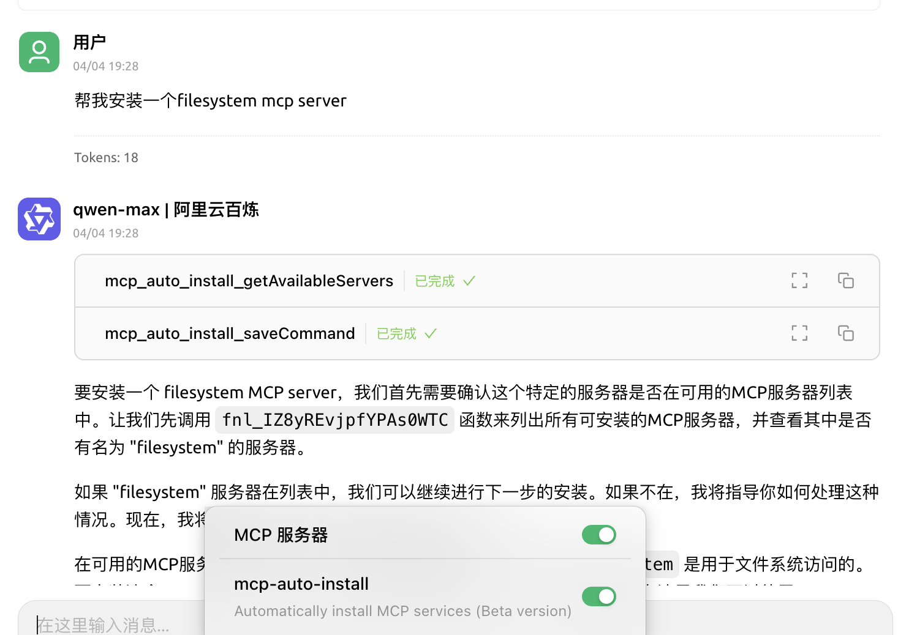


此文件由 AI 從中文翻譯而來，尚未經過審閱。


# 自動安裝 MCP

> 自動安裝 MCP 需要將 Cherry Studio 升級至 v1.1.18 或更高版本。

## 功能簡介

除了手動安裝外，Cherry Studio 還內建了 `@mcpmarket/mcp-auto-install` 工具，這是一個更便捷的 MCP 伺服器安裝方式。你只需要在支援 MCP 服務的大型模型對話中輸入相應的指令即可。


**測試階段提醒：**

* `@mcpmarket/mcp-auto-install` 目前仍處於測試階段
* 效果依賴大型模型的「智商」，有些會自動添加，有些還是**需要在 MCP 設定中再手動更改某些參數**
* 目前搜尋來源是從 @modelcontextprotocol 中進行搜尋，可以自行設定（下方說明）


## 使用說明

例如，你可以輸入：

```
幫我安裝一個 filesystem mcp server
```

<figure><figcaption><p>輸入指令安裝 MCP 伺服器</p></figcaption></figure>

<figure><figcaption><p>MCP 伺服器設定介面</p></figcaption></figure>

系統會自動識別你的需求，並透過 `@mcpmarket/mcp-auto-install` 完成安裝。這個工具支援多種類型的 MCP 伺服器，包括但不限於：

* filesystem（檔案系統）
* fetch（網路請求）
* sqlite（資料庫）
* 等等...

> MCP_PACKAGE_SCOPES 變數可以自訂 MCP 服務搜尋來源，預設值為：`@modelcontextprotocol`，可以自訂設定。

## `@mcpmarket/mcp-auto-install` 函式庫的介紹


**預設設定參考：**

```json
// `axun-uUpaWEdMEMU8C61K` 為服務id,自訂即可
"axun-uUpaWEdMEMU8C61K": {
  "name": "mcp-auto-install",
  "description": "Automatically install MCP services (Beta version)",
  "isActive": false,
  "registryUrl": "https://registry.npmmirror.com",
  "command": "npx",
  "args": [
    "-y",
    "@mcpmarket/mcp-auto-install",
    "connect",
    "--json"
  ],
  "env": {
    "MCP_REGISTRY_PATH": "详情见https://www.npmjs.com/package/@mcpmarket/mcp-auto-install"
  },
  "disabledTools": []
}
```

`@mcpmarket/mcp-auto-install` 是一個開源的 npm 套件，你可以在 [npm 官方倉庫](https://www.npmjs.com/package/@mcpmarket/mcp-auto-install) 查看其詳細資訊和使用文件。`@mcpmarket` 為 Cherry Studio 官方 MCP 服務集合。
