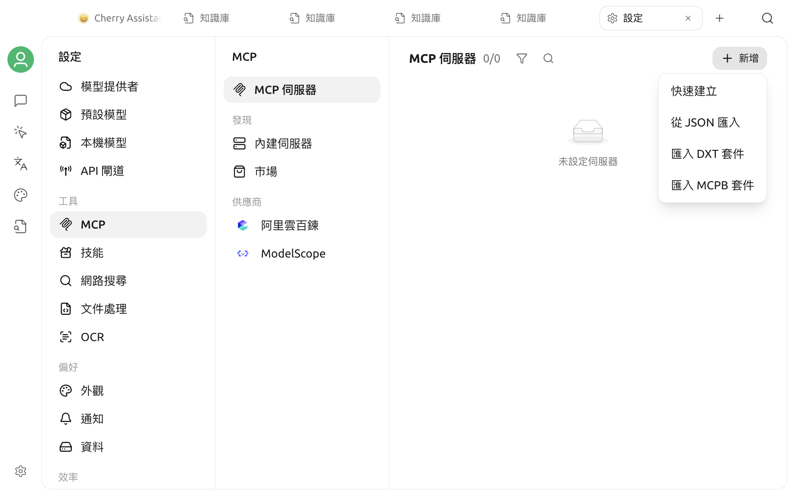

# 設定與使用 MCP

在 Cherry Studio 中使用 MCP 分為兩件事：

1. 將 MCP 伺服器新增至**設定 → MCP 伺服器**，完成連線和權限設定；
2. 將已啟用的伺服器新增至需要使用它的助手或 Agent。

如果還不瞭解 MCP 的用途，請先閱讀 [MCP 使用教學](README.md)。如果系統缺少 NPX、Bun 或 UV，請先完成 [MCP 環境安裝](install.md)。



## 選擇新增方式

開啟**設定 → MCP 伺服器**，按一下**新增伺服器**，可以選擇：

| 方式 | 適用情境 |
| --- | --- |
| 新增 | 手動填寫 STDIO、SSE 或 Streamable HTTP 設定 |
| 從 JSON 匯入 | 開發者已經提供 `mcpServers` JSON |
| 從 DXT 匯入 | 已取得 `.dxt` 擴充套件 |
| 內建伺服器 | 使用 Cherry Studio 已適配的常用工具 |

對於常見需求，請優先檢查[內建 MCP 伺服器](in-memory.md)。內建版本無需手動尋找指令，也更容易控制權限。

## 連線類型

### STDIO

STDIO 伺服器由 Cherry Studio 在本機啟動，通常需要填寫：

| 欄位 | 說明 |
| --- | --- |
| 名稱 | 用來識別伺服器，可以自訂 |
| 類型 | `STDIO` |
| 指令 | 可執行程式，例如 `npx`、`uvx`、`node` |
| 參數 | 每行一個參數，順序必須與開發者文件一致 |
| 環境變數 | 每行一個 `KEY=value` |

當指令包含 NPX、Bun、UV 或 UVX 時，頁面會顯示選用的套件 Registry 設定。除非預設來源無法使用，否則不需要修改。

以下使用官方 Time Server 示範最小設定：

| 欄位 | 值 |
| --- | --- |
| 名稱 | `time` |
| 類型 | `STDIO` |
| 指令 | `uvx` |
| 參數 | 第一行 `mcp-server-time`，第二行 `--local-timezone=Asia/Shanghai` |

也可以省略時區參數，讓模型在呼叫工具時明確傳入時區。

### SSE

用於連線至使用 Server-Sent Events 的遠端 MCP 伺服器。選擇 `SSE` 後填寫伺服器 URL，例如：

```text
https://example.com/sse
```

如果服務需要驗證，請在**請求標頭（Headers）**中每行填寫一個 `KEY=value`：

```text
Authorization=Bearer your-token
```

### Streamable HTTP

用於連線至較新的 Streamable HTTP MCP 伺服器。設定方式與 SSE 類似，但 URL 通常以 `/mcp` 結尾：

```text
https://example.com/mcp
```

通訊協定類型必須與伺服器端一致。不能因為某個 URL 可以在瀏覽器中開啟，就假設它同時支援 SSE 和 Streamable HTTP。


遠端伺服器的 Header 可能包含帳號權杖。請只將金鑰填寫在伺服器設定中，不要放入提示詞、截圖或共用設定。


## 從 JSON 匯入

Cherry Studio 每次只能匯入一個伺服器。常見格式如下：

```json
{
  "mcpServers": {
    "example-server": {
      "command": "npx",
      "args": ["-y", "@example/mcp-server"],
      "env": {
        "EXAMPLE_API_KEY": "匯入後取代"
      }
    }
  }
}
```

遠端伺服器可以使用 `type`、`url` 和 `headers`：

```json
{
  "mcpServers": {
    "remote-example": {
      "type": "streamableHttp",
      "url": "https://example.com/mcp",
      "headers": {
        "Authorization": "Bearer your-token"
      }
    }
  }
}
```

匯入後，伺服器預設不會啟用。請先開啟詳細資料頁面，檢查指令、參數、URL、Header 和環境變數，再嘗試連線。

## 從 DXT 匯入

DXT 是包含伺服器資訊清單和資源的擴充套件。選擇 `.dxt` 檔案後，Cherry Studio 會讀取其中的啟動設定並建立伺服器。

DXT 仍屬於可執行的擴充功能。請只安裝來自可信來源的檔案，並在匯入後檢查提供者、指令、參數和所需權限。

## 檢查伺服器詳細資料

按一下已安裝的伺服器以進入詳細資料頁面。儲存設定並啟用後，可以查看：

- **設定**：連線類型、指令、參數、環境變數、Header、逾時和進階資訊；
- **工具**：伺服器提供的工具、參數結構、啟用狀態和自動核准；
- **提示**：伺服器提供的 MCP Prompts；
- **資源**：伺服器提供的 MCP Resources；
- **日誌**：連線過程和 STDIO 錯誤輸出。

並非所有伺服器都會提供提示或資源；這些分頁只會在伺服器啟用後出現。

### 逾時與長時間任務

一般工具呼叫的預設逾時時間為 60 秒。只有伺服器確實需要長時間執行時，才開啟**長時間運作模式（Long Running）**或提高逾時時間。逾時設定無法修正錯誤的指令、無效的金鑰或無法存取的 URL。

### 工具權限

在**工具**頁面可以個別停用某個工具，也可以控制是否自動核准。建議：

- 查詢和唯讀工具依需要啟用；
- 寫入檔案、刪除資料、傳送訊息、建立訂單等操作保留人工確認；
- 直接關閉不使用的工具，縮小模型誤呼叫的範圍。

## 在一般助手中使用

開啟助手設定的 **MCP** 頁面，或使用輸入框中的 MCP 快捷面板，可以選擇三種模式：

| 模式 | 行為 |
| --- | --- |
| 停用 | 目前的助手不使用 MCP |
| 自動 | 透過內建 Hub 探索並呼叫所有已啟用 MCP 伺服器中的工具 |
| 手動 | 只使用你為目前助手選取的已啟用伺服器 |

對權限敏感的工作建議使用**手動**模式。自動模式適合工具較多、需要模型自行探索功能的情境，但仍應在每個伺服器的**工具**頁面限制高風險操作。

選擇模式後，使用支援工具呼叫的模型並提出明確任務。例如：

```text
請使用 time 工具查詢東京目前時間，並同時說明與上海的時差。
```

模型是否呼叫工具取決於模型能力、問題和提示詞。需要強制檢索時，可以明確寫出伺服器或工具的用途。

## 在 Agent 中使用

1. 開啟目標 Agent 的編輯或設定頁面。
2. 進入**工具 → MCP**。
3. 新增需要的伺服器。
4. 儲存 Agent。

只有已啟用的 MCP 伺服器可以被選取。伺服器停用後，即使仍保留在 Agent 設定中，也不會提供工具。

## 驗證是否連線成功

建議依以下順序檢查：

1. 伺服器清單中的狀態為啟用；
2. 詳細資料頁面的**工具**頁面可以列出工具；
3. 目標助手或 Agent 已新增該伺服器；
4. 所選模型支援工具呼叫；
5. 傳送一個範圍明確且容易驗證結果的測試問題；
6. 在回答中展開工具呼叫記錄，確認參數和結果正確。

如果伺服器無法啟動、連線後沒有工具或呼叫逾時，請查看 [MCP 伺服器常見問題](chang-jian-wen-ti.md)。

## 相關文件

- [MCP 使用教學](README.md)
- [MCP 環境安裝](install.md)
- [內建 MCP 伺服器](in-memory.md)
- [自動安裝 MCP](auto-install.md)
- [意見與建議](../../question-contact/suggestions.md)
