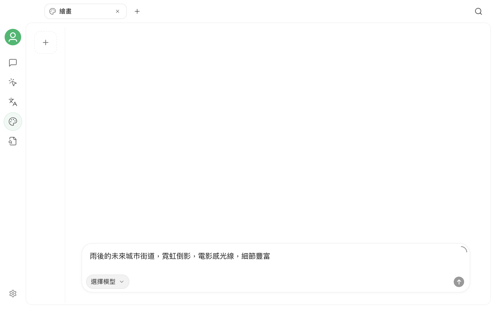

# 繪畫



繪畫是 Cherry Studio 的獨立圖片生成工作區。它會讀取你已設定的服務商和模型，讓你在同一頁面中選擇圖片模型、輸入提示詞、調整該模型支援的參數，並管理本次生成的圖片。


繪畫頁面只會顯示具備圖片生成功能的可用模型。可選項目取決於目前版本、已啟用的服務商和模型設定，因此應以應用程式內的清單為準。


## 開始前的準備

使用繪畫前，至少需要一個可用的圖片生成模型：

1. 開啟 `設定` → `模型服務`。
2. 啟用服務商，並完成必要的 API 金鑰或連線設定。
3. 確認服務商中已新增支援圖片生成的模型。

如果尚未設定服務商，請先閱讀[設定模型服務](../../pre-basic/providers/README.md)。

## 開啟繪畫

按一下頂部標籤列右側的 `+`，開啟**啟動台**，然後選擇**繪畫**。

頁面主要分為三個區域：

| 區域 | 用途 |
| --- | --- |
| 左側設定區 | 選擇服務商和模型，調整目前模型支援的生成參數 |
| 中央畫布 | 查看生成狀態和結果；一次傳回多張圖片時可逐張切換 |
| 右側歷史記錄區 | 建立新繪畫、切換歷史記錄或刪除不再需要的記錄 |

底部是提示詞輸入區。選擇模型並寫好描述後，即可開始生成。

## 文字生成圖片

文字生成圖片只需要描述你想要的畫面：

1. 在左側選擇服務商和圖片生成模型。
2. 在底部輸入提示詞。
3. 依照需要調整尺寸、長寬比、解析度或其他參數。
4. 按一下傳送按鈕開始生成。
5. 等待中央畫布顯示結果。

例如：

```text
一隻戴圓框眼鏡的橘貓坐在書堆上，復古油畫風格，溫暖的黃昏光線，中景構圖
```

生成期間，畫布會顯示進度；如需停止，可以取消目前任務。如果模型一次傳回多張圖片，可以使用畫布上的上一張、下一張按鈕切換。

## 使用參考圖或編輯圖片

部分模型除了文字生成圖片，還支援圖片編輯、混合或其他圖片模式。選擇這類模型後，提示詞輸入區會顯示新增圖片的入口。

你可以：

- 從本機選擇圖片；
- 將圖片拖入輸入區；
- 從剪貼簿貼上圖片；
- 在模型支援時新增多張參考圖。

新增圖片後，請描述需要保留和修改的內容，再開始生成。例如：

```text
保留主體和構圖，將背景改成雨後的東京街道，加入霓虹燈倒影
```


如果輸入區沒有新增圖片的入口，表示目前選取的模型未提供圖片編輯功能。請改用支援相關模式的模型。


## 調整生成參數

參數面板會依照所選模型動態變化，只顯示該模型宣告支援的選項。常見參數包括：

| 參數 | 功能 |
| --- | --- |
| 尺寸或長寬比 | 控制圖片的畫布形狀和輸出尺寸 |
| 解析度 | 在模型支援時選擇輸出清晰度 |
| 圖片數量 | 控制一次生成傳回的結果數量 |
| 品質、風格、背景 | 調整模型提供的畫面選項 |
| Seed、Guidance、Steps | 控制隨機性或生成過程，僅部分模型提供 |

不同模型的參數名稱、值和計費方式可能不同。如果不確定，建議先使用預設值完成一次生成，再逐項調整；模型未顯示的參數不需要手動補充。

## 管理繪畫記錄

右側歷史記錄區用於管理不同的繪畫任務：

- 按一下頂部的 `+` 建立一筆空白繪畫；
- 按一下縮圖返回現有記錄；
- 記錄較多時，向下捲動以載入更多內容；
- 刪除不再需要的記錄前，應用程式會再次確認。

生成結果會顯示在中央畫布。按一下圖片可以開啟大圖預覽，再使用預覽介面提供的操作查看或儲存結果。

## 撰寫更有效的提示詞

提示詞不需要固定格式，但建議至少包含下列資訊：

- **主體**：人物、物品或場景；
- **環境**：地點、時間、天氣和背景；
- **視覺風格**：攝影、插畫、油畫、3D 等；
- **構圖**：近景、全身、俯拍、對稱構圖等；
- **光線與色彩**：柔光、逆光、冷色調、低飽和度等；
- **限制條件**：希望保留或避免的元素。

不同模型對語言和提示詞結構的理解不同。如果結果偏離預期，可以先減少互相衝突的要求，再逐步增加細節。

## 常見問題

### 看不到可選的服務商或模型

繪畫頁面只會列出目前已啟用且具備圖片生成功能的模型。請檢查服務商是否已啟用、金鑰是否有效、模型是否已新增，以及模型功能或端點類型是否設定正確。

### 沒有顯示新增圖片按鈕

目前模型只支援文字生成圖片，或未向 Cherry Studio 宣告圖片編輯功能。切換至支援圖片編輯的模型後再試。

### 生成持續失敗

請依序檢查：

1. 服務商連線和 API 金鑰；
2. 模型是否仍然可用；
3. 帳戶餘額、額度或呼叫頻率限制；
4. 提示詞和參考圖是否觸發服務商內容政策；
5. 目前參數組合是否受模型支援；
6. 網路或代理伺服器能否存取服務商及其圖片位址。

服務商傳回的詳細錯誤通常有助於判斷問題來自驗證、額度、參數或內容限制。

### 為什麼相同提示詞會產生不同結果

圖片生成通常包含隨機過程。如果模型提供 `Seed`，可以固定種子並保持其他參數不變，以提高結果的可重現性；如果沒有該參數，重複生成時出現差異屬於正常情況。

## 隱私權與費用

提示詞、參考圖和生成參數會傳送給所選服務商處理。請勿上傳你無權處理的敏感圖片，並在使用前確認服務商的隱私權政策、內容政策和計費規則。提高解析度、增加圖片數量或使用編輯模式，可能會產生較高費用。

***

如果遇到問題或希望改善功能，請前往[意見回饋與建議](../../question-contact/suggestions.md)。
