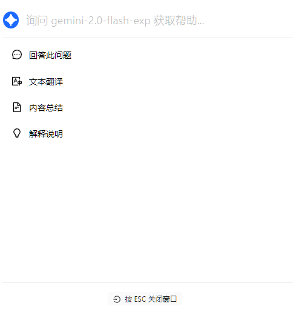


此文件由 AI 從中文翻譯而來，尚未經過審閱。


# 快捷助手

快捷助手是 Cherry Studio 提供的便捷工具，允許您在任何應用程式中快速存取 AI 功能，實現即時提問、翻譯、摘要和解釋等操作。

### 啟用快捷助手

1. **開啟設定：** 導覽至 `設定` -> `快速鍵` -> `快捷助手`。
2. **啟用開關：** 找到並開啟 `快捷助手` 對應按鈕。

<figure><figcaption>
啟用快捷助手示意圖
</figcaption></figure>

3. **設定快速鍵（選用）：**
   * Windows 預設快速鍵為 <kbd>Ctrl</kbd> + <kbd>E</kbd>。
   * macOS 預設快速鍵為 <kbd>⌘</kbd> + <kbd>E</kbd>。
   * 您可在此自訂快速鍵以避免衝突或符合個人使用習慣。

### 使用快捷助手

1. **喚起功能：** 在任何應用程式中，按下設定好的快速鍵（或預設快速鍵）即可開啟快捷助手。
2. **功能操作：** 在快捷助手視窗中可直接進行：
   * **即時提問：** 向 AI 提出任何疑問。
   * **文字翻譯：** 輸入待翻譯文字內容。
   * **內容摘要：** 輸入長文字進行重點摘要。
   * **術語解釋：** 輸入需說明的概念或專有名詞。

       <figure><figcaption>
快捷助手介面示意圖
</figcaption></figure>
3. **關閉視窗：** 按下 <kbd>ESC</kbd> 鍵或點擊視窗外任意位置即可關閉。


快捷助手採用 [全域預設對話模型](settings/default-models.md#mo-ren-zhu-shou-mo-xing)。


### 使用提示與技巧

* **快速鍵衝突：** 若預設快速鍵與其他應用程式衝突，請修改設定。
* **探索進階功能：** 除說明文件功能外，快捷助手可能支援程式碼生成、風格轉換等操作，建議持續嘗試發掘。
* **問題回報與建議：** 使用時如遇問題或有功能改進建議，請隨時向 Cherry Studio 團隊 [提交回饋](../../../question-contact/suggestions.md)。