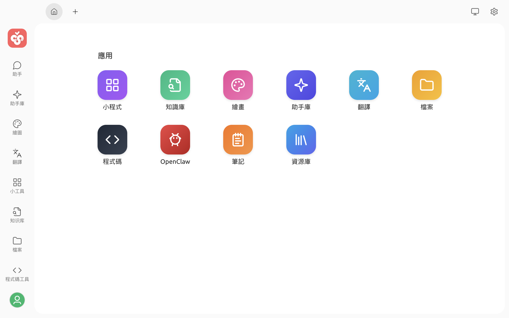

# 啟動台

啟動台是 Cherry Studio 的首頁，可集中開啟常用功能和小程式。你可以從這裡進入知識庫、繪畫、助手庫、翻譯、檔案、程式碼工具、OpenClaw、筆記和資源庫等工作區。

## 開啟啟動台

啟動 Cherry Studio 後，應用程式預設會進入啟動台。使用過程中也可以透過以下方式返回或新增啟動台：

* 點選視窗頂部分頁列左側的首頁按鈕，返回已開啟的啟動台分頁。
* 點選分頁列中的 `+`，新增分頁。新分頁會從啟動台開始。

從啟動台點選應用程式後，目前的分頁會進入對應的工作區。如需同時處理多項工作，可以使用 `+` 開啟多個分頁。

## 應用入口

啟動台的「應用」區域提供以下入口：

| 應用 | 用途 |
| :--- | :--- |
| 小程式 | 開啟和管理網頁小程式 |
| 知識庫 | 管理知識庫、資料來源和檢索設定 |
| 繪畫 | 使用圖像模型產生和管理圖片 |
| 助手庫 | 瀏覽和匯入社群助手 |
| 翻譯 | 翻譯文字，並對照原文與譯文 |
| 檔案 | 查看曾在 Cherry Studio 中使用的檔案 |
| 程式碼 | 管理和執行支援的 AI 程式碼工具 |
| OpenClaw | 安裝、設定和開啟 OpenClaw |
| 筆記 | 建立和整理 Markdown 筆記 |
| 資源庫 | 管理助手、智慧體、技能和提示詞 |

「助手庫」和「資源庫」是兩個不同的入口：助手庫用於瀏覽可匯入的助手，資源庫則用於管理自己的助手、智慧體、技能和提示詞。

## 小程式區域

固定到啟動台的小程式會顯示在「應用」區域下方。保持開啟狀態的小程式也可能顯示在這裡，方便快速返回。

如需新增或移除入口，請在「小程式」頁面開啟對應小程式的操作選單，然後選擇「新增到啟動台」或「從啟動台移除」。


從啟動台移除小程式只會取消快捷入口，不會刪除小程式本身。


## 使用建議

* 從啟動台開始一項新工作；如需繼續既有對話或工作，請使用左側邊欄或對應頁面的歷史記錄。
* 使用多個分頁同時開啟不同功能，避免頻繁離開目前的工作區。
* 將常用的網頁小程式新增到啟動台，減少重複搜尋。
