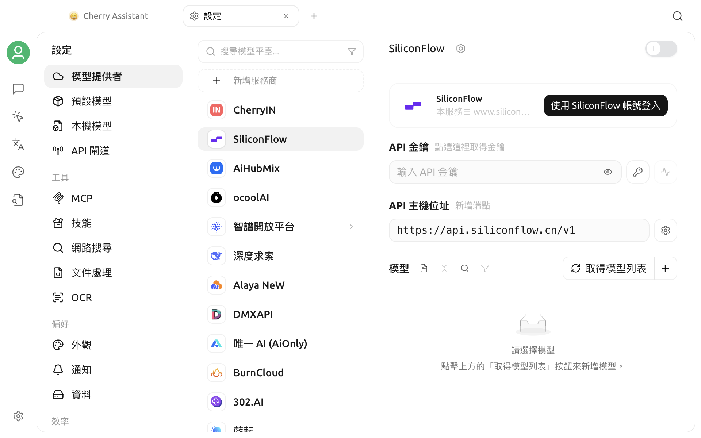

# 軟體設定

Cherry Studio V2 將模型接入、工具服務、應用程式偏好、資料管理和效率功能集中在設定中心。本頁是設定導覽，不重複每個開關的詳細資訊；依目標找到對應分區後，再進入相關專題文件。

## 開啟設定

點選主視窗左下角的**設定**圖示。

設定中心預設開啟**模型提供者**。側邊欄頂部是不帶分區標題的模型入口，後面依序是四個有標題的分區：

1. 模型提供者、預設模型、本機模型和 API 閘道；
2. 工具；
3. 偏好；
4. 效率；
5. 系統。


不同作業系統、視窗尺寸或版本中的文字和位置可能略有差異。如果某項功能未出現，請先在**關於我們**中確認版本，並檢查它是否只在特定平台上提供。


## 模型入口

| 設定項目 | 用途 | 相關文件 |
| --- | --- | --- |
| 模型提供者 | 新增或管理模型供應商、API Key、API 位址、連線方式和模型清單 | [模型服務設定](providers.md) |
| 預設模型 | 選擇預設助理、快速、翻譯和繪畫模型 | [預設模型設定](default-models.md) |
| 本機模型 | 下載或移除本機嵌入和 OCR 模型元件 | [本機模型](local-models.md) |
| API 閘道 | 透過本機 OpenAI 相容介面，將 Cherry Studio 的模型能力提供給其他應用程式 | [API 閘道](../../../advanced-basic/api-server.md) |

首次使用時，建議依以下順序設定：

1. 在**模型提供者**中啟用供應商並完成連線檢查；
2. 確認需要的模型已出現在模型清單中；
3. 在**預設模型**中設定各類預設模型；
4. 返回對話頁面傳送一則測試訊息。

模型供應商的 API Key 屬於敏感憑證。不要將真實 Key 放入螢幕截圖、公開文件或問題回報。

## 工具

| 設定項目 | 用途 | 相關文件 |
| --- | --- | --- |
| MCP | 安裝和管理 MCP 工具，為助理或智慧代理連接外部能力 | [MCP 使用教學](../../../advanced-basic/mcp/) |
| Skills | 管理可供智慧代理呼叫的技能 | — |
| 網路搜尋 | 選擇關鍵字搜尋和 URL 讀取供應商，設定結果數量、壓縮和黑名單 | [網路搜尋](../../../websearch/) |
| 文件處理 | 設定 PDF 和 Office 文件解析服務 | [文件處理](../../../pre-basic/settings/doc-process.md) |
| OCR | 設定圖片文字辨識服務 | [文件處理](../../../pre-basic/settings/doc-process.md) |

工具服務是否可用，通常同時取決於：

- 功能本身是否已完成設定；
- 目前模型是否支援工具呼叫或對應的輸入類型；
- 助理或智慧代理是否已取得該工具的權限；
- 本機網路和第三方服務是否可存取。

不要只因介面中出現一個開關，就判斷功能已經可用。完成設定後，應在實際對話中進行一次最小測試。

## 偏好

| 設定項目 | 用途 | 相關文件 |
| --- | --- | --- |
| 外觀 | 語言、主題、字型、訊息顯示、數學公式和自訂 CSS | [外觀設定](display.md) |
| 通知 | 管理應用程式通知 | — |
| 資料 | 本機資料目錄、匯入匯出、備份、WebDAV、S3 和筆記服務 | [資料設定](../../../data-settings/) |

外觀、通知和資料已拆成獨立入口；需要修改啟動、代理或隱私選項時，請前往**系統**。


大多數外觀選項會立即生效，但語言、代理、儲存位置和部分系統整合可能需要重新開啟視窗或重新啟動應用程式。是否需要重新啟動，請以設定項目旁的提示和實際介面為準。


## 效率

| 設定項目 | 用途 | 相關文件 |
| --- | --- | --- |
| 頻道 | 讓智慧代理透過飛書、Telegram 等外部頻道接收和傳送訊息 | [頻道](../../../advanced-basic/agent-channels.md) |
| 排程任務 | 依排程自動執行智慧代理任務 | [排程任務](../../../advanced-basic/scheduled-tasks.md) |
| 快速鍵 | 查看、修改、啟用或停用應用程式與全域快速鍵 | [快速鍵設定](key-shortcut.md) |
| 快捷助理 | 透過全域快速鍵或系統匣開啟輕量提問視窗 | [快捷助理](../kuai-jie-zhu-shou.md) |
| 劃詞助理 | 在其他應用程式中選取文字後執行翻譯、摘要、解釋等操作 | [劃詞助理](../selection-assistant.md) |

頻道和排程任務可能讓智慧代理在主視窗之外或無人值守時執行。啟用前應檢查模型費用、工具權限、可存取資料和任務停止條件。

## 系統

| 設定項目 | 用途 | 相關文件 |
| --- | --- | --- |
| 系統 | 管理啟動、代理、隱私和其他系統層級選項 | [一般設定](general.md) |
| 環境相依性 | 查看和管理功能所需的外部執行環境 | — |
| 關於我們 | 查看版本、更新管道、官方網站、開放原始碼儲存庫和授權資訊 | — |

## 建議的首次設定順序

如果剛安裝 Cherry Studio，可以依下列順序完成最小設定：

1. **模型提供者**：啟用一個供應商，填寫憑證並檢查連線；
2. **預設模型**：選擇預設助理模型；
3. **外觀**：選擇語言和主題；
4. **資料**：確認資料位置，並檢查目前版本可用的匯出或移轉方式；
5. **網路搜尋或文件處理**：只設定目前確實需要的工具；
6. **快速鍵**：避免全域按鍵組合與其他應用程式衝突；
7. **關於我們**：確認使用的是預期版本。

不必一次啟用所有服務。先讓基本對話穩定運作，再逐項增加聯網、MCP、頻道和自動任務，更容易定位設定問題。

## 設定後的檢查

修改設定後，可用以下方式快速確認：

| 變更 | 建議檢查 |
| --- | --- |
| 模型服務或 API Key | 執行連線檢查，再傳送一則簡短訊息 |
| 預設模型 | 建立新對話，確認頂端顯示的模型 |
| 網路搜尋 | 開啟地球圖示，詢問一個需要最新資料的問題 |
| 文件處理 | 上傳一個小型測試檔案並檢查解析結果 |
| 代理 | 重新存取需要代理的服務，必要時重新啟動應用程式 |
| 快速鍵 | 在目標視窗中實際按一次按鍵組合 |
| 資料、匯入或匯出 | 確認目標檔案或目標應用程式中確實出現預期內容 |

## 常見問題

### 設定完成後未生效

先確認輸入框已失去焦點，或已點選儲存／檢查按鈕。接著重新開啟對應頁面；涉及語言、網路、系統權限或儲存路徑時，再重新啟動 Cherry Studio。

### 找不到文件中提到的設定項目

檢查：

1. 目前 Cherry Studio 是否為 V2 社群版的近期版本；
2. 該功能是否只支援特定作業系統；
3. 是否需要先啟用某個供應商、模型或實驗功能；
4. 設定視窗左側是否可以繼續捲動；
5. 文件所述功能是否已移至助理、智慧代理或應用程式頁面。

### 能否將所有設定同步到另一台裝置

不同備份方式涵蓋的資料範圍不同。不要只憑「備份成功」判斷所有憑證和本機路徑都會同步；遷移前請閱讀[資料設定](../../../data-settings/)，並在目標裝置上核對模型服務、路徑和系統權限。

***

### 取得協助與提交意見

如果在設定過程中遇到問題，請透過[意見回饋](../../../question-contact/suggestions.md)中列出的官方管道提交意見。建議附上 Cherry Studio 版本、作業系統、設定項目名稱和經過遮蔽處理的錯誤提示。
