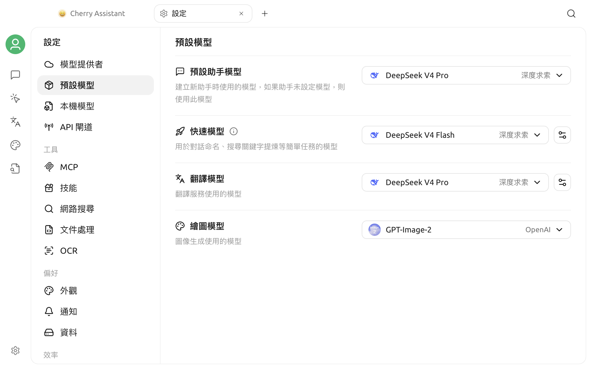

# 預設模型設定

Cherry Studio 的不同功能會在未個別指定模型時使用預設模型。V2 目前提供四個全域角色：**預設助理模型**、**快速模型**、**翻譯模型**和**繪畫模型**。

它們可以選擇同一個模型，也可以依品質、速度和成本分別設定。

## 使用前準備

進入預設模型設定前，先確認：

1. 已在**設定 → 模型提供者**中設定至少一個服務商；
2. 目標模型已加入該服務商；
3. 服務商和模型都處於啟用狀態；
4. 目標模型可以通過連線檢查或實際對話。

設定方法請參閱[模型服務設定](providers.md)。


前三個文字模型選擇器只顯示已啟用服務商中的已啟用對話模型，並排除嵌入、重新排序和純圖像產生模型；繪畫模型選擇器只顯示被識別為圖像產生模型的項目。找不到目標模型時，應先回到模型服務檢查啟用狀態和能力標記。


## 開啟模型設定

進入：

> **設定 → 預設模型**

頁面包含預設助理、快速、翻譯和繪畫四個模型選擇器。快速模型和翻譯模型右側另有附加設定。

## 四個預設模型

| 角色 | 主要用途 | 選擇重點 |
| --- | --- | --- |
| 預設助理模型 | 助理未個別指定模型時使用的對話模型 | 穩定、遵循指示、日常成本 |
| 快速模型 | 話題命名、筆記摘要、部分輕量內部任務和 LLM 語言檢測 | 回應快、輸出簡潔、成本低 |
| 翻譯模型 | 翻譯頁面、快捷翻譯和其他呼叫統一翻譯模型的功能 | 語言涵蓋範圍、忠實度、格式保持 |
| 繪畫模型 | 繪畫頁面預設使用的圖像產生模型 | 圖像產生能力、品質、速度和成本 |

## 預設助理模型

### 使用時機

助理實際使用模型的優先順序通常為：

1. 助理目前明確選擇的模型；
2. 助理自身儲存的預設模型；
3. 全域預設助理模型。

因此，變更全域預設模型不會強制取代每個已個別選擇模型的助理。

### 如何選擇

日常使用可優先考慮：

- 文字對話穩定；
- 能遵循系統提示詞；
- 上下文長度符合常見任務需求；
- 目前帳號的額度和延遲可接受；
- 如果經常使用 MCP、聯網或智慧代理，模型應支援工具呼叫。

不要只依模型名稱手動標記能力。視覺、原生聯網和工具呼叫等能力必須與伺服器端實際支援一致。

## 快速模型

快速模型負責不需要主對話模型完整能力的背景或輕量任務，例如：

- 依最近的對話內容產生話題名稱；
- 為筆記內容產生簡短標題或摘要；
- 在翻譯功能選擇 LLM 檢測時識別來源語言；
- 其他呼叫應用程式快速模型的內部流程。

### 選擇建議

快速模型適合：

- 首字回應快；
- 短文字指示遵循穩定；
- 能可靠輸出簡短結果；
- 單次呼叫成本較低；
- 不依賴複雜工具或超長上下文。

最快的模型不一定最合適。如果話題名稱經常偏離主題、語言識別不穩定或輸出帶有解釋，可以更換成較可靠的輕量模型。

### 話題命名設定

點選快速模型右側的設定按鈕，可以：

- 開啟或關閉自動話題命名；
- 修改話題命名提示詞；
- 還原預設提示詞。

關閉自動話題命名後，應用程式會嘗試使用第一則訊息的文字作為話題名稱，而不是呼叫快速模型產生名稱。

自訂提示詞時應保留介面說明中要求的變數。錯誤刪除變數或要求模型輸出長篇內容，可能導致話題名稱不完整。

### 與翻譯語言檢測的關係

翻譯頁面的語言檢測方式可選擇演算法或 LLM。選擇 LLM 時會呼叫快速模型。

部分專用翻譯模型不適合執行語言檢測。例如，目前的實作會拒絕使用 Qwen-MT 類模型執行 LLM 語言檢測。如果翻譯模型使用專用翻譯模型，快速模型仍應選擇一般對話模型。

## 翻譯模型

翻譯模型用於：

- 翻譯頁面；
- 快捷助理中的翻譯；
- 劃詞助理的翻譯操作；
- 呼叫統一翻譯服務的其他入口。

有關快捷入口，請參閱[快捷助理](../kuai-jie-zhu-shou.md)和[劃詞助理](../selection-assistant.md)。

### 選擇建議

依自己的語言組合測試：

- 專有名詞是否正確保留；
- Markdown、程式碼和預留位置是否被意外改寫；
- 長文字是否漏譯；
- 小語種是否穩定；
- 輸出是否帶有解釋或前言；
- 成本和回應速度是否可接受。

一般對話模型和專用翻譯模型都可以使用，但能力和參數不同。應使用真實文字測試，不要只依服務商宣傳選擇。

### 翻譯附加設定

點選翻譯模型右側的設定按鈕，可以修改：

- 翻譯提示詞；
- 自訂語言名稱、代碼和圖示。

修改翻譯提示詞後，頁面會出現還原按鈕。還原操作會取代目前的自訂提示詞。

翻譯提示詞中的目標語言和原文變數必須保留。如果刪除變數，模型可能不知道要翻譯成什麼語言，或無法收到待翻譯文字。

## 繪畫模型

繪畫模型是繪畫頁面預設使用的圖像產生模型。它不會自動回退到預設助理模型；未選擇時，請先在模型服務中啟用支援圖像產生的模型，再回到本頁選擇。

選擇時應實際測試目標尺寸、提示詞遵循、中文文字產生、速度和計費方式。只有被 Cherry Studio 識別為圖像產生模型的項目才會出現在此選擇器中。

## 建議設定方式

### 追求簡單

預設助理、快速和翻譯三個文字角色可以使用同一個穩定的通用對話模型；繪畫模型仍需另外選擇支援圖像產生的模型。

### 兼顧成本

| 角色 | 建議 |
| --- | --- |
| 預設助理模型 | 日常最可靠的主力對話模型 |
| 快速模型 | 便宜、低延遲的輕量對話模型 |
| 翻譯模型 | 在目標語言組合上測試表現最佳的模型 |
| 繪畫模型 | 在常用畫面類型上品質、速度和成本合適的圖像產生模型 |

### 重視隱私

可以選擇本機模型，但仍需確認：

- 本機服務已啟動；
- 模型在 Cherry Studio 中可以連線；
- 機器記憶體或顯示卡記憶體足夠；
- 翻譯和話題命名的速度可接受；
- 相關功能沒有同時呼叫外部聯網或第三方工具。

## 修改後的驗證

### 預設助理模型

1. 建立一個未個別固定模型的助理或對話；
2. 檢查頂端的模型名稱；
3. 傳送一則簡短訊息；
4. 如需工具，另外執行一次工具呼叫測試。

### 快速模型

1. 開啟自動話題命名；
2. 建立新話題並完成至少一輪對話；
3. 等待話題名稱更新；
4. 檢查名稱是否簡潔且與內容相關。

如果使用 LLM 語言檢測，再前往翻譯頁面輸入一段短文字，檢查識別結果。

### 翻譯模型

1. 開啟翻譯頁面；
2. 輸入包含專有名詞、Markdown 或程式碼的測試文字；
3. 選擇常用的目標語言；
4. 比較譯文完整性和格式；
5. 再測試一次快捷助理或劃詞助理。

### 繪畫模型

1. 開啟繪畫頁面；
2. 輸入一段不含敏感資訊的測試提示詞；
3. 確認可以成功產生圖片；
4. 檢查尺寸、提示詞遵循、耗時和本次費用。

## 常見問題

### 選擇器中沒有目標模型

檢查服務商和模型是否都已啟用。預設助理、快速和翻譯選擇器不會顯示嵌入、重新排序或純圖像產生模型；繪畫模型選擇器只顯示圖像產生模型。如果分類不符合預期，請回到模型服務檢查模型能力標記。

### 已選模型後來變成空白

可能是模型被刪除或停用、服務商被停用，或模型唯一 ID 在遷移後發生變更。

返回[模型服務設定](providers.md)重新拉取或新增模型，再重新選擇。

### 變更預設助理模型後，既有助理沒有變化

這是正常現象。既有助理如果儲存了自己的模型，會繼續優先使用自己的選擇。需要逐一修改助理，或清除其獨立模型設定。

### 自動話題命名無法運作

確認：

- 自動話題命名已開啟；
- 快速模型仍存在且已啟用；
- 快速模型的服務商和 API Key 可用；
- 對話已產生足夠訊息；
- 話題名稱未被手動編輯；
- 自訂命名提示詞未破壞必要變數。

### 翻譯提示模型不存在

重新選擇翻譯模型。如果使用專用翻譯模型，還需要檢查服務商是否要求特殊參數或支援的語言代碼。

### 背景任務費用異常

話題命名、筆記摘要、LLM 語言檢測和翻譯都可能產生獨立請求。可以將快速模型換成成本較低的模型，或關閉不需要的自動話題命名與 LLM 檢測。

## 資料與安全

- 預設模型設定不包含 API Key，憑證仍由模型服務管理；
- 模型呼叫會將對應文字傳送給所選服務商；
- 話題命名可能傳送最近幾則訊息的正文；
- 翻譯會傳送待翻譯文字；
- 涉及敏感內容時，應選擇符合隱私要求的服務商或本機模型。

***

### 取得協助與提交意見

如果預設模型無法運作，請透過[意見回饋](../../../question-contact/suggestions.md)中列出的官方管道提交意見。建議說明 Cherry Studio 版本、四個模型角色的選擇、服務商、模型 ID 和經過遮蔽處理的錯誤提示。
