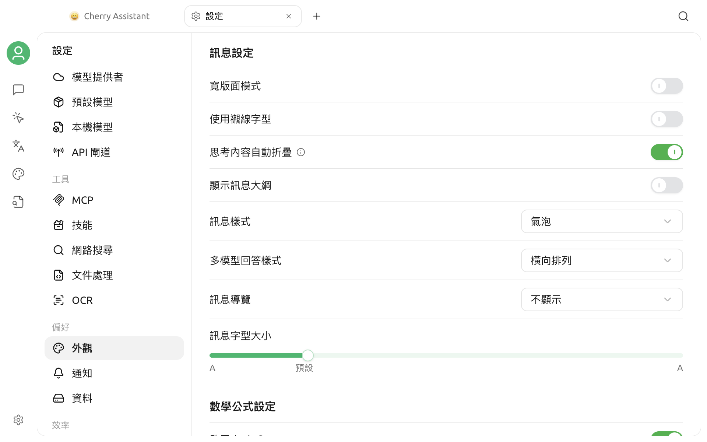

# 外觀設定

Cherry Studio V2 的外觀選項位於 **設定 > 外觀**。頁面包含顯示與語言、字型、輸入、訊息、數學公式、程式碼顯示、程式碼執行和自訂 CSS 等區域。本頁重點說明主題、縮放、字型、訊息顯示和數學公式渲染。

## 主題與主題色彩

### 選擇主題

**主題**提供三種模式：

| 模式 | 效果 |
| --- | --- |
| 淺色 | 一律使用淺色介面 |
| 深色 | 一律使用深色介面 |
| 系統 | 跟隨作業系統目前的淺色或深色外觀 |

選擇後會立即更新應用程式介面。使用 **系統** 時，作業系統切換外觀後，Cherry Studio 也會隨之變更。

### 設定主題色彩

**主題色彩**會影響主要按鈕、選取狀態和強調元素。你可以：

- 從綠色、紅色、琥珀色、藍色或紫色預設中選擇。
- 點擊色彩選擇器選擇其他色彩。
- 在輸入框中填寫十六進位色彩，例如 `#3B82F6`。

色彩輸入支援 `#RGB` 和 `#RRGGBB`，儲存時會轉換為完整的六位大寫格式。無效的色彩不會套用。

預設主題色彩為 `#00B96B`。


主題色彩不是完整的自訂主題。若要修改更多介面樣式，請使用[自訂 CSS](../../../personalization-settings/css.md)，並在修改前儲存原有樣式。


## 平台專屬視窗選項

部分顯示選項只會在對應的系統中出現：

- **macOS：透明視窗**——在透明與不透明的視窗樣式之間切換。
- **Linux：使用系統標題列**——改用系統提供的視窗標題列；確認後應用程式會重新啟動。

Windows 不會顯示這兩項。不同的桌面環境、系統主題和顯示卡設定可能會影響透明或標題列效果。

## 介面縮放

**縮放**區域會顯示目前的比例：

- 點擊 `-` 縮小介面。
- 點擊 `+` 放大介面。
- 點擊重設圖示恢復預設比例。

每次調整以 10% 為一個級距。縮放會同時影響文字、圖示和介面控制項，不等同於單獨修改聊天訊息的字型大小。

你也可以使用以下預設快速鍵：

| 操作 | macOS | Windows / Linux |
| --- | --- | --- |
| 放大 | `⌘ + =` | `Ctrl + =` |
| 縮小 | `⌘ + -` | `Ctrl + -` |
| 重設 | `⌘ + 0` | `Ctrl + 0` |

快速鍵的目前狀態以 **設定 > 快速鍵** 為準，詳情請參閱[快速鍵設定](key-shortcut.md)。

## 字型設定

### 全域字型

**全域字型**會影響應用程式介面的一般文字。選擇器會讀取目前系統中可用的字型，並在清單中顯示預覽。

如果字型名稱未出現：

1. 確認字型已經安裝到作業系統。
2. 關閉並重新開啟 Cherry Studio，讓應用程式重新讀取字型清單。
3. 再次進入字型選擇器搜尋。

點擊右側的重設圖示，可以恢復預設字型。

### 程式碼字型

**程式碼字型**用於程式碼內容和需要等寬顯示的區域。建議選擇包含目標語言字元、數字與常用符號的等寬字型，避免程式碼對齊異常或出現缺字。

全域字型與程式碼字型彼此獨立；重設其中一項不會影響另一項。


聊天訊息的字型大小屬於訊息顯示設定，不會在這裡單獨調整。介面整體過大或過小時請使用縮放；只想改變字型風格時，請使用全域字型或程式碼字型。


## 訊息設定

訊息設定控制對話內容的版面配置與閱讀方式：

- **寬版面模式：** 擴大訊息內容的可用寬度；
- **使用襯線字型：** 只變更訊息正文的字型風格；
- **自動折疊思考內容：** 預設收合模型的思考過程；
- **顯示訊息大綱：** 為長對話提供訊息結構入口；
- **訊息樣式：** 在氣泡等顯示樣式之間切換；
- **多模型回答樣式：** 選擇收合、垂直、水平或網格版面；
- **訊息導覽：** 選擇不顯示、按鈕或錨點導覽；
- **訊息字型大小：** 只調整訊息字號，不影響整個介面縮放。

訊息字型大小的範圍為 12–22，預設值為 14。

## 數學公式設定

**啟用 `$...$`** 控制是否將單個美元符號包裹的內容渲染為行內數學公式。此項預設啟用；如果一般文字中的美元金額被誤判為公式，可以停用後重新查看訊息。

## 常見問題

### 選擇「系統」主題後沒有立即變更

請先確認作業系統本身已經切換到另一種外觀，並檢查 Cherry Studio 是否仍然選擇 **系統**。如果系統主題事件未由桌面環境正確傳遞，請重新開啟應用程式後再檢查。

### 字型清單中沒有剛安裝的字型

Cherry Studio 會在進入設定時讀取系統字型。安裝字型後請重新開啟應用程式，再進入 **顯示與語言**。

### 自訂 CSS 導致顯示異常

前往 **設定 > 外觀 > 自訂 CSS**，暫時清空相關樣式並觀察是否恢復。自訂 CSS 的選擇器可能會隨版本調整，應避免依賴過深的內部 DOM 結構。

如果問題仍然存在，請透過[意見回饋與建議](../../../question-contact/suggestions.md)提交作業系統、Cherry Studio 版本、顯示設定值和完整的介面截圖。
