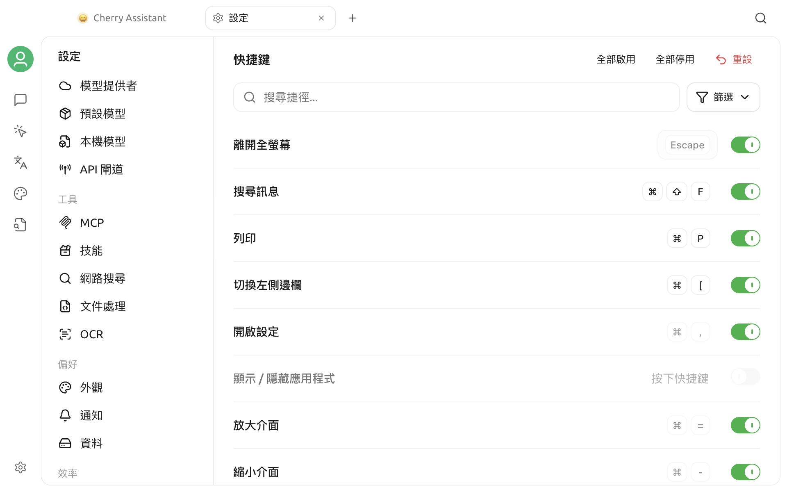

# 快速鍵設定

快速鍵設定集中管理 Cherry Studio 的鍵盤操作。你可以在這裡查看目前的按鍵綁定、修改可編輯的組合鍵、暫時停用某項操作，或將設定恢復為預設值。


本文中的 `Cmd/Ctrl` 表示 macOS 使用 `Command (⌘)`，Windows 和 Linux 使用 `Ctrl`。實際介面會依照目前的作業系統顯示對應按鍵。


## 開啟快速鍵設定

前往 **設定 > 快速鍵**。

頁面使用單一清單顯示快速鍵。點選搜尋框右側的**篩選**，可以查看全部快速鍵或依四類操作篩選：

| 篩選項目 | 包含的操作 |
| --- | --- |
| 全域與視窗 | 顯示或隱藏應用程式、開啟設定、退出全螢幕、列印、介面縮放和全域搜尋 |
| 訊息互動 | 搜尋訊息、複製或編輯訊息、選擇模型 |
| 會話與對話 | 切換左右側邊欄、新增話題和重新命名話題 |
| AI 助理工具 | 快捷助理和劃詞助理的全域快速鍵 |

功能未啟用時，對應的快速鍵不會顯示。例如，啟用快捷助理或劃詞助理後，對應項目才會出現在**AI 助理工具**中。

頁面上方的搜尋框會在目前篩選結果中，依操作名稱或目前顯示的組合鍵繼續篩選。

## 修改快速鍵

### 設定或替換按鍵

1. 找到目標操作。
2. 點擊右側的按鍵區域；尚未綁定時，點擊 **按下快速鍵**。
3. 直接按下新的組合鍵。
4. 組合鍵通過驗證後會立即儲存並啟用。

編輯過程中按 `Esc` 可以取消。有效的組合鍵通常需要同時包含輔助鍵和一般按鍵，例如 `Cmd/Ctrl + Shift + M`；`Esc` 和 `F1` 至 `F12` 也可以單獨使用。

部分系統層級的快速鍵無法編輯，例如開啟設定、退出全螢幕和介面縮放。這些快速鍵仍會顯示在清單中，但按鍵區域無法點擊。

### 啟用或停用

每項快速鍵右側都有獨立開關：

- 關閉開關會保留按鍵綁定，但不再回應操作。
- 重新開啟後會繼續使用原本的綁定。
- 沒有綁定按鍵的項目無法直接開啟，需要先設定組合鍵。

**全部啟用**和**全部停用**只會影響目前篩選和搜尋結果中已綁定按鍵的項目，不會修改未綁定的項目。

### 處理衝突

Cherry Studio 會檢查兩類衝突：

- **應用程式內重複：** 如果新的組合鍵已由另一個已啟用的 Cherry Studio 操作占用，介面會顯示發生衝突的操作名稱，並拒絕儲存。
- **系統或其他應用程式占用：** 如果作業系統無法註冊該組合鍵，介面會以紅色提示「該快速鍵已被系統或其他應用程式占用」。

遇到衝突時，請為其中一項操作改用其他組合鍵。系統保留鍵、輸入法快速鍵、視窗管理器快速鍵，以及其他常駐應用程式的全域快速鍵，都可能造成註冊失敗。

## 目前的預設快速鍵

下表對應 Cherry Studio V2 目前的預設設定。升級後的實際綁定可能會保留你先前的自訂設定，請以應用程式內顯示為準。

### 全域與視窗

| 操作 | 預設綁定 | 預設狀態 | 說明 |
| --- | --- | --- | --- |
| 退出全螢幕 | `Esc` | 啟用 | 退出全螢幕模式 |
| 搜尋訊息 | `Cmd/Ctrl + Shift + F` | 啟用 | 開啟全域訊息搜尋 |
| 列印 | `Cmd/Ctrl + P` | 啟用 | 列印目前頁面內容 |
| 開啟設定 | `Cmd/Ctrl + ,` | 啟用 | 開啟設定視窗 |
| 顯示 / 隱藏應用程式 | 未綁定 | 停用 | 設定後可在其他應用程式位於前景時顯示或隱藏 Cherry Studio |
| 放大介面 | `Cmd/Ctrl + =` | 啟用 | 增加介面縮放比例；數字鍵盤的 `+` 也可以使用 |
| 縮小介面 | `Cmd/Ctrl + -` | 啟用 | 降低介面縮放比例；數字鍵盤的 `-` 也可以使用 |
| 重設縮放 | `Cmd/Ctrl + 0` | 啟用 | 恢復預設縮放比例 |

### 訊息互動

| 操作 | 預設綁定 | 預設狀態 | 說明 |
| --- | --- | --- | --- |
| 複製上一則訊息 | `Cmd/Ctrl + Shift + C` | 停用 | 複製目前話題的最後一則訊息正文 |
| 編輯最後一則使用者訊息 | `Cmd/Ctrl + Shift + E` | 停用 | 開啟最後一則使用者訊息的編輯狀態 |
| 在目前的對話中搜尋訊息 | `Cmd/Ctrl + F` | 啟用 | 在目前話題內尋找訊息 |
| 選擇模型 | `Cmd/Ctrl + Shift + M` | 啟用 | 開啟目前助理的對話模型選擇器 |

### 會話與對話

| 操作 | 預設綁定 | 預設狀態 | 說明 |
| --- | --- | --- | --- |
| 切換左側邊欄 | `Cmd/Ctrl + [` | 啟用 | 顯示、隱藏或聚焦助理側邊欄 |
| 新增話題 | `Cmd/Ctrl + N` | 啟用 | 在目前助理下新增一個獨立話題 |
| 重新命名話題 | `Cmd/Ctrl + T` | 停用 | 修改目前話題名稱 |
| 切換右側邊欄 | `Cmd/Ctrl + ]` | 啟用 | 顯示、隱藏或聚焦話題清單 |

### AI 助理工具

| 操作 | 預設綁定 | 預設狀態 | 使用條件 |
| --- | --- | --- | --- |
| 快捷助理 | `Cmd/Ctrl + E` | 停用 | 請先在快捷助理設定中啟用功能 |
| 開關劃詞助理 | 未綁定 | 停用 | 請先啟用劃詞助理 |
| 劃詞助理：取詞 | 未綁定 | 停用 | 請先啟用劃詞助理 |

快捷助理、劃詞助理和「顯示 / 隱藏應用程式」屬於全域快速鍵：完成綁定並啟用後，即使 Cherry Studio 視窗沒有焦點也能回應。其他大多數對話和視窗快速鍵只會在 Cherry Studio 視窗位於前景時生效。

如需瞭解功能本身的設定方法，請參閱[快捷助理](../kuai-jie-zhu-shou.md)和[劃詞助理](../selection-assistant.md)。

## 恢復預設設定

修改過的可編輯快速鍵旁會出現恢復圖示，點擊後只會恢復該項目的預設綁定與預設啟用狀態。

點擊頁面頂部的 **重設**，確認後會恢復所有快速鍵的預設設定。此操作會覆寫你為快速鍵設定的自訂綁定。

## 常見問題

### 按下快速鍵沒有反應

請依序檢查：

1. 對應項目是否已經綁定按鍵並處於啟用狀態。
2. 目前的功能是否已經啟用，例如快捷助理或劃詞助理。
3. 觸發對話類快速鍵時，Cherry Studio 視窗是否位於前景。
4. 介面是否出現系統或其他應用程式占用的紅色提示。
5. 作業系統、輸入法或其他常駐應用程式是否使用了相同的組合鍵。

修改後仍然無效時，請先改用一個不常見的組合鍵測試，再嘗試重新啟動 Cherry Studio。

### 為什麼看不到劃詞助理快速鍵？

劃詞助理快速鍵只有在功能已經啟用時才會顯示。請先前往**設定 > 劃詞助理**啟用功能，再返回快速鍵頁面。

### 為什麼「全部啟用」沒有開啟某些項目？

批次操作只會處理目前篩選和搜尋結果中已經綁定按鍵的項目。對於顯示「按下快速鍵」的未綁定項目，需要先逐項設定組合鍵。

### 如何快速回到預設設定？

如果只改錯了一項，請使用該項目旁邊的恢復圖示；如果多項設定已經混亂，請使用頁面頂部的 **重設**。

如果仍無法解決，請透過[意見回饋與建議](../../../question-contact/suggestions.md)提交系統版本、Cherry Studio 版本、發生衝突的組合鍵和重現步驟。
