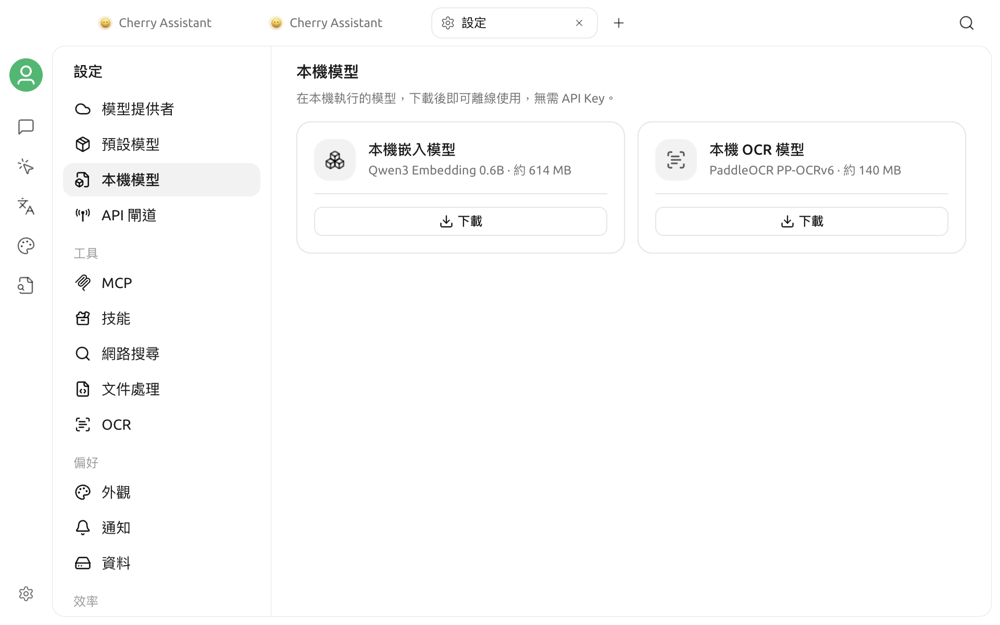

# 本機模型

本機模型在你的裝置上執行。模型下載完成後可以離線使用，不需要 API Key；首次下載仍需要網路連線。

## 開啟本機模型

開啟 **設定 > 本機模型**。頁面包含兩張模型卡片，並顯示每個模型的用途、約略大小和目前狀態。

## 可用模型

| 模型 | 頁面顯示大小 | 用途 |
| --- | --- | --- |
| **本機嵌入模型**（Qwen3 Embedding 0.6B） | 約 614 MB | 為知識庫內容產生文字向量 |
| **本機 OCR 模型**（PaddleOCR PP-OCRv6） | 約 140 MB | 從圖片中辨識文字 |

本機 OCR 只處理圖片，不用於文件轉 Markdown。

## 下載與管理

1. 在需要的模型卡片中按一下 **下載**。
2. 下載期間查看進度列和百分比；如需停止，按一下 **取消**。
3. 下載完成後，卡片會顯示 **已就緒**。
4. 不再需要模型時，按一下卡片右上角的刪除圖示。

卡片顯示的是模型的約略大小。首次下載任一模型時，Cherry Studio 還可能下載兩個模型共用的執行元件，因此實際下載量和磁碟用量可能略高。

## 刪除限制與自動行為

- 本機嵌入模型下載完成後會出現在知識庫的嵌入模型選項中。如果在建立新知識庫前已經就緒，新知識庫會預設使用它。
- 如果本機嵌入模型仍被知識庫使用，Cherry Studio 不會刪除其檔案，並會提示模型仍在使用。請先為相關知識庫更換嵌入模型，再重試刪除。
- 本機 OCR 下載完成後，如果你沒有明確選擇其他圖片轉文字處理器，Cherry Studio 會將它設為預設處理器；刪除它後會恢復平台預設處理器。

## 平台限制

Intel Mac 不支援這些本機模型。此時頁面會顯示 **目前平台不支援本機模型**，並隱藏下載卡片。

## 常見問題

### 下載失敗

檢查網路連線後重新按一下 **下載**。失敗或取消的下載不會保留為可用模型。

### 刪除本機嵌入模型後仍然顯示

該模型仍被至少一個知識庫使用。先為相關知識庫更換嵌入模型，再返回本頁刪除。

### 刪除失敗

重新開啟本頁後再試。若仍然失敗，請查看應用程式日誌中的錯誤資訊。
