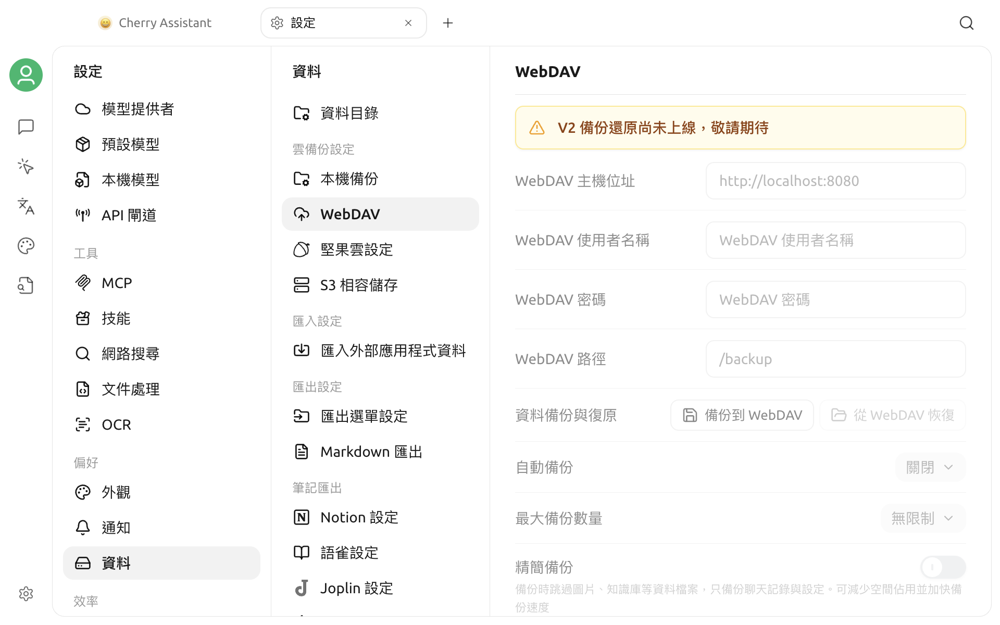

# WebDAV 備份

目前版本可以透過 **設定 > 資料 > WebDAV** 開啟 WebDAV 頁面，但頁面明確提示 **「V2 備份還原尚未上線，敬請期待」**。


目前版本無法透過此頁面建立、還原或自動管理 WebDAV 備份。請不要將頁面中顯示的設定項目視為已經可用的功能。


## 頁面目前顯示的內容

頁面預留了下列設定和操作：

- WebDAV 主機位址、使用者名稱、密碼和路徑；
- 備份到 WebDAV 與從 WebDAV 還原；
- 自動備份週期和最大備份數；
- 精簡備份選項。

這些輸入框、按鈕和開關目前都無法使用。看到此頁面不表示 WebDAV 連線已經建立，也不能用來驗證伺服器位址或憑證。

## 使用建議

- 目前不要在此頁面輸入真實的 WebDAV 憑證，也不要依賴它保存重要資料。
- 不要依照舊版介面或舊教學執行備份、還原或自動備份操作。
- 後續版本啟用此功能後，請以應用程式中的可用狀態、更新說明和本頁最新內容為準。
