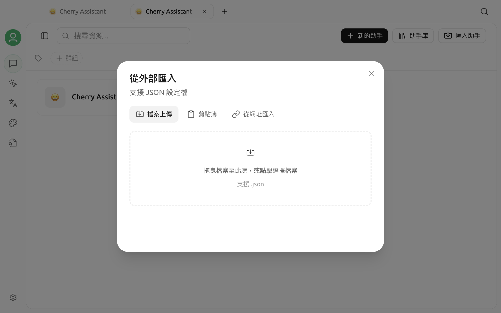

# 助理訂閱與匯入


目前 Cherry Studio V2 社群版不再提供持續性的「助理訂閱」或自動重新整理遠端範本功能。舊版教學中的訂閱網址不會持續同步。目前可用的替代功能是一次性 **匯入助手**。


匯入會將 JSON 中的助理複製為本機助理。遠端 JSON 後續發生變更時，已匯入的助理不會自動更新。

## 開啟匯入助手

1. 從側邊欄或啟動台開啟 **對話**。
2. 開啟助理與話題清單的更多選單，選擇 **管理助手**。
3. 在管理介面頂端按一下 **匯入助手**。
4. 在 **從外部匯入**對話框中選擇一種方式：
   - **檔案上傳：** 選擇本機 `.json` 檔案；
   - **剪貼簿：** 貼上 JSON；
   - **從網址匯入：** 從支援的 Raw GitHub 或 Raw Gist 位址取得 JSON。



URL 匯入只會下載一次，不會儲存為訂閱。目前僅接受 HTTP(S) 的 `raw.githubusercontent.com` 和 `gist.githubusercontent.com` 位址；GitHub 檔案預覽頁、一般 Gist 頁面或其他網站位址都會被拒絕。

## JSON 格式

可以匯入單一物件或物件陣列。每個助理至少需要 `name` 和 `prompt`：

```json
{
  "name": "文件審閱助理",
  "emoji": "📝",
  "description": "檢查結構、術語和可執行性",
  "prompt": "審閱產品文件，並提出具體、可執行的修改建議。",
  "group": ["寫作"]
}
```

`emoji`、`description` 和 `group` 可以省略。匯入資料沒有模型資訊時，Cherry Studio 會使用目前的預設對話模型。匯入檔案、剪貼簿內容或 URL 回應不得超過 5 MB。

## 更新已匯入的助理

遠端內容更新後，需要再次執行匯入。重新匯入不會將遠端內容持續綁定到原助理，並可能產生額外的本機副本；匯入後請在管理助手中檢查名稱、群組和提示詞，並視需要刪除舊版本。

如果需要在團隊中分發範本，建議維護可版本化的 JSON 檔案，並在檔名或助理說明中標示版本，不要依賴舊版的訂閱語意。

## 安全建議

- 只從可信來源匯入，並先閱讀完整提示詞。
- 不要將 API Key、Token、內部位址或個人資料寫入助理 JSON。
- 匯入後檢查預設模型、知識庫、工具和 MCP 設定，再開始處理敏感資料。
- URL 匯入失敗時，確認使用的是 Raw 內容位址、回應內容為 JSON，且大小未超過限制。

助理庫、建立與管理流程請參閱[助理庫](../cherrystudio/preview/agents.md)。如果仍無法匯入，請透過[回饋與建議](../question-contact/suggestions.md)提交 Cherry Studio 版本、匯入方式、已遮蔽敏感資訊的範例和錯誤提示。
