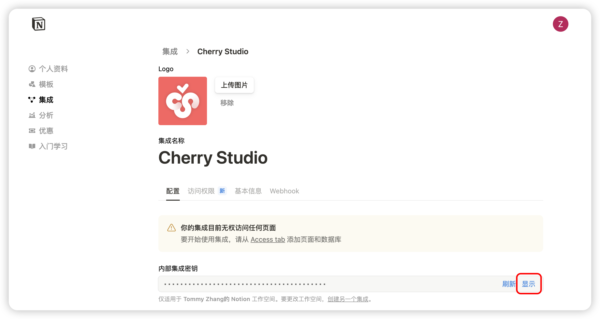

# Notion 配置教學


此文件由 AI 從中文翻譯而來，尚未經過審閱。


## Notion 配置教學

Cherry Studio 支援將話題導入 Notion 的數據庫。

### 第一步

開啟網站 [Notion Integrations](https://www.notion.so/profile/integrations) 建立應用程式

<figure><figcaption>
點擊加號建立應用程式
</figcaption></figure>

### 第二步

建立應用程式

<figure><figcaption>
填寫應用程式資訊
</figcaption></figure>

名稱：Cherry Studio

類型：選擇第一個

圖示：可以保存此圖片

<figure><figcaption></figcaption></figure>

### 第三步

複製金鑰並填寫到 Cherry Studio 設定中

<figure><figcaption>
點擊複製金鑰
</figcaption></figure>

<figure><figcaption>
將金鑰填寫到數據設定中
</figcaption></figure>

### 第四步

開啟 [Notion](https://www.notion.so/) 網站建立新頁面，在下方選擇數據庫類型，名稱填寫 Cherry Studio，按照圖示操作連接

<figure><figcaption>
建立新頁面選擇數據庫類型
</figcaption></figure>

<figure><figcaption>
輸入頁面名稱，並選擇連接到 APP
</figcaption></figure>

### 第五步

<figure><figcaption>
複製數據庫 ID
</figcaption></figure>

若您的 Notion 數據庫 URL 類似：

https://www.notion.so/\<long\_hash\_1>?v=\<long\_hash\_2>

則 Notion 數據庫 ID 就是 `<long_hash_1>` 部分

<figure><figcaption>
填寫數據庫 ID 並點擊檢查
</figcaption></figure>

### 第六步

填寫 `頁面標題欄位名稱`：

若網頁顯示英文，填寫 `Name`\
若網頁顯示中文，填寫 `名稱`

<figure><figcaption>
填寫頁面標題欄位名稱
</figcaption></figure>

### 第七步

恭喜！Notion 配置已完成 ✅ 接下來可將 Cherry Studio 內容匯出到您的 Notion 數據庫

<figure><figcaption>
匯出到 Notion
</figcaption></figure>

<figure><figcaption>
查看匯出結果
</figcaption></figure>
