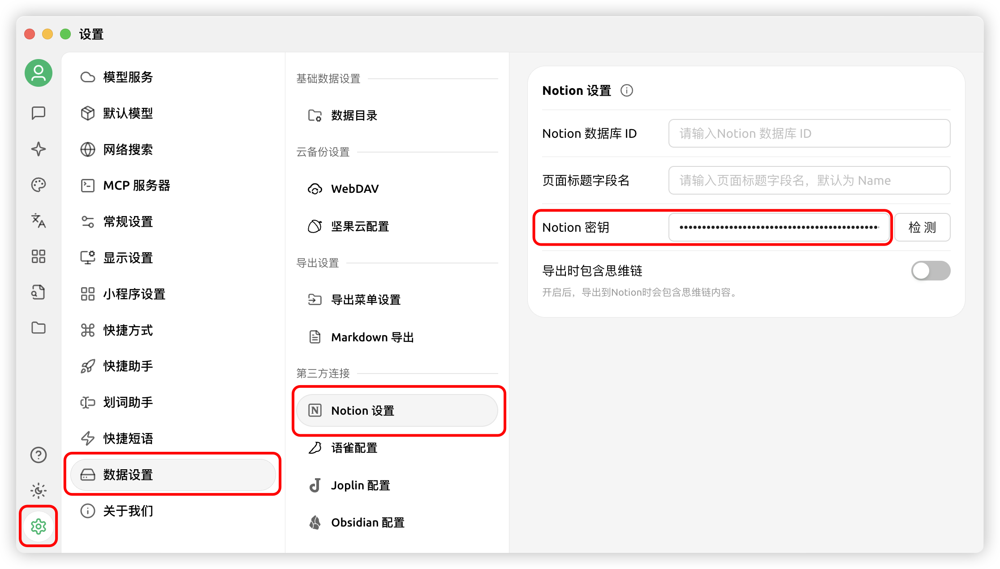


此文件由 AI 從中文翻譯而來，尚未經過審閱。


# Notion 設定教學

Cherry Studio 支援將話題匯入 Notion 的資料庫。

## 第一步

開啟網站 [Notion Integrations](https://www.notion.so/profile/integrations) 建立一個應用程式

<figure><figcaption>
點擊加號建立應用
</figcaption></figure>

## 第二步

建立一個應用程式

<figure><figcaption>
填寫應用資訊
</figcaption></figure>

名稱：Cherry Studio

類型：選第一個

圖示：可以儲存一下這個圖片

<figure><figcaption></figcaption></figure>

## 第三步

複製密鑰填寫到 Cherry Studio 設定裡

<figure><figcaption>
點擊複製密鑰
</figcaption></figure>

<figure><figcaption>
將密鑰填寫到資料設定裡
</figcaption></figure>

## 第四步

開啟 [Notion](https://www.notion.so/) 網站建立一個新頁面，在下方選擇資料庫類型，名稱填寫 Cherry Studio，按圖示操作連接

<figure><figcaption>
建立一個新頁面選擇資料庫類型
</figcaption></figure>

<figure><figcaption>
輸入頁面的名字，並選擇連接到 APP
</figcaption></figure>

## 第五步

<figure><figcaption>
複製資料庫 ID
</figcaption></figure>

如果你的 Notion 資料庫的 URL 類似這樣：

https://www.notion.so/\<long_hash_1>?v=\<long_hash_2>

那麼 Notion 資料庫 ID 就是 `<long_hash_1>` 這部分

<figure><figcaption>
填寫資料庫 ID 並點擊檢查
</figcaption></figure>

## 第六步

填寫 `頁面標題欄位名稱`：

若你的網頁是英文的，則填寫 `Name`
若你的網頁端是中文的，則填寫 `名稱`

<figure><figcaption>
填寫頁面標題欄位名稱
</figcaption></figure>

## 第七步

恭喜你，Notion 的設定已經完成了 ✅ 接下來就可以將 Cherry Studio 內容匯出到你的 Notion 資料庫了

<figure><figcaption>
匯出到 Notion
</figcaption></figure>

<figure><figcaption>
檢視匯出結果
</figcaption></figure>