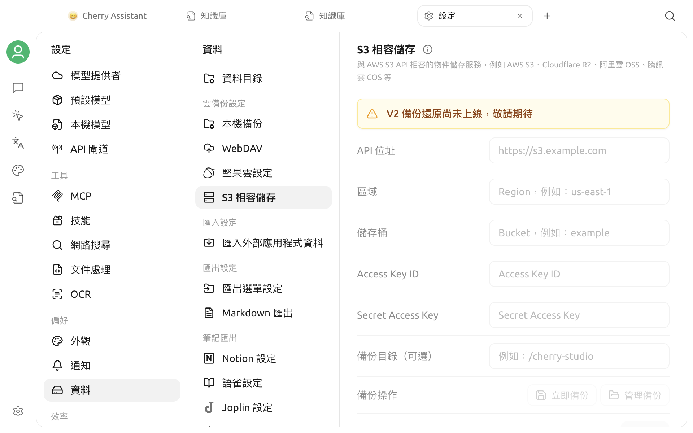

# S3 相容儲存空間備份

目前版本可以透過 **設定 > 資料 > S3 儲存空間** 開啟設定頁面，但頁面明確提示 **「V2 備份與還原功能尚未上線，敬請期待」**。


目前版本無法透過此頁面建立、還原或自動管理 S3 備份。請勿將頁面中顯示的設定項目理解為已經可用的功能。


## 頁面目前顯示的內容

頁面預留了以下設定和操作：

- API 位址、區域和儲存空間；
- Access Key ID 與 Secret Access Key；
- 選用的備份目錄；
- **立即備份**與**管理備份**；
- 自動同步、備份數量上限和精簡備份。

這些輸入框、按鈕和開關目前均無法使用。看到頁面不代表 S3 連線已經建立，也不能用來驗證 Endpoint、儲存空間或憑證。

## 使用建議

- 目前不要在此頁面輸入真實的物件儲存憑證，也不要依賴它保存重要資料。
- 不要根據舊版介面或舊教學執行備份、還原、自動同步或備份清理。
- 物件儲存中已存在的檔案不會被此未開放頁面讀取、修改或刪除。
- 後續版本啟用此功能後，請以應用程式中的可用狀態、更新說明和本頁最新內容為準。
