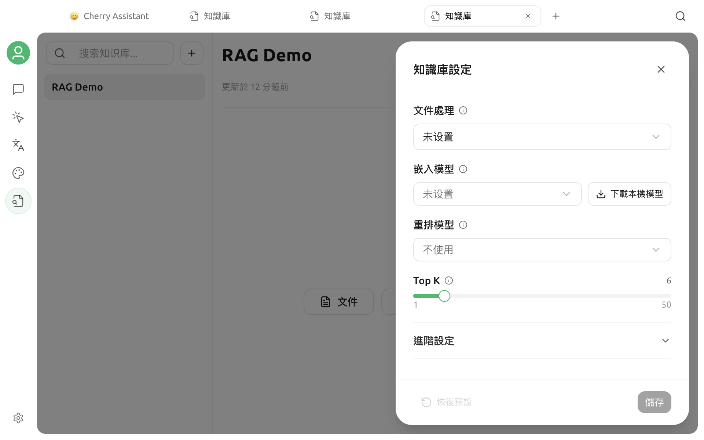

# 嵌入模型

嵌入模型會將文字轉換成向量，用於依語意尋找相關資料。它負責檢索，不負責產生最終回答；聊天模型、嵌入模型和重新排序模型是三種不同的能力。

## 新建知識庫時的預設行為

新建視窗只要求填寫名稱，並可選擇群組，不需要先選擇嵌入模型。

- 如果本機嵌入模型尚未下載，知識庫會先以 **BM25** 模式建立。BM25 依關鍵字檢索，不會產生向量，也不會呼叫嵌入介面。
- 如果本機嵌入模型已經下載完成，新知識庫會自動使用該模型及固定維度，從一開始建立向量索引。

因此，沒有嵌入模型也可以匯入和搜尋資料；需要語意檢索時，再到知識庫設定中啟用即可。

## 啟用語意檢索

進入目標知識庫，按一下右上角的**設定**，在**嵌入模型**欄位選擇一種方式。

### 使用本機模型

按一下**下載本機模型**。下載完成後，Cherry Studio 會自動選擇並儲存內建的本機嵌入模型，然後為現有資料補建向量。

本機模型可避免將資料片段傳送給外部嵌入服務；第一次下載和第一次建立索引會占用時間、記憶體及磁碟空間。如果目前平台不支援本機執行，下載按鈕不會顯示。

### 使用已設定的模型服務

也可以從下拉清單選擇已啟用且具備 **Embedding** 能力的模型。如果清單中沒有目標模型，請先到**設定 → 模型服務**完成服務商設定，並確認模型能力已標記為嵌入。

儲存時，Cherry Studio 會傳送一段簡短的測試文字，以取得實際向量維度。API 位址、金鑰、模型 ID 或網路無法使用時，儲存會失敗，但不會使用猜測的維度。


DeepSeek、Kimi、GLM、GPT、Claude 等名稱本身不代表模型支援嵌入。是否可以選取取決於具體模型的能力，而不是品牌。


## 現有資料會如何處理

模型變更會依知識庫目前狀態選擇安全流程：

| 目前狀態 | 處理方式 |
| --- | --- |
| BM25 知識庫第一次啟用嵌入模型 | 在原知識庫中補建向量，不需要重新建立 |
| 空白知識庫更換嵌入模型 | 直接儲存新設定 |
| 已有向量和資料後更換嵌入模型 | 進入還原／重建流程，避免混用新舊向量 |

啟用或重建期間請勿退出應用程式，也不要移動原始資料。資料越多，處理時間以及線上模型的費用也會相應增加。

## 如何選擇模型

重點比較以下因素：

- **語言涵蓋範圍**：使用自己的中文、英文、日文或俄文資料進行召回測試。
- **隱私**：線上模型會接收資料片段和查詢；敏感資料應優先評估本機模型。
- **速度和費用**：第一次建立索引、重新建立索引及查詢，都可能呼叫線上嵌入介面。
- **穩定性**：模型 ID、輸出維度和介面行為應保持穩定。

不要只依排行榜或模型名稱選擇。使用相同資料和固定問題，比較正確片段能否出現在前幾筆結果中。

## 常見問題

### 嵌入模型清單為空

請確認服務商已啟用、模型已新增，而且模型能力包含 **Embedding**。一般聊天模型和 Rerank 模型不會出現在這裡。

### 儲存時提示取得維度失敗

請依序檢查服務商狀態、API 位址、金鑰、模型 ID、網路及帳戶餘額。儲存時會發起一次真實的嵌入請求。

### 只使用 BM25 有什麼限制

BM25 擅長精確關鍵字、產品名稱和編號，但對同義改寫和自然語言表達的召回通常弱於語意檢索。可以先用 BM25 驗證資料品質，再決定是否啟用嵌入模型。

### 更換 API 金鑰需要重建嗎

如果仍然呼叫同一個模型且輸出維度不變，通常不需要。如果服務商實際路由到不同模型版本，應重新執行召回測試。

詳細資料流和本機檔案位置請參閱[知識庫資料](data.md)。

***

### 取得協助與提交意見

如果模型識別、下載或建立索引時發生問題，請透過[意見回饋與建議](../question-contact/suggestions.md)聯絡社群。
